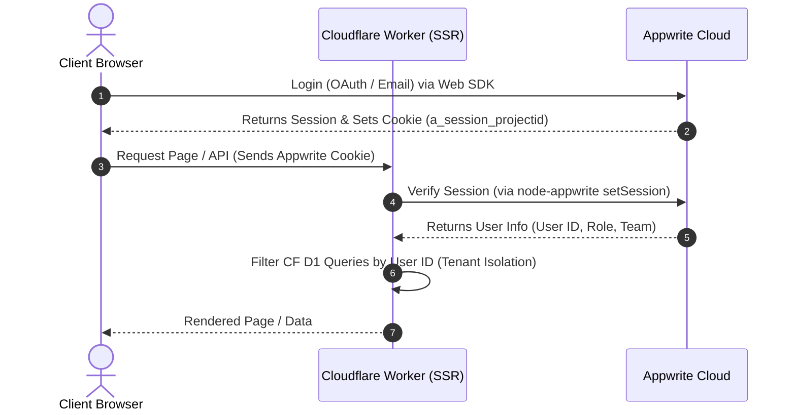

# Appwrite Migration Research — AI-DRAKON Scaffolder

## Executive Summary
Based on our research into Appwrite Cloud and the GitHub Student Pack, we recommend adopting a **Hybrid Architecture (Option B)**. This approach utilizes Appwrite specifically for authentication, user management, and billing metadata, while keeping compute, routing, and high-performance server-side rendering (SSR) on Cloudflare Pages and Workers. This option allows us to leverage Appwrite's robust user management and OAuth out-of-the-box, bypasses the strict 2-project constraint of the Appwrite Student plan for core application environments, and avoids the latency and cold start penalties associated with running SSR on centralized Appwrite Functions.

## Student Plan Limits
The Appwrite Education plan (redeemed via the GitHub Student Developer Pack) is a "Pro-equivalent" tier. Its resource limits per-project and per-account include:

| Metric / Feature | Limit / Value | Details |
| :--- | :--- | :--- |
| **Project Count** | 2 Projects | Reduced from 10 to 2 in April 2026 to prevent platform abuse. |
| **Monthly Bandwidth** | 2 TB | Shared across the account. |
| **Storage Capacity** | 150 GB | Shared across the account. |
| **Monthly Active Users (MAU)** | 200,000 | Per project limit for authenticated users. |
| **Databases** | Unlimited | No limit on databases, collections, or documents. |
| **Buckets (File Storage)** | Unlimited | No limit on file storage buckets. |
| **Functions** | Unlimited | No limit on serverless functions. |
| **Project Pausing** | Never Paused | Education plan projects are exempt from the 7-day inactivity pause rule. |
| **Realtime Connections** | Unlimited / High | High WebSocket concurrency limits. |
| **Email Support** | Excluded | Standard support is community-based (Discord); no 1-on-1 email tickets. |
| **Cost** | Free ($0) | Valid for the duration of verified student status. |

## Capability Comparison

| Feature / Service | Cloudflare (CF) Stack | Appwrite Cloud | Winner | Rationale |
| :--- | :--- | :--- | :--- | :--- |
| **Authentication** | Custom / None (needs development) | Built-in (OAuth, Email, Magic Link, RBAC, Sessions) | **Appwrite** | Complete, secure auth available instantly with minimal frontend integration. |
| **Database** | CF D1 (Edge SQL / SQLite) | Appwrite Databases (Document store, collections, relations) | **Tie** | D1 is faster for edge SSR; Appwrite is better for rapid schema setup and realtime sync. |
| **Key-Value Store** | CF KV (Edge KV) | Appwrite Databases (Cache / Documents) | **Cloudflare** | CF KV has lower latency and global replication at the edge. |
| **File Storage** | MinIO (Self-hosted/local) | Appwrite Storage (Buckets, CDN, image resizing, ACLs) | **Appwrite** | Replaces complex MinIO config with fully-managed storage with built-in ACLs. |
| **Serverless Compute** | CF Workers (Edge, zero cold starts) | Appwrite Functions (Node/Python, containerized) | **Cloudflare** | CF Workers run on V8 isolates with <5ms cold starts; Appwrite has container cold starts. |
| **Realtime Updates** | Custom SSE / Polling | WebSockets (Realtime SDK out of the box) | **Appwrite** | Native pub-sub subscription on any database document/collection. |
| **Deployment / CDN** | CF Pages (Global Edge CDN) | Appwrite Sites (Static hosting) | **Cloudflare** | CF Pages is industry-leading for speed, SSR build pipeline, and routing. |

---

## Migration Option Analysis

### Option A — Full migration
* **Description**: Port all computing, database queries, and files to Appwrite. Appwrite Databases replaces CF D1, Appwrite Storage replaces MinIO, and Appwrite Functions replace CF Workers (the API routes). Only the frontend is hosted on CF Pages (as static assets).
* **Pros**:
  - Extremely unified stack; all backend data and logic reside on a single platform.
  - Out-of-the-box support for database realtime subscriptions.
* **Cons**:
  - Higher SSR latency: Fetching database content for SSR requires Cloudflare Pages to call Appwrite's centralized server APIs, introducing roundtrip network delay (100–300ms).
  - Appwrite Functions have higher cold-start overhead than Cloudflare's edge-native V8 isolates.
  - The 2-project Student plan limit makes it impossible to host development, staging, and production environments entirely on Appwrite (requires paying for Pro or self-hosting).
* **Effort Estimate**: **High** (60–80 hours). Requires complete rewrite of database schema, query logic, API endpoints, and file handling.

### Option B — Hybrid (Recommended)
* **Description**: Keep TanStack Start and the core API routes on Cloudflare Pages/Workers. Connect to Appwrite Cloud specifically for Authentication, User Management, and Billing/Subscription metadata. Use CF D1 for lightweight relational data and local user caching.
* **Pros**:
  - Combines the high-performance edge compute/SSR of Cloudflare with the ready-made identity management of Appwrite.
  - Keeps database performance fast: D1 handles relational application data close to the user at the edge.
  - Bypasses the 2-project Student plan constraint because Appwrite is only used for authentication and billing. Development and staging environments can share a single Appwrite project using separate API keys/databases, or we can use Cloudflare's unlimited project capacity for computing.
* **Cons**:
  - Requires syncing user sessions between the browser client (Appwrite Web SDK) and the Cloudflare Workers server (using session cookies).
* **Effort Estimate**: **Medium** (25–35 hours). Requires integrating Appwrite Auth, cookie session extraction in CF Workers, and database integration for tenant isolation.

### Option C — New features only
* **Description**: Keep current CF Pages + Workers + D1 database without changes. Use Appwrite solely as a secondary service for new features like multi-user roles/billing.
* **Pros**:
  - Lowest risk, zero impact on existing features.
* **Cons**:
  - Inconsistent architecture; user records would live in Appwrite, but other configurations might still lack proper owner-relation fields in D1.
* **Effort Estimate**: **Low** (10–15 hours).

---

## Recommended Path
We recommend **Option B (Hybrid)**. 

### Rationale:
1. **Student Plan Constraints**: The 2-project limit on Appwrite Cloud makes a full migration (Option A) highly impractical for development workflows. By using a Hybrid approach, we can run infinite microservices and branches on Cloudflare Workers/Pages for free, while routing authentication requests to a single Appwrite production project (and using the second project for dev/staging).
2. **TanStack Start SSR Performance**: TanStack Start runs SSR on Cloudflare Pages Functions. To render pages instantly, database reads must be fast. CF D1 resides on Cloudflare's network, ensuring sub-10ms query times. Offloading all databases to Appwrite would slow down SSR page loads significantly.
3. **Development Efficiency**: Custom security features (like OAuth2, reset password, and session tokens) take a long time to build and verify. Appwrite Auth provides these features securely on day one.

---

## Multi-user Mode Design
To implement multi-user mode with the Hybrid architecture:



1. **Authentication Flow**:
   - The React client uses the `appwrite` Web SDK to handle login.
   - Appwrite sets a session cookie named `a_session_<project_id_lowercase>` on the client's browser.
2. **Session Verification on Server (Cloudflare Workers)**:
   - When the user requests an SSR page or API route, the request includes the Appwrite session cookie.
   - The Cloudflare Worker reads the cookie and initializes a temporary session client using the Appwrite Node SDK:
     ```javascript
     import { Client, Account } from "node-appwrite";
     
     const client = new Client()
       .setEndpoint(env.APPWRITE_ENDPOINT)
       .setProject(env.APPWRITE_PROJECT);
     
     const sessionCookie = cookies.get(`a_session_${env.APPWRITE_PROJECT.toLowerCase()}`);
     if (sessionCookie) {
       client.setSession(sessionCookie);
     }
     const account = new Account(client);
     const user = await account.get(); // Verifies cookie & returns user info
     ```
3. **Database Tenant Isolation**:
   - Every table in Cloudflare D1 (e.g., projects, pipelines, zones) must include a `user_id` column.
   - All SQL queries will enforce user boundaries:
     ```sql
     SELECT * FROM pipelines WHERE user_id = ? AND id = ?;
     ```
4. **Role-Based Access Control (RBAC)**:
   - Use Appwrite's built-in **Teams** feature.
   - Create a team (e.g., `editors`) and add members. Cloudflare Workers check team membership before permitting mutations:
     ```javascript
     const teams = new Teams(client);
     const userTeams = await teams.list();
     const isEditor = userTeams.teams.some(t => t.name === 'editors');
     ```

---

## Billing & AI Packages Design
We can implement tiered access levels (Free, Pro, Enterprise) for LLM tool usage:

1. **Billing Collection in Appwrite**:
   - Create a `billing` collection in Appwrite Databases with fields:
     - `userId` (String, unique index)
     - `plan` (String: `free`, `pro`, `enterprise`)
     - `llm_limit` (Integer: monthly request quota)
     - `llm_used` (Integer: current cycle consumption)
     - `stripe_customer_id` (String)
2. **LLM Usage Enforcement**:
   - When a user issues a command via an AI agent, the Cloudflare Worker intercepts the request.
   - It retrieves the user's billing record from Appwrite.
   - If `llm_used >= llm_limit`, the Worker returns a `402 Payment Required` status.
   - Otherwise, the request is passed to the LLM, and `llm_used` is incremented.
3. **Stripe Integration via Webhooks**:
   - Set up an Appwrite Function or Cloudflare Worker endpoint as a Stripe Webhook receiver.
   - On `checkout.session.completed` or `customer.subscription.updated` events, the webhook uses Appwrite's **Admin Client** (with API key) to update the user's `billing` document with their new plan and limits.

---

## Technical Risks & Open Questions
1. **Edge Runtime Compatibility**: The standard `node-appwrite` SDK relies on some Node-specific libraries. We must verify that it operates without issues in the V8 Edge environment of Cloudflare Workers. If compatibility errors arise, we will fallback to direct `fetch` API requests to Appwrite's JSON endpoints.
2. **Network Latency overhead**: Inspecting user sessions on every API request involves a HTTP roundtrip from Cloudflare to Appwrite, which may add latency.
   * *Mitigation*: We can cache verified sessions inside Cloudflare KV for 5–10 minutes, using the session cookie hash as the cache key.
3. **Cookie Attributes**: Since Appwrite Cloud is hosted on `cloud.appwrite.io`, third-party cookie restrictions in modern browsers may block session cookies unless the Appwrite endpoint is mapped to a custom subdomain of our primary domain (e.g., `auth.ai-drakon.me`).

---

## Next Steps
If we proceed with the migration:
1. **Setup Account**: Register an Appwrite account and activate the GitHub Student Developer Pack to obtain the Education plan.
2. **Create Project**: Initialize a project named `ai-drakon` in the Appwrite console. Set up a custom domain (e.g., `auth.ai-drakon.me`) to prevent cookie issues.
3. **Client Integration**: Install the client SDK (`appwrite`) and create authentication routes (`/login`, `/register`) in the frontend.
4. **Server Middleware**: Write session cookie extraction helpers in Cloudflare Pages server functions using the Appwrite Node SDK.
5. **D1 Schema Update**: Modify D1 database schemas to add `user_id` fields to all user-owned tables and update existing queries.
6. **Billing & Stripe Webhook**: Build the Stripe payment integration webhook to update Appwrite user accounts.
