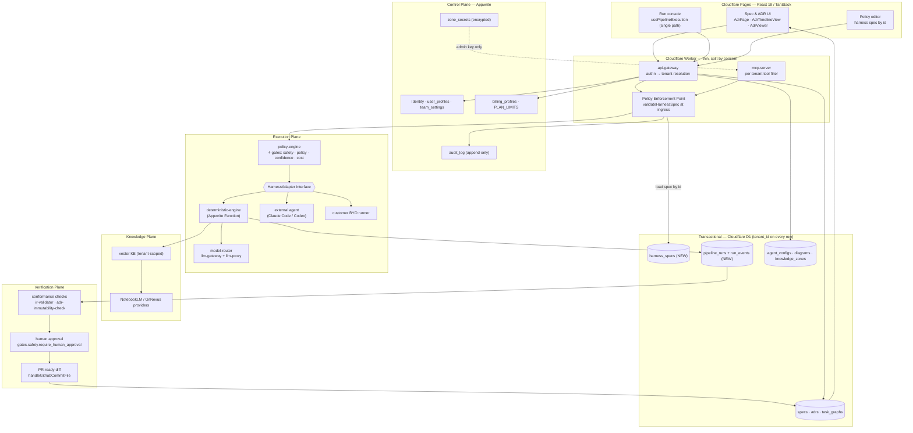

# 4. Target Architecture

## 4.1 The organising principle

One sentence governs every decision below:

> **The harness spec is server-resident, tenant-owned, and versioned; the client may reference it by id, never supply it.**

Everything else — multi-tenancy, audit, billing integrity, MCP authorization, model routing — follows mechanically from enforcing that one rule. It is also the smallest change that makes the word "governed" in the product statement true.

## 4.2 Target diagram



## 4.3 THE FIRST CONCRETE END-TO-END WORKFLOW — "Spec-to-PR Loop v0"

This is the target the project owner says is missing. It is deliberately narrow, uses **only components that already exist**, and closes the loop from an architecture decision back to an architecture decision.

**Trigger:** an engineer adds or edits `docs/adr/0016-*.md` with `status: proposed`, plus a companion `specs/005-<slug>/plan.md` listing tasks `T-501…T-50N`.

**The loop, step by step, naming every real file and function:**

| # | Step | Existing code to use | Change required |
|---|---|---|---|
| 1 | **Ingest the ADR** | `fetchAllAdrs` / `fetchAdr` / `parseAdr` — `src/lib/adr/parser.ts` L84–152 (on `main`) | Move parsing to `packages/spec-kit`; add worker route `GET /v1/specs/adrs` that reads from D1 `adrs` scoped by `tenant_id`, instead of static-fetching `docs/adr/*.md` in the browser |
| 2 | **Derive a task graph** | `src/lib/htse/ir-schema.ts`, `ir-types.ts`, `diagram-to-ir.ts`, `ir-validator-core.ts` | New `specToTaskGraph(plan) → DrakonIR` in `packages/spec-kit`. Each `T-50N` becomes an IR action node. Persist to D1 `task_graphs`. **The IR is the task graph — do not invent a second format.** |
| 3 | **Resolve the policy** | `DrakonHarnessSpec` + `validateHarnessSpec` — `src/lib/harness/harness-spec.ts` L7–53 | Persist specs in a new D1 table `harness_specs(tenant_id, spec_id, version, spec_json)`. Worker loads by `spec_id`; calls `validateHarnessSpec` **for the first time in the codebase's history**; rejects any `harness_spec` present in the request body |
| 4 | **Authorize** | `verifyOwnerAuth` — worker L303 | Replace with `resolveTenant(request) → {tenantId, userId, roles}`. Every D1 query gains `WHERE tenant_id = ?` per the schema's own stated law |
| 5 | **Execute under gates** | `services/deterministic-engine/src/main.ts` L101–340, `capabilityMatches` L58 | Engine stops reading `harness_spec` from the payload; receives a server-resolved spec. Extract the gate loop into `packages/policy-engine` so it is unit-testable |
| 6 | **Record the trace** | `GateVerdict` (`pipeline-client.ts` L16–22), `pipeline_runs` (`infrastructure/d1/schema.sql` L62–74) | New D1 `run_events(run_id, tenant_id, seq, node_id, event, gate, allowed, reason, tokens, ts)`. Every `node_done` / `gate_blocked` persists. Verdicts stop being ephemeral React state |
| 7 | **Audit** | `AuditLogEntry` — `infrastructure/appwrite/schema.ts` L65–71 | Write `"pipeline.run"`, `"gate.blocked"`, `"spec.applied"` entries. First writer to a collection that has existed unused |
| 8 | **Human approval** | `gates.safety.require_human_approval: ["github.repo.*.commit"]` — `harness-spec.ts` L100 | Implement the approval checkpoint the default spec already declares. Run pauses; UI reuses the existing breakpoint mechanism (`breakpointNode` in `usePipelineExecution.ts` L19, `resumeExecution`) |
| 9 | **Emit the diff** | `handleGithubCommitFile` worker L1251, `gitGetFileSha` L1110, `handleSaveDiagramToGit` L1119 | Commit to a branch `spec/0016-<slug>` and open a PR rather than committing to the default branch |
| 10 | **Verify** | `scripts/adr-immutability-check.sh`, `validateIrDeterministic` worker L36, `ir-validator-core.ts` | Run as a gate before the PR opens, not as a separate CI afterthought |
| 11 | **Close the loop** | `AdrViewer` / `ImmutabilityBanner` (`src/components/adr/AdrViewer.tsx` L12–55) | On merge, flip `status: proposed → accepted` in the ADR frontmatter and link `run_id`. The ADR now carries the evidence of its own execution |

**Why this target and not another.** It is the only workflow that simultaneously (a) proves the governance claim end-to-end, (b) forces the four highest-value refactors (server-resident spec, tenant resolution, extracted policy engine, persisted trace) as *prerequisites* rather than as separate hardening work, (c) reuses six subsystems already written, and (d) produces something demonstrable to a buyer in a single screen recording: *"here is an architecture decision; here is the agent executing it under the constraints that decision imposed; here is the PR; here is the audit trail proving no rule was broken."*

Note the pleasing property of step 8: the codebase's own default policy already says a commit needs human approval. The first workflow simply makes the system honour a promise it has been making to itself since 2026-06-30.

## 4.4 Bounded contexts

| Context | Owns | Never owns |
|---|---|---|
| **Identity & Tenancy** | users, teams, roles, sessions, tenant resolution | domain data |
| **Spec** | ADRs, PRDs, plans, task graphs, acceptance criteria, invariants | how tasks execute |
| **Policy** | harness specs, gate definitions, capability grants, quotas, approval rules | what a task does |
| **Knowledge** | indexed documents, embeddings, zones, evidence links | decisions |
| **Execution** | runs, adapters, sessions, model routing, checkpoints | policy authorship |
| **Verification** | conformance checks, test results, approvals, artifacts | execution mechanics |
| **Billing** | plans, quotas, consumption | enforcement (it *publishes* limits; Policy enforces) |

## 4.5 Core services and their split across Appwrite / Cloudflare

The existing header comment in `infrastructure/appwrite/schema.ts` already states the right principle. Extended to the target:

| Concern | Home | Rationale |
|---|---|---|
| Identity, sessions, teams | **Appwrite** | Already there; JWT verification path exists (`verifyAppwriteJwt` L285) |
| Secrets (MCP tokens, PATs) | **Appwrite** encrypted attributes | `ZoneSecret` design is correct: D1 holds only `mcp_auth_secret_ref` |
| Audit log | **Appwrite** append-only | Permissions already model immutability (create-only) |
| Billing profiles | **Appwrite** source of truth, **D1** read-replica for hot quota checks | Quota check is on the request path; must be edge-local |
| Specs, ADRs, task graphs, harness specs, runs, run events | **D1** | Transactional, tenant-partitioned, edge-read |
| API gateway, authn, tenant resolution, policy enforcement point | **Cloudflare Worker** | Must be at the edge, before any work is dispatched |
| MCP server surface | **Cloudflare Worker** | External agents need a stable, low-latency, authenticated endpoint |
| Long-running execution | **Appwrite Functions** (today) behind `HarnessAdapter` | Workers have CPU limits; adapters make the choice swappable |
| Realtime collaboration | **Durable Objects** (`RoomDO`, `DiagramSyncDO`) | Correct as-is |
| Blob artifacts | **R2** (migrating off MinIO) or MinIO behind `BlobStore` | Removes hand-rolled SigV4 from the router |

**The proxy layer's place.** `services/llm-gateway` (TS) and `services/llm-proxy` (Python) are today incidental plumbing. In the target they become the **model-router**, a first-class platform primitive sitting behind the Policy Plane: it receives `{tenantId, specId, nodeId, capability}`, resolves the provider per `TeamSettings.llmProvider` (`"proxy" | "anthropic" | "openai"`, already modelled at `infrastructure/appwrite/schema.ts:45`), enforces `permissions.max_tokens_per_hour`, meters into `BillingProfile.llmConsumed`, and emits a trace event. Model governance becomes a policy field rather than an env var. This is also what makes per-tenant BYO-key and cost attribution possible later.

## 4.6 MCP strategy

Today there is no real seam between `src/lib/mcp/projects.ts` and `cloudflare-worker/worker-mcp-drakon.js` — the split is accidental naming, not a designed boundary. `src/lib/mcp/projects.ts` (90 lines) is an MCP *client* wrapper: `listProjects` calls `mcpCall("drakon.listdiagrams")`, `saveDiagramToMinio` calls `mcpCall("drakon.savediagram")`, `saveDiagramToGit` calls `mcpCall("drakon.savetogit")`. It contains no server logic. The MCP *server* is entirely `getMcpTools()` + `handleMcp` in the worker. They share a directory name and nothing else.

Target model — three tiers:

1. **Internal services** (not MCP): IR conversion, validation, storage, codegen. Plain typed function calls inside packages.
2. **MCP tools, tenant-filtered** (the product surface): the 24 tools in `getMcpTools()` become a registry where each tool declares a capability string matching the `allowed_tools` vocabulary already used in `harness-spec.ts` (`"mcp.gitnexus.query"` style). `tools/list` returns **only** the tools the calling tenant's resolved spec grants. `tools/call` re-checks. Today all 24 are returned to everyone.
3. **MCP resources & prompts** (currently absent): expose ADRs, specs, task graphs, and run traces as MCP *resources* so an external agent can ground itself in the tenant's architecture memory — and expose vetted prompts as MCP *prompts*. This is where "knowledge packs" and "policy packs" become sellable artifacts.

Critically: **`allowed_tools` must be enforced at the MCP surface, not only inside the engine.** Today the only enforcement is the engine's `policy` gate reading the client's own copy.

## 4.7 The `HarnessAdapter` contract

The missing interface that makes the product a *meta*-harness rather than one harness:

```ts
interface HarnessAdapter {
  readonly id: string;                      // "deterministic" | "claude-code" | "codex" | ...
  readonly capabilities: string[];          // what this runner can be granted
  start(input: {
    tenantId: string;
    runId: string;
    taskGraph: DrakonIR;                    // from packages/drakon-ir
    spec: DrakonHarnessSpec;                // server-resolved, never client-supplied
    knowledge: KnowledgeHandle[];
  }): Promise<{ executionId: string }>;
  poll(executionId: string): Promise<RunSnapshot>;   // events + verdicts + artifacts
  resume(executionId: string, approval: ApprovalDecision): Promise<void>;
  cancel(executionId: string): Promise<void>;
}
```

`services/deterministic-engine` becomes the first implementation. The `services/*-agent` FastAPI services become the second. Customer-supplied runners become the third — and that third one is the SaaS's expansion revenue.

## 4.8 Mandatory concerns, addressed explicitly

| Concern | Design |
|---|---|
| **Multi-tenancy** | `tenant_id` = Appwrite `teamId` (already the stated convention, `infrastructure/d1/schema.sql` L4). `resolveTenant()` replaces `verifyOwnerAuth` at all 12 call sites. Every D1 statement carries `WHERE tenant_id = ?`, enforced by a repository layer that makes an unscoped query unrepresentable — not by developer discipline |
| **Agent/tool authorization** | Capability strings (`harness-spec.ts` `allowed_tools`) checked at the MCP surface **and** at the adapter boundary. `capabilityMatches` (`main.ts` L58) is the existing wildcard matcher — promote it into `packages/policy-engine` |
| **Audit trail** | Appwrite `audit_log`, append-only, one entry per policy decision, run transition, spec change, and approval. Action vocabulary already sketched at `schema.ts` L68 |
| **Trace storage** | New D1 `run_events`, append-only, `(run_id, seq)` ordered; large payloads to R2 with a pointer. `pipeline_runs` gains `spec_id`, `spec_version`, `task_graph_id`, `adr_ref` |
| **Policy evaluation** | Single PEP at the Worker ingress + PDP as `packages/policy-engine`. Deny-by-default. The 4-gate order (safety → policy → confidence → cost) from `main.ts` is preserved as the reference semantics |
| **Knowledge indexing** | `KnowledgeProvider` interface over: worker vector KB (`handleKbIndex` L3028 / `handleKbSearch` L3198), NotebookLM (`src/server/notebooklm-mcp.ts`), GitNexus, Garden notes (`src/lib/garden/`). Every chunk carries `tenant_id` and `zone_id`; every retrieval returns evidence links persisted on the run |
| **Architecture decision memory** | ADRs in D1 + object storage, immutable once `accepted` (enforcing `scripts/adr-immutability-check.sh` server-side, not only in CI), each linked to the `run_id`s it authorised. `AdrRecord.supersedes` / `superseded-by` already model the chain |
| **Model/provider routing** | `model-router` service (§4.5), driven by `TeamSettings.llmProvider` + spec `permissions`, metered into `BillingProfile.llmConsumed` against `PLAN_LIMITS` |

---

Source: full analysis in [`docs/plans/ai-drakon-saas-architecture.md`](../plans/ai-drakon-saas-architecture.md). Authorised by [ADR-0016](../adr/0016-product-reframing-spec-driven-meta-harness-saas.md).
