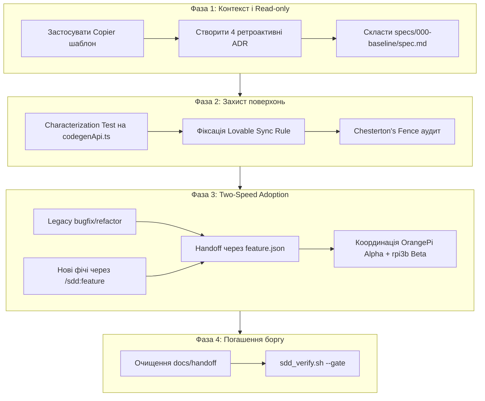

Ось готовий дослідницький звіт та рекомендації у форматі Markdown для впровадження SDD та ADR у проєкт `ai-drakon-scaffolder`.

***

# Дослідницький звіт та рекомендація: Впровадження SDD та ADR (MADR v3.x) у проєкт `ai-drakon-scaffolder`

**Статус проєкту:** Brownfield (на паузі через методологічний глухий кут)  
**Цільовий стек:** TypeScript, React, Vite, Cloudflare Pages/Workers, Appwrite, DRAKON JSON  
**Методологічна основа:** `sdd-universal-template` (Copier, MADR v3.x, Doubt-Driven Development, Two-Speed SDD)  
**Режим аналізу:** READ-ONLY (без прямих комітів у репозиторій)

---

## 1. Контекст і діагноз ситуації

Проєкт `ai-drakon-scaffolder` опинився в типовій brownfield-пастці: код та функціонал створювалися паралельно з різними експериментами (DRAKON-генерація, агентський флот на OrangePi/Raspberry Pi, Cloudflare Workers, Appwrite), але документація розпалася на кілька несумісних форматів:
1. **Дрейф живого контексту:** Контекст "втік" із каталогу `docs/handoff/` безпосередньо в корінь (`MASTER-CONTEXT.md`), залишивши в директорії документації мертві 1-байтові заглушки.
2. **Фрагментація агентських інструкцій:** Файли `CLAUDE.md`, `AGENTS.md`, `GEMINI.md` частково порожні, частково дублюють автозгенеровані інструкції, не маючи єдиного канонічного джерела істини (Single Source of Truth).
3. **Невикористаний капітал архітектурних рішень:** У `MASTER-CONTEXT.md` уже зафіксовані ключові рішення у вигляді структурованої таблиці, але вони не мають статусу ADR і ризикують бути втраченими або порушеними під час подальшого рефакторингу.

**Висновок:** Проєкт готовий до безболісного та швидкого переходу на `sdd-universal-template`. Це не переписування з нуля, а впорядкування наявного знання з фіксацією критичного шляху.

---

## 2. Аудит файлового ландшафту та мапінг переходів

### 2.1. Матриця трансформації файлів

| Поточний файл | Поточний стан | Цільова дія в SDD | Куди мігрує вміст / Нове місце |
| :--- | :--- | :--- | :--- |
| **`CLAUDE.md`** | 45 рядків, typo `<`, 100% авто-блок GitNexus | **Рефакторинг / Дедуплікація** | Залишається тонким клієнтським адаптером. Виправляється typo `<`, GitNexus-блок скорочується або лінкується на `AGENTS.md`. Додаються посилання на `.specify/constitution.md`. |
| **`AGENTS.md`** | 259 рядків, технічний довідник, дубль GitNexus | **Канонізація** | Стає головним хабом інструкцій агентів. Зберігає секції Overview, Features, Routing. GitNexus-блок оформлюється як канонічний. |
| **`GEMINI.md`** | 0 байт | **Видалення / Сімлінк** | Замінюється на коротке посилання на `AGENTS.md` або видаляється (якщо агент підтримує читання `AGENTS.md`). |
| **`docs/INDEX.md`** | 0 байт | **Генерація** | Заповнюється навігаційним індексом нової структури: посилання на `docs/adr/`, `docs/for-agents/`, `specs/`. |
| **`CONTEXT.md`** | 125 рядків, EN, DRAKON JSON, bundles, Lovable sync | **Міграція в Domain Docs** | Мігрує в `docs/for-agents/drakon-architecture.md`. Правило "Lovable sync rule" (`src/` $\rightarrow$ `.lovable/src/`) вноситься як інваріант у `.specify/constitution.md`. |
| **`MASTER-CONTEXT.md`** | 111 рядків, UA, таблиця рішень + флот агентів | **Розщеплення (Split)** | **1.** Таблиця рішень $\rightarrow$ ретроактивні ADR у `docs/adr/`.<br>**2.** Флот агентів (OrangePi Alpha + rpi3b Beta) $\rightarrow$ `docs/for-agents/agent-fleet.md`.<br>**3.** Сам файл видаляється або архівується. |
| **`docs/handoff/*`** | 1-байт заглушки (`sharon-uav-...`, `project-context-...`) | **Очищення** | Видаляються. Замість них координація переходить у формат `.specify/feature.json` та SDD-артефакти. |
| **`TASKS.md`** (якщо є) | Черга задач | **Міграція** | Задачі перетворюються на специфікації в `specs/` (або `specs/000-baseline/tasks.md`). |

---

### 2.2. Технічна дедуплікація GitNexus-блоку

Дублювання блоку `<!-- gitnexus:start --> ... <!-- gitnexus:end -->` між `CLAUDE.md` та `AGENTS.md` **не є архітектурною проблемою**. Це стандартний сайд-ефект автогенерації інструментом GitNexus.

**Рішення:**
* `AGENTS.md` містить повний канонічний блок GitNexus.
* `CLAUDE.md` містить короткий вказівник: `"Див. канонічні інструкції та правила графу в AGENTS.md"`, або стандартний мінімальний адаптер виклику.

---

## 3. Обґрунтування `enable_adr: true` та ретроактивні ADR

### 3.1. Чому `enable_adr: true` — безальтернативне "ТАК"
1. **Нульова вартість збору інформації:** Усі 4 ключові архітектурні рішення вже зібрані в таблиці `MASTER-CONTEXT.md`. Не треба проводити інтерв'ю чи згадувати історію — сирий матеріал готовий на 100%.
2. **MADR v3.x стандартизація:** Шаблонні поля (Context, Decision, Consequences, Alternatives) заповнюються автоматично з наявної таблиці за 15 хвилин.
3. **Захист від деградації:** Без фіксації цих рішень агенти ризикують порушити 15-хвилинний JWT-ліміт Appwrite або зламати механізм огинання cold starts через Cloudflare Workers.

### 3.2. Специфікація перших 4 ретроактивних ADR

```
docs/adr/
├── 0001-appwrite-student-plan-backend.md
├── 0002-cloudflare-workers-routing-auth.md
├── 0003-gitnexus-code-knowledge-graph.md
└── 0004-mempalace-vector-memory-sessions.md
```

#### Мапінг вмісту для генерації ADR:

1. **`docs/adr/0001-appwrite-student-plan-backend.md`**
   * *Title:* Вибір Appwrite Student Plan як основного BaaS бекенду
   * *Context:* Необхідна готова інфраструктура Auth, Database та Serverless Functions для взаємодії з AI-агентами.
   * *Decision:* Використати Appwrite Student Plan (Serverless functions: `drakon-codegen`, `semantic-graph`, `llm-gateway`).
   * *Alternatives considered:* AWS Lambda / ECS (надмірна складність адміністрування для поточної стадії).
   * *Status:* Accepted (Retroactive).

2. **`docs/adr/0002-cloudflare-workers-routing-auth.md`**
   * *Title:* Маршрутизація та обхід JWT-лімітів через Cloudflare Workers
   * *Context:* Appwrite JWT має ліміт життя 15 хвилин; прямі виклики функцій страждають від cold start.
   * *Decision:* Винести глобальну маршрутизацію, аутентифікацію та шлюз запитів на периферію Cloudflare Workers.
   * *Alternatives considered:* Внутрішня маршрутизація всередині Appwrite functions (неприйнятні затримки cold starts).
   * *Status:* Accepted (Retroactive).

3. **`docs/adr/0003-gitnexus-code-knowledge-graph.md`**
   * *Title:* Використання GitNexus для аналізу семантичного графу та blast radius
   * *Context:* При автоматичній генерації та рефакторингу коду AI-агентами необхідне точне знання залежностей і меж впливу.
   * *Decision:* Інтегрувати GitNexus для побудови графу коду та перевірки впливу (`impact()`, `detect_changes()`).
   * *Alternatives considered:* Класичний текстовий `grep`/`ripgrep` (відсутність розуміння AST та контексту).
   * *Status:* Accepted (Retroactive).

4. **`docs/adr/0004-mempalace-vector-memory-sessions.md`**
   * *Title:* Векторна пам'ять MemPalace (ChromaDB) для сесій та щоденників агентів
   * *Context:* Багатоагентна розробка вимагає збереження довготривалої пам'яті, щоденників сесій та швидкого семантичного пошуку.
   * *Decision:* Використати MemPalace на базі ChromaDB.
   * *Alternatives considered:* Реляційні таблиці SQL / Appwrite DB без векторного пошуку.
   * *Status:* Accepted (Retroactive).

---

## 4. Адаптований 4-фазний план Brownfield SDD для `ai-drakon-scaffolder`



### Фаза 1 — Контекст і Read-only аудит (День 1)
* **Дія:** Ініціалізація `sdd-universal-template` через `copier copy` з параметром `enable_adr: true`.
* **Deliverable:** `specs/000-baseline/spec.md`:
  * Фіксація поточної структури `.drakon` JSON (branch, action, question, address nodes з `CONTEXT.md`).
  * Фіксація Lovable sync контракту (`src/` $\leftrightarrow$ `.lovable/src/`).
  * Генерація `docs/adr/0001`–`0004` на базі таблиці `MASTER-CONTEXT.md`.
* **Принцип:** *Doubt-Driven Development* — будь-яке твердження в бейзлайні підтверджується цитатою `файл:рядок` (наприклад, критичний виклик `src/lib/codegen/codegenApi.ts:47-96`).

### Фаза 2 — Захист наявних поверхонь (Дні 2–3)
* **Критичний шлях:** Покриття тестами характеру (Characterization / Golden Master Tests) функції `generateDrakonCode` у `src/lib/codegen/codegenApi.ts:47-96`.
  * Фіксуємо реальні вхідні `.drakon` JSON-файли та перевіряємо, що згенерований TypeScript/JS код залишається ідентичним до байта.
* **Chesterton's Fence:** Заборона видалення "дивної" синхронізації з `.lovable/src/` без повного розуміння механізму білду Cloudflare Pages.

### Фаза 3 — Two-Speed Adoption (Дні 3–4)
* **Legacy-траєкторія:** Виправлення помилок та чистка кодогенератора тільки через `/sdd:bugfix` або `/sdd:refactor` з обов'язковим проходженням baseline-тестів.
* **New-Feature траєкторія:** Нові вузли DRAKON чи інтеграції — за повним циклом `/sdd:feature` (Spec $\rightarrow$ Plan $\rightarrow$ Tasks $\rightarrow$ Red-Green-Refactor).
* **Multi-Agent Coordination:**
  * Синхронізація між вузлами **OrangePi Alpha** (основний воркер) та **rpi3b Beta** (допоміжний агент) переноситься на рейки `.specify/feature.json` та `docs/for-agents/agent-fleet.md`.

### Фаза 4 — Погашення техборгу та автоматизовані ворота (День 5)
* Фізичне видалення порожніх файлів `docs/handoff/*.md`, `GEMINI.md`, `docs/INDEX.md` (після заміни на згенерований).
* Налаштування верифікатора: `bin/sdd_verify.sh --gate` для автоматичної перевірки відсутності незакритих задач і невалідованих ADR.

---

## 5. Оцінка трудовитрат

* **Загальний масштаб:** **1 робочий тиждень (3–5 днів)** для одного розробника/оператора з AI-агентом. Це **НЕ місячна робота**.
* **Розподіл зусиль:**
  * Шаблонізація та ADR: ~2 години.
  * Baseline Spec + мапінг документації: ~4 години.
  * Characterization тестування `codegenApi.ts`: 1–1.5 дні.
  * Налаштування мультиагентного флоту (`feature.json`): ~0.5 дня.

---

## 6. Конкретний перший крок на сьогодні

Виконати ініціалізацію шаблону в режимі brownfield поверх існуючого репозиторію `ai-drakon-scaffolder`:

```bash
# 1. Перебуваючи в корені ai-drakon-scaffolder, накатити шаблон через Copier
# (brownfield — не окремий параметр шаблону, а режим дій за
# docs/brownfield-migration-guide.md.jinja; project_mode у copier.yml не існує):
copier copy https://github.com/maxfraieho/sdd-universal-template . \
  --data enable_adr=true \
  --data project_name="ai-drakon-scaffolder"

# 2. Створити каталог для першого ретроактивного ADR:
mkdir -p docs/adr

# 3. Перенести таблицю з MASTER-CONTEXT.md у docs/adr/0001..0004
# (Використати згенерований docs/adr/template.md)

# 4. Створити бейзлайн-специфікацію:
mkdir -p specs/000-baseline
# Зафіксувати в specs/000-baseline/spec.md поточний стан codegenApi.ts:47-96
```

***

### 📌 Коротке резюме (Executive Summary)

Проєкт `ai-drakon-scaffolder` має високий рівень готовності до впровадження SDD та MADR v3.x, оскільки вся ключова інформація вже зібрана, але страждає від дезорганізації файлів. Головне архітектурне багатство — таблиця рішень у `MASTER-CONTEXT.md` — трансформується у 4 ретроактивні ADR (`Appwrite`, `Cloudflare Workers`, `GitNexus`, `MemPalace`), тому прапорець `enable_adr: true` є обов'язковим. Дублювання блоку GitNexus між `CLAUDE.md` та `AGENTS.md` вирішується простою дедуплікацією на користь `AGENTS.md`. Першочерговим інженерним захистом стане створення `specs/000-baseline/spec.md` та Characterization-тестів для критичного шляху генерації коду `src/lib/codegen/codegenApi.ts:47-96`. Повний перехід є компактною задачею обсягом в один робочий тиждень (3–5 днів), а першим практичним кроком є запуск `copier copy` з параметром `enable_adr=true`.
