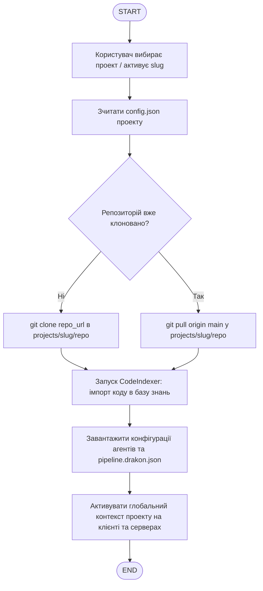

# Project Context Hub — дизайн єдиного джерела правди (Single Source of Truth)

> **Статус:** Концепт / Архітектурний дизайн (TASK-44)  
> **Контекст:** Вирішення проблеми ізольованості робочих просторів (workspaces) в AI-DRAKON платформі.  
> **Мета:** Об'єднати код, базу знань, агентів та пайплайни навколо поняття "Проект" (Project Context), синхронізованого на всіх рівнях та клієнтах.

## Семантичні зв'язки
[[handoff/_INDEX]] [[concept/03-architecture]]

---

## 1. Як це має працювати (UX Flow)

Наразі інтерфейси (агент-чат, DRAKON-редактор, code viewer) працюють ізольовано. Концепція **Project Context Hub** пропонує наскрізне перемикання проектів:

1. **Вхід в систему та вибір:** Користувач відкриває AI-DRAKON веб-інтерфейс. В header/top-bar відображається глобальний компонент `ProjectSelector`.
2. **Створення/Вибір проекту:** Користувач вибирає існуючий проект або створює новий, вказуючи унікальний текстовий ідентифікатор (`slug`, наприклад `sharon-uav`).
3. **Підключення джерела коду:** Користувач вказує URL до GitHub-репозиторію проекту та за необхідності `github_token`.
4. **Автоматична ініціалізація (під капотом):**
   - Платформа робить `git clone` репозиторію у спеціальну папку проекту.
   - Запускається сервіс `CodeIndexer`, який парсить кодову базу та розбиває її на чанки для бази знань (KB).
   - Зчитуються конфігурації агентів та їх пайплайнів (файли `*.drakon.json`).
5. **Єдиний робочий простір:** Після активації проекту всі вкладки (чат з архітектором, DRAKON-редактор схем, інтерфейс бази знань) автоматично перемикаються на контекст вибраного `slug`.
6. **Наскрізна зміна:** Якщо користувач змінює проект у `ProjectSelector`, вся платформа миттєво оновлює контекст (перевантажує активних агентів, оновлює файлове дерево та KB).

---

## 2. Структура даних проекту на сервері

Вся інформація про проект зберігається у файловій структурі на dev-сервері (`~/projects/{slug}/`):

```
~/projects/{slug}/
  config.json             # Метадані: slug, repo_url, github_token, created_at, etc.
  .last_sync              # Timestamp останньої успішної синхронізації з GitHub
  repo/                   # Клонована кодова база проекту (auto-sync з origin/main)
  agents/                 # Налаштування агентів проекту
    {agent_name}/
      pipeline.drakon.json  # DRAKON IR схема логіки агента
      kb/                 # Специфічні markdown-документи бази знань агента
```

---

## 3. Аналіз розбіжностей (Gap Analysis)

Щоб перетворити поточну реалізацію на повноцінний Project Context Hub, необхідно розробити такі компоненти:

| Компонент | Чого не вистачає зараз | Вплив на систему |
|-----------|------------------------|------------------|
| **Global Project Context** | Глобальний React context або Zustand store на фронтенді, який зберігає поточний `activeProjectSlug` та оновлює залежні компоненти. | Високий |
| **ProjectSelector UI** | Випадаючий список у верхній панелі (top-bar) для швидкого перемикання проектів + кнопка "Додати проект". | Середній |
| **Project CRUD API** | Ендпоінти `/projects` (list, create, update, delete) для керування `config.json`. | Високий |
| **Auto-Sync Service** | Сервіс на бекенді для клонування та періодичного `git pull` репозиторіїв у `projects/{slug}/repo`. | Високий |
| **Code Indexer** | Інструмент для автоматичного парсингу та імпорту файлів коду з `repo/` в `kb/` чанки (для використання через вбудований інструмент `search_kb`). | Середній |

---

## 4. DRAKON-схема для логіки "Project Load"

Нижче наведено текстовий опис логіки завантаження та ініціалізації проекту (Project Load Flow):



### Деталізований крок-за-кроком DRAKON Flow:
1. **Початок (START)**
2. **Вибір проекту:** Отримання `slug` через UI або API.
3. **Перевірка директорії:** Якщо папка `projects/{slug}/repo` порожня або відсутня:
   - *Гілка ТАК (потрібен клон):* Запустити процес `git clone` з використанням збережених `repo_url` та `github_token`.
   - *Гілка НІ (потрібне оновлення):* Виконати `git pull` для отримання свіжих комітів.
4. **Індексація коду:** `CodeIndexer` сканує файли коду (наприклад, `.py`, `.ts`, `.tsx`), створює семантичні текстові чанки та завантажує їх у SQLite FTS5 сховище для відповідних агентів.
5. **Завантаження агентів:** Зчитування JSON-файлів пайплайнів з папки `projects/{slug}/agents/`. hot-compile перевірка валідності графів.
6. **Активація контексту:** Оновлення стану в React додатку та оновлення системного контексту для backend-сервісів (архітектор, документатор, DRAKON API).
7. **Кінець (END)**

---

## 5. Пріоритет реалізації (Roadmap)

Впровадження системи має відбуватися ітеративно:

1. **Етап 1: React Project Context & CRUD API**
   - Створення Zustand стору або React Context для глобального збереження вибраного `activeProject`.
   - Реалізація API `/projects/{slug}/config` (GET/PUT) для роботи з конфігураційними файлами проектів.
2. **Етап 2: Авто-синхронізація (GitHub Sync)**
   - Реалізація фонового сервісу для клонування та оновлення коду.
   - Ендпоінт `POST /projects/{slug}/sync` для ручного тригеру оновлення кодовой бази.
3. **Етап 3: Інтеграція Code Indexer**
   - Розробка скрипта `services/shared/code_indexer.py`, який конвертує файли коду в маркдаун чанки.
   - Автоматичний запуск після синхронізації репозиторію.
4. **Етап 4: Клієнтська інтеграція (UI)**
   - Додавання компонента `ProjectSelector` у верхню панель.
   - Прив'язка файлового провідника та чату до активного `project_slug`.
