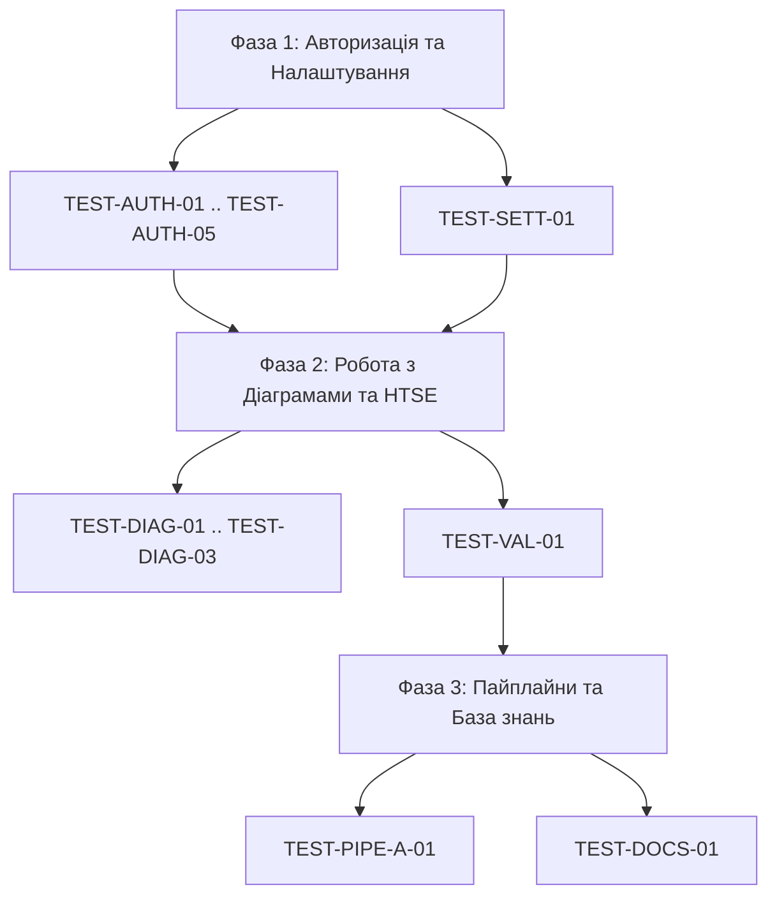

---
tags:
  - domain:plan
  - status:active
  - format:plan
created: 2026-05-26
updated: 2026-05-28
tier: 3
title: "План тестування PinchTab — Платформа AI-DRAKON"
lang: uk
---

# План тестування PinchTab — Платформа AI-DRAKON

> **Цільова адреса тестування:** [https://ai-drakon-scaffolder.pages.dev/](https://ai-drakon-scaffolder.pages.dev/)
> **Інструмент автоматизації:** PinchTab (емуляція браузера Chrome через CDP-протокол на хості 192.168.3.184)

Цей документ містить вичерпний покроковий архітектурний план автоматизованого тестування інтерфейсу користувача (UI) платформи **AI-DRAKON**. План орієнтований на розробника/агента (Клода), який буде писати безпосередні PinchTab-скрипти взаємодії з DOM-деревом React-додатку.

---

## 1. Загальні передумови та конфігурація тестування

Для успішного виконання тестування PinchTab має бути налаштований з наступними параметрами та оточенням:
1. **Базовий шлях (Base URL):** `https://ai-drakon-scaffolder.pages.dev/`
2. **Адреса Cloudflare Worker (API Proxy):** Налаштовується в локальному сховищі або через сторінку `/settings`. Поточний робочий проксі: `https://drakon-mcp-worker.maxfraieho.workers.dev`
3. **Локальні збереження (Local Storage):**
   - Токен авторизації: `clientJwt` (значення JWT, згенероване при успішній авторизації).
   - Налаштування підключення: `settings.workerUrl` (значення URL проксі-воркера).
   - Токен GitHub: `settings.github.token` (для взаємодії з репозиторіями через браузер коду).
   - Репозиторій GitHub: `settings.github.repo` (у форматі `owner/repo`).
4. **Тестовий обліковий запис:** Для перевірки авторизації використовується пароль, який генерує валідний JWT.

---

## 2. Карта маршрутів та DOM-взаємодії (PinchTab Blueprint)

Додаток побудований на базі **React 19**, **TanStack Router** та компонентів **shadcn/ui** (поверх Tailwind CSS). 
* Усі інтерактивні елементи (кнопки, інпути, вкладки) мають семантичні класи Tailwind або унікальні ідентифікатори/атрибути.
* Більшість сторінок обгорнуті в лейаут `WorkspaceShell.tsx`, який надає глобальний сайдбар навігації та шапку.

---

## 3. Детальні Тест-Кейси (Фаза 1)

### Категорія A: Авторизація та Захищені Маршрути (Protected Routes)

#### TEST-AUTH-01: Спроба доступу до кореня `/` без токена
- **Призначення:** Перевірити роботу авторизаційного посередника (Guard).
- **Передумови:** Очистити `localStorage` (`clientJwt` відсутній).
- **Кроки:**
  1. Викликати `pinchtab_navigate` на `https://ai-drakon-scaffolder.pages.dev/`.
  2. Зачекати завершення рендерингу (наприклад, 1000 мс).
- **Очікуваний результат:** 
  - Браузер виконує автоматичний редирект на `/login`.
  - Поточний URL у PinchTab має містити `/login`.
  - DOM-дерево містить заголовок `Вхід` або форму авторизації (пошук елемента `input[type="password"]`).
- **Перевірка:** `pinchtab_snapshot` + перевірка наявності поля введення пароля.

#### TEST-AUTH-02: Спроба доступу до захищеної сторінки `/diagrams` без токена
- **Призначення:** Запобігання несанкціонованому перегляду схем.
- **Передумови:** `localStorage` чистий.
- **Кроки:**
  1. Викликати `pinchtab_navigate` на `https://ai-drakon-scaffolder.pages.dev/diagrams`.
  2. Зачекати рендерингу.
- **Очікуваний результат:** Редирект на `/login`. Поле введення пароля присутнє.
- **Перевірка:** `pinchtab_snapshot`.

#### TEST-AUTH-03: Успішна авторизація з валідними даними
- **Призначення:** Перевірка повного циклу логіну.
- **Передумови:** Сторінка `/login` відкрита, `clientJwt` відсутній.
- **Кроки:**
  1. Знайти поле введення пароля: `input[type="password"]` або за placeholder `"Введіть пароль..."`.
  2. Викликати `pinchtab_fill` з тестовим паролем.
  3. Знайти кнопку входу (текст `"Увійти"` або селектор `button[type="submit"]`).
  4. Викликати `pinchtab_click` на кнопку.
  5. Зачекати виконання запиту до Worker API (до 2000 мс).
- **Очікуваний результат:**
  - Успішна відповідь від API.
  - Токен `clientJwt` записується в `localStorage`.
  - Автоматичний редирект на головну сторінку `/diagrams`.
  - Відображається інтерфейс редактора діаграм (наявність класу `.drakon-canvas` або елементів сайдбару).
- **Перевірка:** Отримання `localStorage.getItem('clientJwt')` через JS-вираз, перевірка поточного шляху браузера.

#### TEST-AUTH-04: Авторизація з некоректним паролем
- **Призначення:** Перевірка обробки помилок аутентифікації.
- **Передумови:** Відкрита сторінка `/login`.
- **Кроки:**
  1. Заповнити `input[type="password"]` невалідним значенням (наприклад, `wrong_pass`).
  2. Клікнути на кнопку `"Увійти"`.
  3. Зачекати відповіді.
- **Очікуваний результат:**
  - URL залишається `/login`.
  - Токен `clientJwt` не з’являється в сховищі.
  - На екрані з'являється повідомлення про помилку з текстом `"Невірний пароль"` або схожим (елемент з класом `text-destructive` або `div[role="alert"]`).
- **Перевірка:** Знімок екрана + `pinchtab_get_text` з алерт-контейнера.

---

### Категорія B: Головна Сторінка та Редактор (`/diagrams`)

#### TEST-DIAG-01: Рендеринг інтерфейсу за замовчуванням
- **Призначення:** Перевірка цілісності робочого простору.
- **Передумови:** Авторизовано (наявність `clientJwt`), перехід на `/diagrams`.
- **Кроки:**
  1. Викликати `pinchtab_navigate` на `/diagrams`.
  2. Перевірити наявність основних зон макета.
- **Очікуваний результат:**
  - Ліва панель `DiagramsLeftPanel` присутня (клас `.diagrams-left-panel` або пошук тексту `"Схеми"`).
  - Центральна зона полотна `DrakonEditor` активна (пошук тегу `canvas` або контейнера з ID `drakon-widget-container`).
  - Нижній тулбар `CanvasToolbar` присутній (кнопки масштабу, експорту).
  - Глобальна навігація (сайдбар) містить посилання на `/agents`, `/settings`, `/docs`.
- **Перевірка:** Пошук відповідних DOM-селекторів.

#### TEST-DIAG-02: Створення нової схеми (Local Storage & DOM)
- **Призначення:** Тестування локального CRUD діаграм.
- **Передумови:** Знаходження на `/diagrams`.
- **Кроки:**
  1. Клікнути на кнопку `"Нова схема"` (`button` з текстом `"Нова схема"` або іконкою `Plus`).
  2. У діалоговому вікні введення назви (Dialog/Modal) знайти текстове поле `input` та заповнити його значенням `Test Diagram 1`.
  3. Натиснути кнопку `"Створити"` (`button` в модальному вікні).
- **Очікуваний результат:**
  - Модальне вікно закривається.
  - У лівій панелі з'являється новий елемент списку з текстом `Test Diagram 1`.
  - Полотно оновлюється — відображається базова схема (заголовок `Test Diagram 1` та обов'язковий початковий блок `b0`).
- **Перевірка:** Перевірка оновлення масиву в `localStorage.getItem('diagram-storage')`.

#### TEST-DIAG-03: Перевірка локалізації інтерфейсу (UA strict)
- **Призначення:** Верифікація правильної мови інтерфейсу для критичних кнопок.
- **Передумови:** Відкрита будь-яка схема в редакторі.
- **Кроки:**
  1. Просканувати DOM-дерево в зоні панелі інструментів (`CanvasToolbar`) та бічних панелей.
- **Очікуваний результат:**
  - Наявність кнопок з точним текстом: `"Зберегти"`, `"Псевдокод"`, `"Експорт JSON"`, `"Зберегти як PNG"`.
  - Відсутність англомовних плейсхолдерів чи залишків на кшталт `Save`, `Export`, `Pseudo`.
- **Перевірка:** Пошук елементів через `pinchtab_get_text` або XPath `/descendant::button[text()="Зберегти"]`.

---

### Категорія C: Взаємодія з ДРАКОН-нотацією та валідація (HTSE)

#### TEST-VAL-01: Генерація помилок геометричної валідації (Dangling Pointers)
- **Призначення:** Тестування системи виявлення помилок у схемі (HTSE).
- **Передумови:** Відкрита схема в редакторі, активована панель валідації (`ValidationPanel`).
- **Кроки:**
  1. Через інтерфейс редактора (або шляхом прямої мутації через `DrakonIrPanel` для прискорення тесту) видалити ребро зв'язку між дією та кінцевим вузлом (створення dangling pointer).
  2. Зачекати спрацювання валідатора (зазвичай автоматично при зміні IR-дерева).
- **Очікуваний результат:**
  - На полотні біля пошкодженого вузла рендериться візуальний маркер помилки (Validation Chip).
  - Внизу екрану в `ValidationPanel` з'являється запис про помилку: код `DANGLING_POINTER`, рівень `error`, та опис українською мовою.
- **Перевірка:** Пошук елементів з атрибутами `data-node-error` або тексту `"Непідключений зв'язок"`.

---

### Категорія D: Інтеграція Pipeline A (Код → DRAKON IR)

#### TEST-PIPE-A-01: Повний цикл аналізу коду Python
- **Призначення:** Тестування асинхронного парсингу AST та генерації IR.
- **Передумови:** Відкрита вкладка `CodeAnalysisPanel` (Pipeline A) на сторінці `/diagrams` або перехід на `/code`.
- **Кроки:**
  1. Знайти текстову область введення коду (текстове поле Monaco Editor або проста `textarea` у бічній панелі).
  2. Заповнити область валідним Python-кодом:
     ```python
     def calculate_sum(a, b):
         if a > 0:
             return a + b
         else:
             return b
     ```
  3. Клікнути на кнопку `"Аналізувати"` (`button` з текстом `"Аналізувати"` або `"Analyze"`).
  4. Емулювати очікування (PinchTab чекає завершення асинхронного джоба).
- **Очікуваний результат:**
  - Надіслано POST-запит до Worker `/v1/pipeline/analyze`.
  - Отримано `job_id`. Відображається лоадер прогресу (текст `"Аналіз коду..."`).
  - Після завершення джоба (успішний статус від `/v1/pipeline/status/:id`):
    - Створене IR JSON відображається в `DrakonIrPanel`.
    - Згенерована схема `calculate_sum` рендериться на полотні `DrakonEditor`.
    - Схема містить гілку `b0`, блок умови `a > 0?` з гілками `Так` (один) та `Ні` (два).
- **Перевірка:** Screenshot полотна + перевірка наявності ключа `calculate_sum` у дереві схем.

---

### Категорія E: Налаштування (`/settings`)

#### TEST-SETT-01: Конфігурація Worker API та збереження стану
- **Призначення:** Перевірка персистентності налаштувань.
- **Передумови:** Авторизовано, перехід на `/settings`.
- **Кроки:**
  1. Знайти текстове поле `"Worker URL"` (селектор `input[name="workerUrl"]` або за плейсхолдером).
  2. Заповнити новим значенням: `https://test-worker-url.workers.dev`.
  3. Знайти текстове поле `"GitHub Token"`. Заповнити тестовим токеном.
  4. Клікнути на кнопку `"Зберегти налаштування"` (або кнопку `Save` в тулбарі).
  5. Перезавантажити сторінку (`pinchtab_navigate` на `/settings` повторно).
- **Очікуваний результат:**
  - Нові значення успішно збереглися в локальному сховищі (`settings.workerUrl` містить `https://test-worker-url.workers.dev`).
  - Після перезавантаження поля вводу відображають збережені значення.
- **Перевірка:** Зчитування значень з полів + перевірка `localStorage.getItem('settings.workerUrl')`.

---

### Категорія F: Сторінка документації (`/docs` — DQL & Markdown)

#### TEST-DOCS-01: Запуск DQL-запиту через docs-agent
- **Призначення:** Перевірка інтеграції DQL-пошуку.
- **Передумови:** Авторизовано, перехід на `/docs`.
- **Кроки:**
  1. Переконатися, що активна вкладка `"Генератор"` або інструмент пошуку.
  2. У полі введення DQL-запиту (`input` або `textarea` пошуку) ввести команду:
     `LIST FROM "docs" LIMIT 3`
  3. Клікнути кнопку `"Виконати запит"` або `"Пошук"`.
- **Очікуваний результат:**
  - Відправлено POST-запит до `/docs/dataview/query`.
  - Результат відображається у вигляді списку знайдених Markdown-файлів (наприклад, `docs/INDEX.md`, `docs/ui-pages-reference.md`).
  - Кожен рядок є клікабельним посиланням.
- **Перевірка:** `pinchtab_get_text` на результатах пошуку (перевірити наявність принаймні одного відомого заголовка).

---

## 4. Карта пріоритетів та черга запуску тестів

Тестування рекомендується запускати у три фази для забезпечення логічної послідовності:



* **Пріоритет 1 (Критичний):** Авторизація, захист маршрутів, створення діаграм, перевірка локалізації.
* **Пріоритет 2 (Високий):** Робота валідатора (HTSE), робота Pipeline A (код → IR).
* **Пріоритет 3 (Середній):** Сторінка `/settings`, DQL-запити до бази знань, перехід між вкладками без втрати сесії.

---

## 5. Методологія автоматизації для PinchTab (CDP селектори)

Під час написання автоматизованих скриптів Клод має використовувати такі специфічні селектори DOM:
1. **Елементи полотна (Canvas):** 
   - Контейнер відмальовки: `#drakon-widget-container`
   - Елементи SVG/Canvas: всередині `.drakon-canvas`
2. **Панель вводу коду (Pipeline A):**
   - Сайдбар: `.code-analysis-panel`
   - Кнопка запуску: `button[data-action="analyze"]` або XPath `//button[contains(., "Аналізувати")]`
3. **Панель налаштувань:**
   - Поле лінку воркеру: `input[name="settings.workerUrl"]`
   - Кнопка збереження: `button[data-testid="save-settings"]`
4. **Сайдбар навігації:**
   - Посилання: `a[href="/diagrams"]`, `a[href="/agents"]`, `a[href="/settings"]`

---

## Семантичні зв'язки

**Цей документ є частиною:** [[plans/_INDEX]]
**Цей документ пов'язаний з:**
- [[plans/2026-05-22-platform-redesign]] — Редізайн платформи AI-DRAKON — План реалізації
- [[plans/pinchtab-test-results-extended-2026-05-26]] — Розширені результати тестування PinchTab
**Читати далі:** [[plans/pinchtab-test-results-extended-2026-05-26]]
