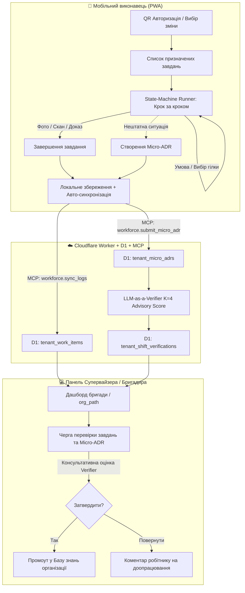

# План редизайну інтерфейсу та реалізації Slice 5.1: Organizational AI Workforce

Цей документ фіксує результати глибокого аналізу існуючого інтерфейсу `ai-drakon-scaffolder`, усунення його недоліків для масового користувача та детальний план розробки за методологією **`notebooklm-gitnexus-copilot`** з розбиттям на **Атомарні Робочі Пакети (Atomic Work Packets)**.

---

## 1. Аудит проблем існуючого інтерфейсу

| Існуюча проблема | Причина | Рішення для нового інтерфейсу |
| :--- | :--- | :--- |
| **Когнітивне перевантаження** | Інтерфейс створювався для AI-інженерів: на панелях терміни `AgentStudio`, `Codegen`, `N8NAutomations`, `PlayPipe`, `Harness`. | **Розділення режимів:** Класичний Dev-режим приховується для масових користувачів. Новий робочий простір має просту термінологію: «Зміна», «Завдання», «Бригада», «Польова нотатка». |
| **Непридатність графа на мобільних пристроях** | Повний редактор схем на канвасі (`DiagramEditorPage`) неможливо комфортно використовувати зі смартфона на виробництві чи об'єкті. | **State-Machine Step Runner:** Замість канвасу показується *тільки поточний вузол* з чіткою дією, кнопками вибору умов та фіксацією фотопідтвердження. |
| **Відсутність ієрархії підрозділів** | Організація сприймалася як плаский список. Немає візуалізації підрозділів / бригад (`org_path`). | **Організаційне дерево:** Простий ієрархічний навігатор підрозділів з можливістю делегованого запрошення учасників за QR-кодом. |
| **Складність фіксації польових рішень** | ADR-документи вимагали знання інженерної розмітки. | **Micro-ADR модальне вікно (3 поля):** «Що сталось?» → «Що зроблено?» → «Який результат?» + завантаження фото/скану. |
| **Залежність від постійної мережі** | Веб-клієнт не мав локальної черги операцій при зникненні інтернет-з'єднання. | **Офлайн-черга (IndexedDB/Zustand):** Повне проходження кроків та збір доказів офлайн з фоновою синхронізацією при відновленні мережі. |

---

## 2. Цільова архітектура користувацьких потоків (Target UX Flow)



---

## 3. Розбиття на Атомарні Робочі Пакети (Atomic Work Packets)

Ці пакети підготовлені для прямої реалізації в Claude згідно з `notebooklm-gitnexus-copilot` методологією (1–3 файли на пакет, ізольована перевірка).

```
                        ПОРЯДОК РЕАЛІЗАЦІЇ ПАКЕТІВ
 ┌────────────────┐     ┌────────────────┐     ┌────────────────┐
 │   ПАКЕТ 1      │ ──► │   ПАКЕТ 2      │ ──► │   ПАКЕТ 3      │
 │ Backend / D1   │     │ State Store    │     │ State-Machine  │
 │ Таблиці & Repo │     │ & Offline Sync │     │ Step Runner UI │
 └────────────────┘     └────────────────┘     └────────────────┘
                                                       │
 ┌────────────────┐     ┌────────────────┐             │
 │   ПАКЕТ 5      │ ◄── │   ПАКЕТ 4      │ ◄───────────┘
 │ Supervisor     │     │ Micro-ADR      │
 │ Review Queue   │     │ Польовий логер │
 └────────────────┘     └────────────────┘
```

---

### 📦 ПАКЕТ 1: Backend D1 Міграції та Tenancy Repository
* **Ціль:** Створити таблиці для воркфорсу та безпечний репозиторій з конструкторною ізоляцією `org_path`.
* **Файли:**
  1. `infrastructure/d1/migrations/002-workforce-tables.sql` (створення `tenant_members`, `tenant_work_items`, `tenant_micro_adrs`).
  2. `packages/tenancy/src/repositories/ScopedWorkItemRepository.ts`
  3. `packages/tenancy/src/repositories/ScopedMicroAdrRepository.ts`
* **Критерій перевірки:** Тест на ізоляцію `org_path` (запити з префіксом `/brigadeA/` не повертають записи з `/brigadeB/`).

---

### 📦 ПАКЕТ 2: Zustand Store та Офлайн-шар мобільного клієнта
* **Ціль:** Створити стан для ведення зміни, кешування кроків схем та черги синхронізації.
* **Файли:**
  1. `src/types/workforce.ts` (інтерфейси для `WorkItem`, `DrakonStepState`, `MicroAdrEntry`, `EvidenceArtifact`).
  2. `src/store/useWorkforceStore.ts` (управління активною зміною, офлайн-чергою та історією кроків).
* **Критерій перевірки:** Збереження стану в `localStorage`/`IndexedDB` при відключенні мережі та виклик синхронізатора при подіях `online`.

---

### 📦 ПАКЕТ 3: UI-компонент State-Machine Step Runner
* **Ціль:** Покроковий інтерфейс проходження діаграм DRAKON для смартфона.
* **Файли:**
  1. `src/components/workforce/DrakonStepRunner.tsx` (відображення поточного вузла, інструкції, кнопок переходу).
  2. `src/components/workforce/EvidenceCapture.tsx` (блок додавання фотографії, скану або числового значення з датчика).
  3. `src/routes/workforce/shift.tsx` (мобільний маршрут "Моя зміна").
* **Критерій перевірки:** Користувач бачить лише поточний вузол, натискання на кнопку вибору гілки коректно змінює `current_step_id` відповідно до графу DRAKON IR.

---

### 📦 ПАКЕТ 4: Швидкий логер Micro-ADR для польових нотаток
* **Ціль:** Форма швидкої фіксації польового досвіду при виявленні неполадок/відхилень.
* **Файли:**
  1. `src/components/workforce/MicroAdrDialog.tsx` (форма з 3 полями: Контекст, Дія, Результат + фото).
  2. `src/components/workforce/OfflineSyncBanner.tsx` (статус-бар синхронізації).
* **Критерій перевірки:** Створена нотатка зберігається в локальний масив зі статусом `PENDING_REVIEW` та потрапляє в чергу відправки.

---

### 📦 ПАКЕТ 5: Панель Супервайзера та Черга Верифікації (Review Queue)
* **Ціль:** Інтерфейс для бригадира/ліда для перегляду виконаних завдань та затвердження польових нотаток у Базу знань.
* **Файли:**
  1. `src/components/workforce/review/VerificationQueue.tsx`
  2. `src/components/workforce/review/VerifierScoreBadge.tsx` (візуалізація консультативного скорингу K=4 від LLM-as-a-Verifier).
  3. `src/routes/workforce/review.tsx`
* **Критерій перевірки:** Супервайзер може в один клік переглянути докази робітника, оцінку верифікатора та натиснути "Затвердити" (статус стає `PROMOTED`).

---

## 4. Інструкція для відновлення кодингу в Claude

Коли сесія Claude буде відновлена, достатньо надати таку коротку команду для старту:

```markdown
Продовжуємо роботу над AI-DRAKON Workforce Vision за планом з WORKFORCE-UI-AND-SLICE5-PLAN.md.
Використовуй навичку notebooklm-gitnexus-copilot і записник 08ddaf87-5d8f-413b-8246-9d80bb1cc94d.
Починаємо з ПАКЕТУ 1: Backend D1 Міграції та Tenancy Repository.
```
