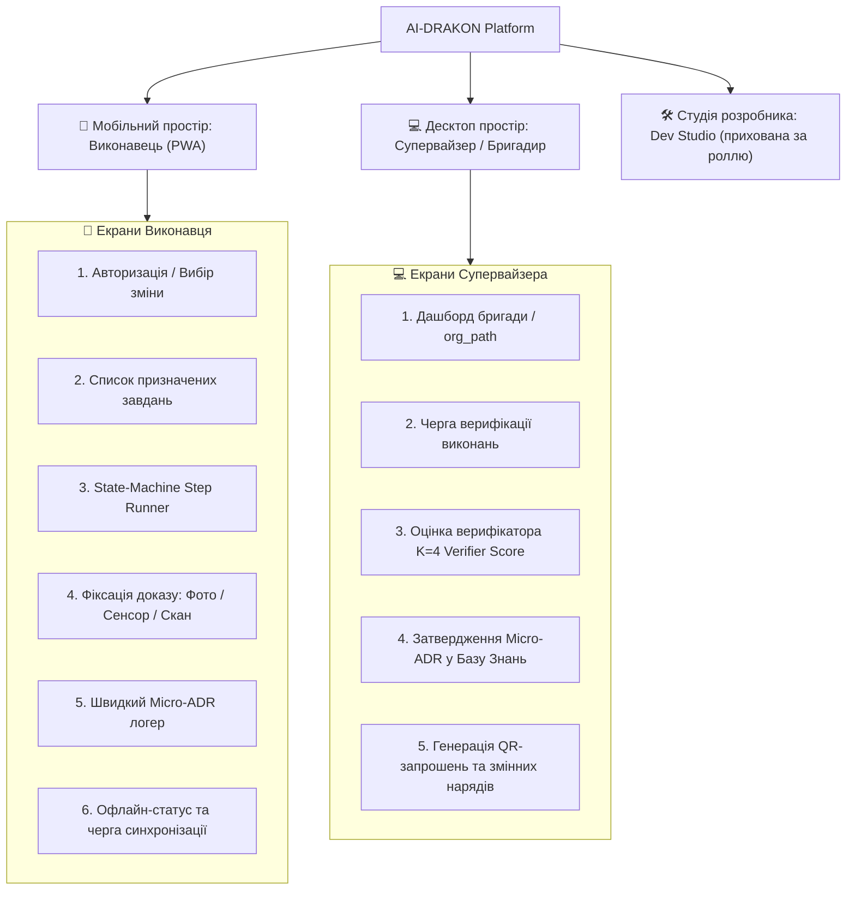

# Специфікація та план редизайну користувацького інтерфейсу: AI-DRAKON Workforce Vision

> **Базовий документ:** [ADR-0026: Organizational AI Workforce Vision](file:///home/vokov/workspace/ai-drakon-scaffolder/docs/adr/0026-organizational-ai-workforce-vision.md)  
> **Мета:** Трансформація інтерфейсу `ai-drakon-scaffolder` з інструменту суто для AI-інженерів у дворівневу операційну систему для масових польових виконавців (Worker PWA) та керівників/супервайзерів (Supervisor Review), зберігаючи інженерний Dev Studio як окремий режим.

---

## 1. Аудит проблем існуючого інтерфейсу та вектор трансформації

| Область | Існуючий стан (As-Is) | Проблема для польового/масового користувача | Нове дизайн-рішення (To-Be) |
| :--- | :--- | :--- | :--- |
| **Когнітивне навантаження** | Всі панелі та терміни відкриті одразу: `AgentStudio`, `Codegen`, `PlayPipe`, `N8NAutomations`, `Harness`. | Звичайний робітник або бригадир губиться серед інженерних концептів. | **Розділення робочих просторів:** Для робітника — простий інтерфейс *«Зміна»*, *«Завдання»*, *«Польова нотатка»*. Dev-панелі доступні лише в режимі розробника. |
| **Візуалізація алгоритмів** | Повний канвас діаграми (`DiagramEditorPage`) з масштабуванням і перетягуванням. | На екрані смартфона в цеху чи на виїзді неможливо орієнтуватися по великому графу. | **State-Machine Step Runner:** Відображення **лише одного активного вузла** у вигляді картки кроку з великими кнопками переходу. |
| **Фіксація відхилень та рішень** | Створення складних Markdown-документів формату ADR з інженерними секціями. | Займає забагато часу і вимагає навичок технічного письма. | **Micro-ADR модалка (3 поля):** «Що сталось?» → «Що зроблено?» → «Який результат?» + швидке фото/скан. |
| **Мережева залежність** | Клієнт очікує стабільного з'єднання з API/MCP. | Втрата зв'язку на об'єкті блокує роботу або призводить до втрати внесених даних. | **Offline-First PWA (IndexedDB + Zustand):** Локальне кешування схеми, черга дій офлайн та автосинхронізація у фоні. |
| **Організаційна структура** | Плоский список сутностей або проєктів. | Немає прив'язки до підрозділів, змін, бригад (`org_path`). | **Організаційне дерево та змінні:** Ієрархічний навігатор підрозділів з авторизацією через QR-код. |

---

## 2. Цільова інформаційна архітектура (Information Architecture)



---

## 3. Детальна специфікація компонентів та екранів

### 3.1. Мобільний виконавець: State-Machine Step Runner
* **Компонент:** `src/components/workforce/DrakonStepRunner.tsx`
* **Призначення:** Покрокове виконання стандартних операційних процедур (SOP), описаних у форматі DRAKON IR.
* **Елементи UI:**
  1. **Header:** Назва поточного завдання, індикатор прогресу (крок $N$ із $M$), бейдж офлайн/онлайн.
  2. **Step Card:**
     - Заголовок та тип поточного вузла (`ACTION`, `QUESTION`, `SELECT`).
     - Текст інструкції з виділенням ключових дій.
     - Додаткові підказки (приховані за акордеоном «Довідка»).
  3. **Action Area (Дії робітника):**
     - Для `ACTION`: Велика кнопка «Виконано / Наступний крок».
     - Для `QUESTION` (розгалуження): Кнопки вибору умов (наприклад: *«Так / Справно»* (зелена), *«Ні / Відхилення»* (бурштинова)).
  4. **Evidence Trigger:** Кнопка «Додати фото / скан» (обов'язкова для вузлів з вимогою верифікації).
  5. **Emergency Button:** Плаваюча кнопка «Повідомити про відхилення (Micro-ADR)».

### 3.2. Компонент збору доказів: Evidence Capture
* **Компонент:** `src/components/workforce/EvidenceCapture.tsx`
* **Призначення:** Фіксація артефактів підтвердження якості виконання операції.
* **Підтримувані типи доказів:**
  - Фотографія з камери смартфона (зі стисненням на клієнті).
  - Скан штрих-коду / QR-коду деталі або обладнання.
  - Числове значення з датчика / приладу (з перевіркою допустимого діапазону).
  - Текстовий коментар.
* **Автоматичні метадані:** Автоматичне додавання мітки часу (ISO 8601), ідентифікатора робітника та `current_step_id`.

### 3.3. Швидкий польовий логер: Micro-ADR Dialog
* **Компонент:** `src/components/workforce/MicroAdrDialog.tsx`
* **Призначення:** Фіксація нестандартних ситуацій та рішень у 3 простих кроки.
* **Поля форми:**
  1. **«Що виявлено / Контекст»** (1–2 речення або вибір типової проблеми зі списку).
  2. **«Що зроблено / Рішення»** (опис прийнятого оперативного рішення).
  3. **«Результат / Пропозиція»** (наслідки дії та рекомендація для зміни SOP).
  4. **Прикріплення медіа** (фото дефекту / виправлення).
* **Логіка збереження:** Запис одразу зберігається у локальний масив зі статусом `PENDING_SUPERVISOR_REVIEW` і додається до черги вивантаження.

### 3.4. Офлайн-шар та банер синхронізації
* **Компонент:** `src/components/workforce/OfflineSyncBanner.tsx` + `src/store/useWorkforceStore.ts`
* **Статуси синхронізації:**
  - 🟢 **Онлайн:** Усі дані збережено на сервері.
  - 🟡 **Офлайн:** Працює локально, $N$ дій очікують синхронізації.
  - 🔵 **Синхронізація...:** Відбувається передача локальних подій на Cloudflare Worker D1.
  - 🔴 **Помилка:** Конфлікт або помилка мережі, можливість повторити вручну.

### 3.5. Панель Супервайзера: Черга верифікації (Review Queue)
* **Компонент:** `src/components/workforce/review/VerificationQueue.tsx`
* **Призначення:** Контроль роботи бригади, перевірка доказів та затвердження польових Micro-ADR у Базу знань організації.
* **Елементи інтерфейсу:**
  1. **Фільтр підрозділу (`org_path`):** Перегляд завдань конкретної бригади або цеху.
  2. **Картка перевірки:**
     - ПІБ робітника, назва схеми, час виконання.
     - Перегляд прикріплених фото та метрик у режимі галереї.
     - **Бейдж верифікатора (`VerifierScoreBadge`):** Консультативна оцінка від `LLM-as-a-Verifier` (K=4) з кольоровою шкалою (0–100%) та стислим текстовим обґрунтуванням відповідності SOP.
  3. **Панель дій супервайзера:**
     - Кнопка **«Затвердити»** (переводить статус у `PROMOTED` та додає до знань підрозділу).
     - Кнопка **«Повернути на доопрацювання»** (з обов'язковим коментарем для робітника).
     - Кнопка **«Відхилити»**.

---

## 4. Дизайн-система та ергономіка інтерфейсу

```
                         МОБІЛЬНА ЕРГОНОМІКА (PWA)
  ┌───────────────────────────────────────────────────────────┐
  │ [=] Бригада №3 / Зміна А            (🟢 Онлайн) [Профіль] │
  ├───────────────────────────────────────────────────────────┤
  │ Прогрес зміни: [████████████░░░░░░] 60% (3/5 завдань)     │
  ├───────────────────────────────────────────────────────────┤
  │                                                           │
  │   ВУЗОЛ 4: Перевірка тиску в гідросистемі                 │
  │   ──────────────────────────────────                      │
  │   Звірте показник манометра на вузлі В-12.                │
  │   Норма: 140-160 бар.                                     │
  │                                                           │
  │   [ 📷 Додати фото манометра (Обов'язково) ]              │
  │                                                           │
  │   ┌───────────────────────────────────────────────────┐   │
  │   │          [ ТИСК В НОРМІ (140-160 бар) ]           │   │  <-- Touch Target ≥ 52px
  │   └───────────────────────────────────────────────────┘   │
  │   ┌───────────────────────────────────────────────────┐   │
  │   │          [ ВІДХИЛЕННЯ / ТИСК ПОЗА НОРМОЮ ]        │   │
  │   └───────────────────────────────────────────────────┘   │
  │                                                           │
  ├───────────────────────────────────────────────────────────┤
  │ [ ⚠️ Зафіксувати Micro-ADR ]     [ 📋 Всі мої завдання ]  │
  └───────────────────────────────────────────────────────────┘
```

### Ключові ергономічні правила:
1. **Touch Targets:** Усі активні елементи (кнопки переходу, вибору умов, фотокамери) мають висоту не менше **52px** для зручної роботи в рукавицях або на ходу.
2. **Контрастність:** Підтримка High-Contrast режиму для читабельності на відкритому сонці.
3. **Мінімум текстового вводу:** Заміна текстових полів на селектори, слайдери діапазонів або фотофіксацію.

---

## 5. План поетапної реалізації (Roadmap)

### 🔹 Фаза 1: Стан та офлайн-сховище (UI Core)
- [ ] Опис TypeScript-інтерфейсів (`src/types/workforce.ts`).
- [ ] Створення Zustand Store з підтримкою IndexedDB (`src/store/useWorkforceStore.ts`).
- [ ] Реалізація черги синхронізації та обробника подій `online`/`offline`.

### 🔹 Фаза 2: Мобільний раннер (Worker Flow)
- [ ] Створення `DrakonStepRunner.tsx` з підтримкою вузлів DRAKON IR.
- [ ] Розробка `EvidenceCapture.tsx` (фото/скан/метрики).
- [ ] Маршрут мобільної зміни `src/routes/workforce/shift.tsx`.
- [ ] Модальне вікно `MicroAdrDialog.tsx`.

### 🔹 Фаза 3: Панель Супервайзера (Supervisor Flow)
- [ ] Розробка черги верифікацій `VerificationQueue.tsx`.
- [ ] Компонент оцінки `VerifierScoreBadge.tsx` (K=4 Verifier).
- [ ] Маршрут рев'ю `src/routes/workforce/review.tsx` та фільтрація за `org_path`.

### 🔹 Фаза 4: Інтеграція та навігаційний перемикач
- [ ] Додавання швидкого перемикача просторів (Worker / Supervisor / Dev Studio).
- [ ] Інтеграційне тестування офлайн-режиму та синхронізації з D1.
