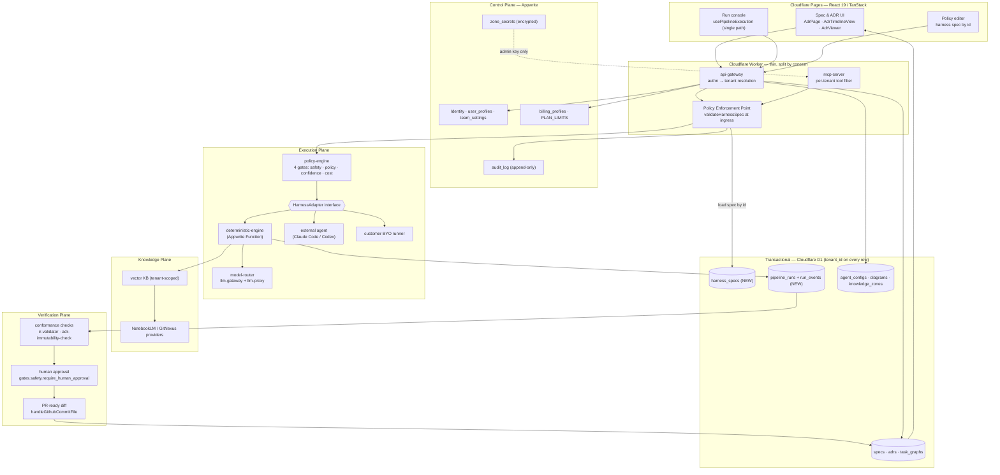

# ai-drakon-scaffolder — Architecture & Restructuring Analysis

**Repository:** `ai-drakon-scaffolder` (https://github.com/maxfraieho/ai-drakon-scaffolder)
**Local clone analysed:** `/home/vokov/projects/ai-drakon-scaffolder`
**Analysis date:** 2026-08-20
**Analyst role:** principal architect / platform restructuring lead
**Target product framing:** *A spec-driven meta-harness SaaS for engineering teams that turns specifications, architecture rules, knowledge assets, and policy logic into governed multi-agent software delivery workflows.*

---

## Evidence provenance and two corrections to the brief

Every claim below is tagged so a reader can tell verified fact from inference:

- **[READ]** — verified by direct file read of the local clone at HEAD.
- **[GN]** — from GitNexus MCP (`query` / `context`), index built from `origin/main`.
- **[INFER]** — my reasoning on top of the above, not directly observed.

Two starting assumptions in the brief were wrong and must be corrected before anything is built on them:

| Brief said | Reality | Evidence |
|---|---|---|
| `cloudflare-worker/worker-mcp-drakon.js` is "2100+ lines" | It is **4730 lines** | [READ] `wc -l` |
| `src/lib/adr/parser.ts` exists in the working tree | It **does not exist on the checked-out branch** | [READ] file not found; `find` for `*adr*` returns nothing outside `.git` |

The second correction is the more serious one, and it is the first structural finding of this report.

### Finding 0 — the repository is split across two divergent branches

[READ] `.git/HEAD` → `ref: refs/heads/feature/astryx-ui`. The working tree is on `feature/astryx-ui`. [READ] `.git/refs/heads` contains `main` and `feature/astryx-ui`; `.git/packed-refs` carries `origin/main` at `f0019133b4b3adfa59b26db877066589b2967edb`.

The entire ADR / SSD / spec apparatus the project owner describes as "already added" exists **only on `main`**, and the GitNexus index was built from `main`. [GN] confirms these paths, none of which are present in the checked-out tree:

- `src/lib/adr/parser.ts` (`parseAdr` L84–106, `parseFrontmatter` L37, `normalizeStatus` L62–71, `extractTitle` L76–79, `fetchAdr` L134–139, `fetchAllAdrs` L144–152)
- `src/components/adr/AdrTimelineView.tsx` (L36–310), `src/components/adr/AdrViewer.tsx` (`ImmutabilityBanner` L12–55, `AdrViewer` L315–469)
- `src/pages/AdrPage.tsx` (L5–13)
- `docs/adr/0015-drakon-embedded-adr-documentation.md`, `docs/adr/assets/README.md`
- `specs/004-adr-drakon-integration/plan.md`
- `docs/sdd-book/00-overview.md`, `docs/sdd-book/0014-pilot-project-vydra-swiss-survey.md`
- `scripts/adr-immutability-check.sh`

Meanwhile the checked-out `feature/astryx-ui` branch carries a full design-system migration (Astryx tokens, `WorkspaceShell`, `AstryxHeader`, `AstryxSideNav` — per the project's own `CLAUDE.md`) plus `src/styles/astryx.css` and `src/components/astryx/` [READ].

So the governance layer (ADRs, specs, immutability enforcement) and the product shell (UI framework) are being developed on **different branches that have never been reconciled**. This is not a cosmetic problem. It means the architecture memory the product is supposed to be *built on* is invisible to the branch the product is *built in*. Merging these two branches is a precondition for every recommendation in this document, and it is Phase 0 task #1.

---

# 1. Executive Reframe

## 1.1 What this project currently appears to be

`ai-drakon-scaffolder` is, today, **a single-tenant personal AI engineering workbench that has accreted a SaaS-shaped skeleton around it.** It is not a product; it is a very capable workshop that several unrelated products have been built inside.

Concretely, four distinct things share one repository:

1. **A DRAKON visual-programming IDE.** The strongest and most coherent part. A canonical intermediate representation (`src/lib/htse/ir-schema.ts`, `ir-types.ts`, `ir-validator-core.ts`, `diagram-to-ir.ts`, `ir-to-diagram.ts`), an editor (`src/components/drakon/DrakonEditor.tsx`, ~700+ lines), diffing (`src/lib/drakon/diff.ts`), history (`history.ts`), and pseudocode rendering (`pseudocode.ts`) [READ].

2. **A multi-agent execution substrate.** `services/` holds 15 service directories [READ]: four Python FastAPI agents (`architect-agent`, `docs-agent`, `drakon-agent`, `crisis-bot`), four partially-migrated TypeScript "flue" reimplementations of three of them (`architect-agent-flue`, `docs-agent-flue`, `drakon-agent-flue`), plus `deterministic-engine`, `drakon-codegen`, `drakon-compiler`, `llm-gateway`, `llm-proxy`, `semantic-graph`, and `shared`.

3. **An integration monolith.** `cloudflare-worker/worker-mcp-drakon.js`, 4730 lines, one `fetch` handler, roughly 60 routes, serving as MCP server, GitHub proxy, S3/MinIO client, KB vector index, auth issuer, SSE relay, pipeline dispatcher, and static-asset router [READ].

4. **Other people's products.** `services/crisis-bot`, `docs/sonate-solidaire/`, `docs/sonate-solidsite/`, `docs/uav-watcher/`, `docs/uav-watcher-analysis/`, and — most tellingly — a hardcoded route in the worker: `const ssChatMatch = path.match(/^\/v1\/agents\/(sonate-solidaire)\/chat$/)` at line 2686 [READ]. A tenant name is compiled into a regex in the integration layer.

Around this sits a large, genuinely valuable but unindexed documentation estate: `docs/` (~30 markdown files plus 6 PDFs), `development/` (~25 planning documents), `lovable-prompts/` (56 numbered UI prompts), `claude-prompts/`, and `docs/sdd-book/` on `main` [READ, GN].

## 1.2 What it should become

The target product is coherent and, importantly, **already latent in the code**. The reframe is not a pivot; it is a promotion of things that already exist from private tooling to public platform primitives.

The core insight the codebase has already had, and which nobody has yet named, is this: **DRAKON IR is a task graph, and `DrakonHarnessSpec` is a policy contract.** The product is what you get when those two are made server-resident, tenant-owned, and auditable.

Stated as a product: *ai-drakon-scaffolder becomes the system where a team's specifications and architecture decisions are the executable source of truth — where an ADR is not a document you write after the fact, but the artifact that authorises, constrains, and later explains an agent's change to the codebase.*

The six planes in the brief map onto real assets, not aspirations:

| Plane | Already exists as | Gap |
|---|---|---|
| Control | `infrastructure/appwrite/schema.ts`, `infrastructure/d1/schema.sql` | No runtime honours `tenant_id` |
| Spec | `src/lib/adr/parser.ts`, `specs/004-*/plan.md`, `src/lib/htse/ir-schema.ts` | Spec never reaches the executor |
| Knowledge | `handleKbIndex`/`handleKbSearch` (worker L3028/L3198), `src/lib/garden/`, NotebookLM bridge | Not tenant-scoped, no evidence links |
| Policy | `src/lib/harness/harness-spec.ts`, `services/deterministic-engine/src/main.ts` | Policy supplied by the browser |
| Execution | `services/deterministic-engine`, worker pipeline routes, `services/*-agent` | Two competing orchestration paths |
| Verification | `scripts/adr-immutability-check.sh`, `ir-validator-core.ts`, gate verdicts | Verdicts are displayed, never persisted |

## 1.3 The strongest reusable core

Ranked by how much product value they carry per unit of work needed to productise them:

**1. `src/lib/harness/harness-spec.ts` (104 lines) — the crown jewel.** [READ] This single file already defines the complete governance contract the product needs to sell:

```
mcp_servers    → which MCP endpoints an agent may reach
allowed_tools  → capability strings ("mcp.gitnexus.query")
resources      → resource scope per domain
permissions    → max_tokens_per_hour / per_node / execution_time / commits_per_day
runtime        → entrypoint, execution_mode, confidence_threshold
gates          → confidence | policy | cost | safety
                 safety.require_human_approval: ["github.repo.*.commit"]
```

That last line is the product thesis expressed as a default value. Someone already understood that a commit is the moment a human must be in the loop.

**2. `services/deterministic-engine/src/main.ts` (409 lines) — the policy evaluator.** [READ] An Appwrite Function that walks a DRAKON IR node-by-node and evaluates four gates in order — safety (regex blocklist), policy (capability allow/deny with wildcard matching via `capabilityMatches`, L58), confidence (min score, critique retries), cost (tokens per node, warn threshold) — emitting a `GateVerdict[]` per node and a `gate_blocked` event on failure. A working policy engine already exists. It is just pointed at the wrong source of truth.

**3. `src/lib/htse/` — the canonical IR.** A validated, versioned, bidirectional intermediate representation with a real validator (`ir-validator-core.ts`) and tests (`__tests__/ir-validator.test.ts`, `ir-validator-integration.test.ts`) [READ]. This is the task-graph substrate; it does not need to be invented.

**4. `infrastructure/d1/schema.sql` — a genuinely well-designed tenant schema.** [READ] Its header comment states the invariant explicitly: *"ЗАКОН: кожна таблиця має tenant_id; ЖОДЕН запит без WHERE tenant_id = ?"* — every table has `tenant_id`; no query without it. All five tables (`billing_profiles`, `knowledge_zones`, `agent_configs`, `diagrams`, `pipeline_runs`) obey it, with correct composite indexes. The data model for multi-tenancy is already correct.

**5. `infrastructure/appwrite/schema.ts` — a deliberate, documented responsibility split.** [READ] Its header states: *Appwrite = identity, profiles, secrets (encrypted attributes), audit; D1 = transactional data.* `ZoneSecret` explicitly documents that D1 stores only a reference (`mcp_auth_secret_ref`) while the token lives encrypted in Appwrite, reachable only via an admin API key from the Worker. This is a correct, defensible control-plane design that someone thought hard about.

**6. The ADR system on `main`.** [GN] A parser with a real record type, a timeline view, a viewer with an `ImmutabilityBanner`, and a CI-style enforcement script. Architecture decision memory is a solved problem here.

## 1.4 The biggest structural problems

Stated bluntly, worst first.

**P1 — Policy is supplied by the client it is meant to constrain.** [READ] `src/hooks/usePipelineExecution.ts:69` calls `createDefaultSpec(pipelineName)` **in the browser**. `src/lib/harness/pipeline-client.ts:51-55` then POSTs `{ drakon_ir, harness_spec, breakpoints }` to `/v1/pipeline/execute-deterministic`. The worker's `handleDrakonExecuteDeterministic` forwards the entire body verbatim to the Appwrite Function [READ]. `services/deterministic-engine/src/main.ts:101,107` destructures `harness_spec` from that payload and treats its `gates` as authoritative.

The consequence: **every quota, every capability allowlist, every deny pattern, every blocked regex, and the human-approval requirement on commits is chosen by the caller.** An agent asked to respect a budget writes its own budget. This is not a hardening detail to be fixed in Phase 5 — it invalidates the product claim ("governed") at its root, and it is the single most important thing this analysis found.

Compounding it: [READ] `validateHarnessSpec` has **zero callers** anywhere in the repository (confirmed both by [GN] `context()` returning empty `incoming`/`outgoing`, and by direct grep). The validator was written and never wired up.

**P2 — There is no tenant.** [READ] `verifyOwnerAuth` (worker L303–327) accepts three credential types and collapses all of them to the same principal:

```js
if (env.MCP_API_KEY && token === env.MCP_API_KEY) return { role: 'owner', sub: 'mcp-agent' };
if (payload && payload.role === 'owner') return payload;          // worker JWT
if (appwriteUser) return { role: 'owner', sub: appwriteUser.$id, email: appwriteUser.email };
```

Any user who signs up via Appwrite becomes `role: 'owner'`. A single shared static `MCP_API_KEY` also becomes `owner`. This function guards 12 call sites [READ]. The D1 schema's `tenant_id` law is therefore enforced nowhere in the runtime that reads it — the schema is correct and the code that uses it is single-tenant.

**P3 — The build root is inverted.** [READ] Root `package.json` is named `workspace-root` and delegates everything into a subdirectory:

```json
"dev":   "npm --prefix .lovable run dev --",
"build": "npm --prefix .lovable run build && ...",
"test":  "cd .lovable && npx vitest run"
```

`.lovable/` is a **complete second copy of the application** — its own `src/`, `package.json`, `node_modules`, `vite.config.ts`, `wrangler.jsonc`, `cloudflare-worker/`, `infrastructure/` [READ]. The project's own `CLAUDE.md` codifies the workaround: *"MUST enforce `rsync -av --delete src/ .lovable/src/` after modifying any source file."* The canonical source is `src/`, the thing that actually builds and ships is `.lovable/src/`, and a manual rsync is the only thing keeping them equal. Every editing agent and every human must remember it, forever, or ship stale code.

**P4 — The integration layer is a god-object.** 4730 lines, one file, ~60 routes, at minimum nine distinct responsibilities (enumerated in §2.5).

**P5 — Duplicated orchestration.** [READ] `usePipelineExecution.ts` contains two complete, independent execution paths selected by a build-time flag `import.meta.env.VITE_USE_DETERMINISTIC`: one via `DeterministicPipelineClient` (POST + poll), one via `startExecution`/`streamExecution` from `src/lib/graph-pipeline-api.ts` (SSE). Both maintain the same React state; neither is authoritative. The `services/*-agent` vs `services/*-agent-flue` pairs are the same pattern one level up — an unfinished Python→TypeScript migration left in place.

**P6 — Foreign tenants are hardcoded.** The `sonate-solidaire` regex at worker L2686 is the clearest possible statement that tenancy was never a concept here. Adding a second customer currently means editing and redeploying the integration layer.

---

# 2. Current-State Architecture Map

## 2.1 Domain map

Modules as GitNexus clusters them, cross-checked against the file tree [GN, READ]:

| Domain | Principal locations | What it actually does | Intentional? |
|---|---|---|---|
| **Drakon IR / editor** | `src/lib/htse/*`, `src/lib/drakon/*`, `src/components/drakon/`, `src/types/drakon.ts` | Canonical IR, validation, bidirectional diagram↔IR, diff, history, pseudocode | **Intentional.** Best-factored domain in the repo. |
| **ADR / Spec** *(main only)* | `src/lib/adr/parser.ts`, `src/components/adr/`, `src/pages/AdrPage.tsx`, `docs/adr/`, `specs/`, `docs/sdd-book/` | Frontmatter parsing, status normalisation, timeline, immutability banner | **Intentional**, but isolated on a branch and read-only. |
| **Harness / Policy** | `src/lib/harness/harness-spec.ts`, `pipeline-client.ts`, `services/deterministic-engine/` | Policy contract + 4-gate evaluator | **Intentional design, accidental wiring.** |
| **Pipeline orchestration** | `src/lib/pipeline-api.ts`, `pipeline-config-api.ts`, `graph-pipeline-api.ts`, `pipeline-history.ts`, `pipeline-to-drakon.ts`, `src/hooks/usePipelineExecution.ts`, `src/components/pipeline*/` | Two parallel execution paths, config fetch/validate, history | **Accidental.** Five `*pipeline*` modules with overlapping concerns. |
| **MCP** | `src/lib/mcp/client.ts`, `src/lib/mcp/projects.ts`, worker `getMcpTools()` L1480–1886, `handleMcp` L1892, `src/server/notebooklm-mcp.ts`, `.mcp.json`, `.ai/mcp/` | Server surface (worker) + two unrelated clients | **Accidental split** — see §3.6. |
| **Knowledge** | worker `handleKbIndex` L3028 / `handleKbSearch` L3198 / `handleKb` L2988, `src/lib/kb-api.ts`, `src/lib/garden/*`, `src/lib/openwiki-service.ts`, `src/server/knowledge.ts`, `src/routes/api.knowledge.*` | Vector index (`cosineSimilarity` L3016, `md5Hex` L3010), wikilinks, backlinks, zones, NotebookLM | **Intentional concept, scattered implementation** across worker + Nitro routes + client libs. |
| **Codegen / Compile** | `src/lib/codegen/{codegenApi,linker}.ts`, `services/drakon-codegen`, `services/drakon-compiler`, worker `/v1/codegen`, `/v1/compile`, `ribosomeN8NInline`, `ribosomeEVEInline` | IR → n8n workflow / EVE agent / source code | Intentional; the "ribosome" inline generators in the worker are accidental placement. |
| **Auth / Identity** | `src/context/AuthContext.tsx`, `src/lib/{auth,appwrite,appwrite-jwt,appwrite-projects,route-auth}.ts`, `src/hooks/use-require-auth.tsx`, worker L209–327 + GitHub OAuth L2259–2506 | Appwrite session, JWT mint/verify, GitHub OAuth, owner check | **Accidental.** Three token systems, one principal. |
| **Storage** | worker MinIO/S3 signer L329–497, `src/lib/diagram-storage.ts`, `folder-storage.ts`, `settings-storage.ts`, D1 | Diagrams in MinIO via hand-rolled SigV4; settings in localStorage | Accidental; see §3.7. |
| **Foreign products** | `services/crisis-bot`, `docs/sonate-solidaire*`, `docs/uav-watcher*`, worker L2686 | Unrelated products | **Accidental.** Must leave. |

## 2.2 Runtime map

Five runtimes, four languages, three orchestration styles [READ, INFER]:

```
Browser (React 19 + TanStack Router/Start)
  └─ Cloudflare Pages (dist/, prepared by scripts/prepare-cloudflare-pages.mjs)
       ├─ Nitro/TanStack server routes  (src/routes/api.*.ts, src/server/*)
       │     └─ NotebookLM MCP proxy → 192.168.3.234:8002
       └─ fetch → Cloudflare Worker  (worker-mcp-drakon.js, 4730 lines)
             ├─ MCP JSON-RPC surface (24 tools)
             ├─ GitHub REST proxy (githubFetch L194)
             ├─ MinIO/S3 (hand-rolled SigV4, signS3Request L345)
             ├─ KB vector index/search (in-worker cosine similarity)
             ├─ Durable Objects: RoomDO, DiagramSyncDO (Yjs collab)
             ├─ Appwrite Functions ──► services/deterministic-engine (4-gate engine)
             ├─ Appwrite Functions ──► codegen / compile
             └─ HTTP ──► services/*-agent (Python FastAPI, self-hosted)
```

Notable runtime facts:
- **Two server layers.** The Nitro/TanStack server (`src/routes/api.*.ts`, `src/server/`) and the Worker both serve API concerns. `src/routes/api.knowledge.zones.*.ts` and the worker's `/v1/kb/*` are the same domain in two runtimes [READ].
- **Two collaboration transports.** `y-webrtc` and `y-websocket` are both dependencies; `RoomDO` and `DiagramSyncDO` both exist [READ].
- **Polling, not streaming, on the governed path.** `DeterministicPipelineClient` polls every 2500 ms up to 120 times [READ] while the legacy path uses SSE (`handlePipelineStream`, worker L2918).

## 2.3 Deployment map

| Artifact | Target | Config | Notes |
|---|---|---|---|
| Frontend | Cloudflare Pages | `wrangler.jsonc`, `scripts/prepare-cloudflare-pages.mjs` | Built **from `.lovable/`**, not from `src/` |
| Integration worker | Cloudflare Workers | `cloudflare-worker/wrangler.toml`, `worker-wrangler.toml` | Default URL hardcoded in `src/lib/worker-url.ts:3` |
| Deterministic engine | Appwrite Function | `DETERMINISTIC_ENGINE_FUNCTION_ID`, default `'6a33b6050037a2fff34f'` hardcoded in worker | Fallback literal in source |
| Identity / secrets / audit | Appwrite Cloud | `infrastructure/appwrite/schema.ts`, `setup.mjs` | Project `6a23420a003a04b4997b`, hardcoded in worker L297 & L4560 |
| Transactional data | Cloudflare D1 | `infrastructure/d1/schema.sql` | Schema exists; no evidence of worker D1 bindings on this branch |
| Python agents | Self-hosted (dev server) | `pyproject.toml` per service | Duplicated by `*-flue` TS variants |
| Object storage | MinIO (S3-compatible) | `getMinioVar` L158 | Custom SigV4 implementation |

Two additional deployment couplings worth flagging: [READ] `src/lib/worker-url.ts` resolves the API base URL from **user-editable localStorage** (`readSettings().app.workerUrl`) before falling back to `VITE_WORKER_URL` and then a hardcoded `*.workers.dev` literal. A frontend that lets the end user retarget its own backend is a deployment detail leaked all the way to the settings page, and a request-forgery surface if any privileged token is attached to those requests.

## 2.4 Dependency map

Direction of dependency, with the problems marked:

```
components/ ──► hooks/ ──► lib/*-api.ts ──► lib/worker-url.ts ──► localStorage  ⚠ UI knows deployment
components/ ──► lib/htse/ (IR)                                                   ✔ clean
hooks/usePipelineExecution ──► lib/harness/harness-spec (createDefaultSpec)      ⚠ UI mints policy
hooks/usePipelineExecution ──► lib/harness/pipeline-client ──► worker            ⚠ policy over the wire
hooks/usePipelineExecution ──► lib/graph-pipeline-api ──► worker (SSE)           ⚠ second path
worker ──► Appwrite Functions ──► deterministic-engine ──► (client's own gates)  ✖ inverted trust
worker ──► GitHub / MinIO / Python agents / Appwrite                             ⚠ all in one file
lib/adr/parser ──► static fetch of docs/adr/*.md                                 ⚠ read-only, no tenant
```

The inverted-trust edge is the one that matters: control flows *downward* from browser to engine carrying its own constraints, when it must flow *upward* from a tenant-owned store.

## 2.5 Coupling hotspot: `worker-mcp-drakon.js` — is it one responsibility or nine?

The brief asked whether this file deserves splitting. It does. [READ] Nine distinct responsibilities, with line evidence:

| # | Responsibility | Evidence |
|---|---|---|
| 1 | **Crypto & auth issuance** | `hmacSha256Raw` L219, `sha256Hex` L231, `hashPassword` L237, `generateJWT` L243, `verifyJWT` L258, `verifyAppwriteJwt` L285, `verifyOwnerAuth` L303 |
| 2 | **GitHub OAuth + REST proxy** | `githubFetch` L194, `handleGithubAuthStart` L2259, `handleGithubAuthCallback` L2316, `exchangeGithubCode` L2455, `fetchGithubUser` L2490, `handleGithubListTree/GetFile/CommitFile/DeleteFile/ListBranches` L1186–1361 |
| 3 | **S3/MinIO client (hand-rolled SigV4)** | `s3UriEncode` L329, `signS3Request` L345, `uploadToMinIO` L400, `getFromMinIO` L427, `deleteFromMinIO` L447, `listMinioKeys` L467 |
| 4 | **MCP server** | `getMcpTools` L1480–1886 (24 tools), `handleMcp` L1892, `toolResultJson` L1886 |
| 5 | **DRAKON IR domain logic** | `_normalizeIr` L10, `validateIrDeterministic` L36, `convertDiagramToIr` L56, `convertIrToDiagram` L82, `sanitizeIrItem` L796, `applyMutationOnIr` L813 |
| 6 | **Knowledge base + vector search** | `handleKb` L2988, `md5Hex` L3010, `cosineSimilarity` L3016, `handleKbIndex` L3028, `handleKbSearch` L3198 |
| 7 | **Pipeline dispatch & streaming** | `mcpCallPipeline` L1396, `mcpGetPipelineStatus` L1414, `handlePipelineStream` L2918, `handlePipeline` L3349, `handleDrakonExecuteDeterministic` L4546 |
| 8 | **Code generation** | `ribosomeN8NInline` (~L4129), `ribosomeEVEInline` (~L4277), `createZip` (~L4396) — a ZIP writer inside the router file |
| 9 | **Realtime collaboration** | `export class RoomDO` (~L4642), `export class DiagramSyncDO` (~L4691) |

Plus repo analysis (`analyzeGithubRepo` L582, `handleMcpAnalyzeCodebase` L707), docs/wikilink queries (L1433–1479), and agent chat proxying (`mcpCallAgent` L1363, `handleAgentChat` L2130).

A single `fetch` handler spanning roughly L2520–L4130 dispatches all of it. Two routes are even **defined twice**: `/v1/github/tree` at L2652 and again at L2841, `/v1/github/file` at L2660 and L2850, `/v1/github/branches` at L2668 and L2881 [READ]. The second definitions are dead code — unreachable, because the first match returns. That is a direct symptom of a file that has outgrown anyone's ability to hold it in mind.

## 2.6 Intentional vs accidental architecture

**Intentional and worth defending:** the D1 tenant law; the Appwrite/D1 responsibility split; the DRAKON IR as canonical format; the harness spec as a governance contract; the 4-gate model; the ADR immutability concept.

**Accidental and to be undone:** `.lovable/` as build root; the worker god-file; two orchestration paths behind a build flag; `services/*` vs `services/*-flue` duplication; foreign products in-tree; three auth token systems converging on one principal; duplicated `parseFrontmatter` in `src/lib/adr/parser.ts:37` and `src/lib/garden/notesApi.ts:340` [GN].

**Dead ends and experiments** (candidates for deletion or archival, pending Chesterton's-fence checks): `services/crisis-bot`; `services/*-flue` (whichever side of the migration loses); `import/` (5 Stitch/Lovable UI import dumps: `stitch_agent_logic_studio`, `stitch_ai_drakon_codegen_ui_refinement`, `stitch_ai_drakon_pipeline_panels`, `stitch_ai_drakon_workspace_shell`, `stitch_pipeline_panels`, plus `drakonred`, `garden-bloom`, `sprint2_verify`); root-level scratch files `res.txt`, `gn_res.txt`, `tools_raw.txt`, `entities.json`; `drn/test-diagram-*.json` and `drn/test-write-token.json`; `.venv/` committed into the tree; `cloudflare-worker/generated-analysis-cache.js`.

---

# 3. Structural Diagnosis

## 3.1 Boundary violations

**V1 — The browser is inside the trust boundary.** Covered as P1. The specific line is `src/hooks/usePipelineExecution.ts:69`: `const spec = createDefaultSpec(pipelineName);`. A React hook mints the security policy for a server-side execution. The fix is not to validate harder on the server — it is to **stop accepting the field**.

**V2 — An unauthenticated read of execution state.** [READ] `handleDrakonExecuteDeterministicStatus` (worker, ~L4590) reads `execution_id` from the query string and immediately proxies to Appwrite with the admin API key. It never calls `verifyOwnerAuth` — unlike its sibling `handleDrakonExecuteDeterministic`, which does. `src/lib/harness/pipeline-client.ts:79-81` correspondingly sends no `Authorization` header on the poll. Anyone holding or guessing an execution id reads that run's full output. This is an authorization gap on the exact path the product's value proposition runs through.

**V3 — Comment-as-implementation.** [READ] `pipeline-client.ts:49` reads `// Authorization token injected by auth layer` inside the headers object of the start request — but no such injection exists in the file, and the caller does not wrap it. The start request therefore relies on ambient credentials that are not there. A comment is standing in for an auth layer.

**V4 — UI coupled to deployment topology.** `src/lib/worker-url.ts` (§2.3). Also `src/hooks/usePipelineExecution.ts:66`, which inlines `"https://drakon-antigravity-worker.maxfraieho.workers.dev"` as a fallback separately from `worker-url.ts`'s own copy of the same literal — the same deployment constant duplicated in two layers.

**V5 — Tenancy encoded in a route regex.** Worker L2686, `sonate-solidaire`.

## 3.2 Mixed responsibilities

The worker (§2.5) is the headline case. Two others deserve naming:

- **`usePipelineExecution.ts` (229 lines)** is simultaneously: a feature-flag router, a policy factory, an IR converter (`convertDiagramToIr` at L78), two protocol clients, a log formatter, and a React state machine. It also reaches directly into a Zustand store (`useDiagramStore.getState()`, L72) from inside an async callback, coupling execution to global UI state.
- **`services/deterministic-engine/src/main.ts` (409 lines)** mixes the gate evaluator (the valuable, reusable part) with Appwrite Function transport, IR traversal, and LLM invocation. The gate evaluator should be a pure, testable library with no knowledge of where its spec came from.

## 3.3 Misplaced abstractions

| Abstraction | Currently at | Belongs at | Why |
|---|---|---|---|
| `DrakonHarnessSpec` | `src/lib/` (frontend bundle) | Shared contract package, consumed by worker + engine + UI | It is a server-authoritative contract, not a UI type |
| `validateHarnessSpec` | Unused in frontend | Worker ingress, before dispatch | Validation belongs where trust changes |
| Gate evaluator | Inside an Appwrite Function | `packages/policy-engine` | Must be unit-testable and reusable per adapter |
| IR conversion | Both `src/lib/htse/` **and** worker L56–115 | One shared package | Two implementations of one canonical format is a correctness risk |
| `parseFrontmatter` | `src/lib/adr/parser.ts:37` **and** `src/lib/garden/notesApi.ts:340` | One markdown-frontmatter utility | Duplicated domain logic [GN] |
| SigV4 signer | Worker L329–497 | `packages/storage` adapter or an SDK | Hand-rolled crypto in a router file |
| ZIP writer, `ribosome*Inline` | Worker ~L4396/L4129/L4277 | `packages/codegen` | Pure functions in an integration layer |

## 3.4 Duplicated orchestration logic

Four separate duplications, all confirmed [READ]:

1. Deterministic (poll) vs graph-pipeline (SSE) paths in `usePipelineExecution.ts`, chosen by `VITE_USE_DETERMINISTIC` — a **build-time** flag, so a single deployment cannot serve both.
2. `services/architect-agent` ↔ `architect-agent-flue`; `docs-agent` ↔ `docs-agent-flue`; `drakon-agent` ↔ `drakon-agent-flue` — Python and TypeScript implementations of the same three agents, both present.
3. Worker `/v1/pipeline/*` vs `/v1/graph-pipelines/*` vs `/v1/agents/pipeline` vs `/v1/playpipe/*` — four pipeline-ish route families.
4. Nitro `src/routes/api.knowledge.zones.*.ts` vs worker `/v1/kb/*` — knowledge served by two runtimes.

## 3.5 Missing product boundaries

There is no boundary between: the platform and its first customer (this repo's own DRAKON tooling); the platform and unrelated products (`crisis-bot`, `sonate-solidaire`, `uav-watcher`); a tenant's data and another's (no tenant exists at runtime); the editor product and the governance product. Everything is one deployable with one principal.

## 3.6 Missing interfaces and contracts

- **No `HarnessAdapter` interface.** The deterministic engine is the only executor, reached by a hardcoded Appwrite Function id. Adding Claude Code, Codex, or a customer's own runner currently means new worker routes.
- **No `PolicyDecision` contract at the ingress.** `GateVerdict` exists (`pipeline-client.ts:16-22`, mirrored in `main.ts:12`) but is duplicated by hand across the boundary rather than shared, and is an *output* type only — there is no request-time authorization contract.
- **No MCP tool-authorization contract.** `getMcpTools()` returns a flat list of 24 tools to every caller. `harness_spec.allowed_tools` exists but is never consulted by the MCP surface — only, downstream, by the engine, using the client's own copy.
- **No trace/checkpoint schema.** `pipeline_runs` in D1 has `llm_calls`, `status`, `input_summary`, `error` — but no column for node events, gate verdicts, artifacts, or approvals. Verdicts computed by the engine are streamed to React state (`setNodeVerdicts`, L91) and discarded on refresh.
- **No spec→task-graph contract.** Nothing converts an ADR or `specs/*/plan.md` into executable IR. This is the missing link the project owner correctly identified.

## 3.7 Missing policy and governance layers

The `audit_log` collection is defined in `infrastructure/appwrite/schema.ts:65-71` with correct append-only permissions and an action vocabulary (`"zone.created" | "pipeline.run" | "billing.upgraded"`) — and **nothing writes to it** on the branch analysed [READ]. Likewise `PLAN_LIMITS` (L86-90) defines quotas that no runtime enforces, and `BillingProfile.llmConsumed` is never incremented. The governance layer is fully specified and entirely unimplemented.

## 3.8 Prototype assumptions that block SaaS evolution

| Assumption | Where | Blocks |
|---|---|---|
| One owner | `verifyOwnerAuth` L303 (12 call sites) | Multi-tenancy, everything downstream |
| Client is trusted with policy | `usePipelineExecution.ts:69` → `pipeline-client.ts:51` | Governance claim, compliance, billing integrity |
| One customer, named in code | Worker L2686 | Self-serve onboarding |
| One executor | Hardcoded function id, worker L4558 | Harness adapters, BYO-runtime |
| Secrets shared per deployment | `MCP_API_KEY` as an owner credential | Per-tenant credentials, revocation, audit attribution |
| Build root is a mirrored directory | Root `package.json`, `CLAUDE.md` rsync rule | CI/CD, contributor onboarding, agent-driven edits |
| Deployment URL is user-editable | `worker-url.ts` | Trust boundary, SSRF posture |

## 3.9 Verdict: keep / extract / merge / delete / isolate

**Keep as-is (they are right):**
`infrastructure/d1/schema.sql` · `infrastructure/appwrite/schema.ts` · `src/lib/htse/*` (IR + validator + tests) · `src/lib/drakon/*` · `src/lib/adr/*` and `src/components/adr/*` *(on `main`)* · `scripts/adr-immutability-check.sh` · the 4-gate model in `deterministic-engine`.

**Extract into shared packages:**
`src/lib/harness/harness-spec.ts` → `packages/harness-contract` · gate evaluator from `services/deterministic-engine/src/main.ts` → `packages/policy-engine` · IR from `src/lib/htse/` (and the worker's duplicate at L56–115) → `packages/drakon-ir` · ADR/spec parsing → `packages/spec-kit` · crypto/auth from worker L209–327 → `packages/auth` · MinIO SigV4 from worker L329–497 → `packages/storage` · `ribosome*Inline` + `createZip` → `packages/codegen`.

**Merge:**
The two branches (`main` + `feature/astryx-ui`) — first · the two orchestration paths in `usePipelineExecution.ts` into one, behind a runtime-selected adapter · `services/*-agent` with `services/*-agent-flue` (pick one language per service and delete the loser) · the two `parseFrontmatter` implementations · `src/` with `.lovable/src/` (collapse the mirror).

**Delete or deprecate** (each after an explicit Chesterton's-fence check):
duplicate route definitions at worker L2841/L2850/L2881 · `services/crisis-bot` and `sonate-solidaire`/`uav-watcher` material → their own repositories · `import/` scratch dumps · root `res.txt`, `gn_res.txt`, `tools_raw.txt`, `entities.json` · `drn/test-*.json` · `.venv/` from version control · `cloudflare-worker/generated-analysis-cache.js`.

**Isolate behind interfaces:**
executors behind `HarnessAdapter` · LLM providers behind a `ModelRouter` (the `services/llm-gateway` + `llm-proxy` pair is the raw material) · knowledge sources behind a `KnowledgeProvider` (MinIO KB, NotebookLM, GitNexus, Garden notes are four implementations of one idea) · storage behind a `BlobStore` · MCP tools behind a per-tenant capability filter.

---

# 4. Target Architecture

## 4.1 The organising principle

One sentence governs every decision below:

> **The harness spec is server-resident, tenant-owned, and versioned; the client may reference it by id, never supply it.**

Everything else — multi-tenancy, audit, billing integrity, MCP authorization, model routing — follows mechanically from enforcing that one rule. It is also the smallest change that makes the word "governed" in the product statement true.

## 4.2 Target diagram



## 4.3 THE FIRST CONCRETE END-TO-END WORKFLOW — "Spec-to-PR Loop v0"

This is the target the project owner says is missing. It is deliberately narrow, uses **only components that already exist**, and closes the loop from an architecture decision back to an architecture decision.

**Trigger:** an engineer adds or edits `docs/adr/0016-*.md` with `status: proposed`, plus a companion `specs/005-<slug>/plan.md` listing tasks `T-501…T-50N`.

**The loop, step by step, naming every real file and function:**

| # | Step | Existing code to use | Change required |
|---|---|---|---|
| 1 | **Ingest the ADR** | `fetchAllAdrs` / `fetchAdr` / `parseAdr` — `src/lib/adr/parser.ts` L84–152 (on `main`) | Move parsing to `packages/spec-kit`; add worker route `GET /v1/specs/adrs` that reads from D1 `adrs` scoped by `tenant_id`, instead of static-fetching `docs/adr/*.md` in the browser |
| 2 | **Derive a task graph** | `src/lib/htse/ir-schema.ts`, `ir-types.ts`, `diagram-to-ir.ts`, `ir-validator-core.ts` | New `specToTaskGraph(plan) → DrakonIR` in `packages/spec-kit`. Each `T-50N` becomes an IR action node. Persist to D1 `task_graphs`. **The IR is the task graph — do not invent a second format.** |
| 3 | **Resolve the policy** | `DrakonHarnessSpec` + `validateHarnessSpec` — `src/lib/harness/harness-spec.ts` L7–53 | Persist specs in a new D1 table `harness_specs(tenant_id, spec_id, version, spec_json)`. Worker loads by `spec_id`; calls `validateHarnessSpec` **for the first time in the codebase's history**; rejects any `harness_spec` present in the request body |
| 4 | **Authorize** | `verifyOwnerAuth` — worker L303 | Replace with `resolveTenant(request) → {tenantId, userId, roles}`. Every D1 query gains `WHERE tenant_id = ?` per the schema's own stated law |
| 5 | **Execute under gates** | `services/deterministic-engine/src/main.ts` L101–340, `capabilityMatches` L58 | Engine stops reading `harness_spec` from the payload; receives a server-resolved spec. Extract the gate loop into `packages/policy-engine` so it is unit-testable |
| 6 | **Record the trace** | `GateVerdict` (`pipeline-client.ts` L16–22), `pipeline_runs` (`infrastructure/d1/schema.sql` L62–74) | New D1 `run_events(run_id, tenant_id, seq, node_id, event, gate, allowed, reason, tokens, ts)`. Every `node_done` / `gate_blocked` persists. Verdicts stop being ephemeral React state |
| 7 | **Audit** | `AuditLogEntry` — `infrastructure/appwrite/schema.ts` L65–71 | Write `"pipeline.run"`, `"gate.blocked"`, `"spec.applied"` entries. First writer to a collection that has existed unused |
| 8 | **Human approval** | `gates.safety.require_human_approval: ["github.repo.*.commit"]` — `harness-spec.ts` L100 | Implement the approval checkpoint the default spec already declares. Run pauses; UI reuses the existing breakpoint mechanism (`breakpointNode` in `usePipelineExecution.ts` L19, `resumeExecution`) |
| 9 | **Emit the diff** | `handleGithubCommitFile` worker L1251, `gitGetFileSha` L1110, `handleSaveDiagramToGit` L1119 | Commit to a branch `spec/0016-<slug>` and open a PR rather than committing to the default branch |
| 10 | **Verify** | `scripts/adr-immutability-check.sh`, `validateIrDeterministic` worker L36, `ir-validator-core.ts` | Run as a gate before the PR opens, not as a separate CI afterthought |
| 11 | **Close the loop** | `AdrViewer` / `ImmutabilityBanner` (`src/components/adr/AdrViewer.tsx` L12–55) | On merge, flip `status: proposed → accepted` in the ADR frontmatter and link `run_id`. The ADR now carries the evidence of its own execution |

**Why this target and not another.** It is the only workflow that simultaneously (a) proves the governance claim end-to-end, (b) forces the four highest-value refactors (server-resident spec, tenant resolution, extracted policy engine, persisted trace) as *prerequisites* rather than as separate hardening work, (c) reuses six subsystems already written, and (d) produces something demonstrable to a buyer in a single screen recording: *"here is an architecture decision; here is the agent executing it under the constraints that decision imposed; here is the PR; here is the audit trail proving no rule was broken."*

Note the pleasing property of step 8: the codebase's own default policy already says a commit needs human approval. The first workflow simply makes the system honour a promise it has been making to itself since 2026-06-30.

## 4.4 Bounded contexts

| Context | Owns | Never owns |
|---|---|---|
| **Identity & Tenancy** | users, teams, roles, sessions, tenant resolution | domain data |
| **Spec** | ADRs, PRDs, plans, task graphs, acceptance criteria, invariants | how tasks execute |
| **Policy** | harness specs, gate definitions, capability grants, quotas, approval rules | what a task does |
| **Knowledge** | indexed documents, embeddings, zones, evidence links | decisions |
| **Execution** | runs, adapters, sessions, model routing, checkpoints | policy authorship |
| **Verification** | conformance checks, test results, approvals, artifacts | execution mechanics |
| **Billing** | plans, quotas, consumption | enforcement (it *publishes* limits; Policy enforces) |

## 4.5 Core services and their split across Appwrite / Cloudflare

The existing header comment in `infrastructure/appwrite/schema.ts` already states the right principle. Extended to the target:

| Concern | Home | Rationale |
|---|---|---|
| Identity, sessions, teams | **Appwrite** | Already there; JWT verification path exists (`verifyAppwriteJwt` L285) |
| Secrets (MCP tokens, PATs) | **Appwrite** encrypted attributes | `ZoneSecret` design is correct: D1 holds only `mcp_auth_secret_ref` |
| Audit log | **Appwrite** append-only | Permissions already model immutability (create-only) |
| Billing profiles | **Appwrite** source of truth, **D1** read-replica for hot quota checks | Quota check is on the request path; must be edge-local |
| Specs, ADRs, task graphs, harness specs, runs, run events | **D1** | Transactional, tenant-partitioned, edge-read |
| API gateway, authn, tenant resolution, policy enforcement point | **Cloudflare Worker** | Must be at the edge, before any work is dispatched |
| MCP server surface | **Cloudflare Worker** | External agents need a stable, low-latency, authenticated endpoint |
| Long-running execution | **Appwrite Functions** (today) behind `HarnessAdapter` | Workers have CPU limits; adapters make the choice swappable |
| Realtime collaboration | **Durable Objects** (`RoomDO`, `DiagramSyncDO`) | Correct as-is |
| Blob artifacts | **R2** (migrating off MinIO) or MinIO behind `BlobStore` | Removes hand-rolled SigV4 from the router |

**The proxy layer's place.** `services/llm-gateway` (TS) and `services/llm-proxy` (Python) are today incidental plumbing. In the target they become the **model-router**, a first-class platform primitive sitting behind the Policy Plane: it receives `{tenantId, specId, nodeId, capability}`, resolves the provider per `TeamSettings.llmProvider` (`"proxy" | "anthropic" | "openai"`, already modelled at `infrastructure/appwrite/schema.ts:45`), enforces `permissions.max_tokens_per_hour`, meters into `BillingProfile.llmConsumed`, and emits a trace event. Model governance becomes a policy field rather than an env var. This is also what makes per-tenant BYO-key and cost attribution possible later.

## 4.6 MCP strategy

Today there is no real seam between `src/lib/mcp/projects.ts` and `cloudflare-worker/worker-mcp-drakon.js` — the brief asked whether the split is meaningful, and the answer is **no, it is accidental naming**. [READ] `src/lib/mcp/projects.ts` (90 lines) is an MCP *client* wrapper: `listProjects` calls `mcpCall("drakon.listdiagrams")`, `saveDiagramToMinio` calls `mcpCall("drakon.savediagram")`, `saveDiagramToGit` calls `mcpCall("drakon.savetogit")`. It contains no server logic. The MCP *server* is entirely `getMcpTools()` + `handleMcp` in the worker. They share a directory name and nothing else.

Target model — three tiers:

1. **Internal services** (not MCP): IR conversion, validation, storage, codegen. Plain typed function calls inside packages.
2. **MCP tools, tenant-filtered** (the product surface): the 24 tools in `getMcpTools()` become a registry where each tool declares a capability string matching the `allowed_tools` vocabulary already used in `harness-spec.ts` (`"mcp.gitnexus.query"` style). `tools/list` returns **only** the tools the calling tenant's resolved spec grants. `tools/call` re-checks. Today all 24 are returned to everyone [READ].
3. **MCP resources & prompts** (currently absent): expose ADRs, specs, task graphs, and run traces as MCP *resources* so an external agent can ground itself in the tenant's architecture memory — and expose vetted prompts as MCP *prompts*. This is where "knowledge packs" and "policy packs" become sellable artifacts.

Critically: **`allowed_tools` must be enforced at the MCP surface, not only inside the engine.** Today the only enforcement is the engine's `policy` gate reading the client's own copy.

## 4.7 The `HarnessAdapter` contract

The missing interface that makes the product a *meta*-harness rather than one harness:

```ts
interface HarnessAdapter {
  readonly id: string;                      // "deterministic" | "claude-code" | "codex" | ...
  readonly capabilities: string[];          // what this runner can be granted
  start(input: {
    tenantId: string;
    runId: string;
    taskGraph: DrakonIR;                    // from packages/drakon-ir
    spec: DrakonHarnessSpec;                // server-resolved, never client-supplied
    knowledge: KnowledgeHandle[];
  }): Promise<{ executionId: string }>;
  poll(executionId: string): Promise<RunSnapshot>;   // events + verdicts + artifacts
  resume(executionId: string, approval: ApprovalDecision): Promise<void>;
  cancel(executionId: string): Promise<void>;
}
```

`services/deterministic-engine` becomes the first implementation. The `services/*-agent` FastAPI services become the second. Customer-supplied runners become the third — and that third one is the SaaS's expansion revenue.

## 4.8 Mandatory concerns, addressed explicitly

| Concern | Design |
|---|---|
| **Multi-tenancy** | `tenant_id` = Appwrite `teamId` (already the stated convention, `infrastructure/d1/schema.sql` L4). `resolveTenant()` replaces `verifyOwnerAuth` at all 12 call sites. Every D1 statement carries `WHERE tenant_id = ?`, enforced by a repository layer that makes an unscoped query unrepresentable — not by developer discipline |
| **Agent/tool authorization** | Capability strings (`harness-spec.ts` `allowed_tools`) checked at the MCP surface **and** at the adapter boundary. `capabilityMatches` (`main.ts` L58) is the existing wildcard matcher — promote it into `packages/policy-engine` |
| **Audit trail** | Appwrite `audit_log`, append-only, one entry per policy decision, run transition, spec change, and approval. Action vocabulary already sketched at `schema.ts` L68 |
| **Trace storage** | New D1 `run_events`, append-only, `(run_id, seq)` ordered; large payloads to R2 with a pointer. `pipeline_runs` gains `spec_id`, `spec_version`, `task_graph_id`, `adr_ref` |
| **Policy evaluation** | Single PEP at the Worker ingress + PDP as `packages/policy-engine`. Deny-by-default. The 4-gate order (safety → policy → confidence → cost) from `main.ts` is preserved as the reference semantics |
| **Knowledge indexing** | `KnowledgeProvider` interface over: worker vector KB (`handleKbIndex` L3028 / `handleKbSearch` L3198), NotebookLM (`src/server/notebooklm-mcp.ts`), GitNexus, Garden notes (`src/lib/garden/`). Every chunk carries `tenant_id` and `zone_id`; every retrieval returns evidence links persisted on the run |
| **Architecture decision memory** | ADRs in D1 + object storage, immutable once `accepted` (enforcing `scripts/adr-immutability-check.sh` server-side, not only in CI), each linked to the `run_id`s it authorised. `AdrRecord.supersedes` / `superseded-by` already model the chain |
| **Model/provider routing** | `model-router` service (§4.5), driven by `TeamSettings.llmProvider` + spec `permissions`, metered into `BillingProfile.llmConsumed` against `PLAN_LIMITS` |

---

# 5. Recommended Repository Shape

## 5.1 Monorepo — and why

**Recommendation: a single pnpm/Turborepo monorepo**, with two products (`crisis-bot`, `sonate-solidaire`/`uav-watcher` material) extracted *out* to their own repositories.

The justification is specific to this codebase rather than generic:

1. **Contracts must not drift.** `GateVerdict` is currently hand-duplicated between `src/lib/harness/pipeline-client.ts:16-22` and `services/deterministic-engine/src/main.ts:12` [READ]. `DrakonHarnessSpec` is duplicated as `HarnessSpec` in the engine (`main.ts:47`). IR conversion exists twice (`src/lib/htse/` and worker L56–115). A shared-package boundary with one type definition is the direct fix; polyrepo would make it worse.
2. **The repo already is a monorepo** — it just lacks a workspace tool. Root `package.json` is literally named `"workspace-root"` [READ], and there are 15 service directories with their own manifests.
3. **Atomic cross-cutting change.** The Spec-to-PR loop touches frontend, worker, engine, and schema simultaneously. Split repos make that a four-PR dance.
4. **Polyglot is fine.** Python services stay in-tree under `services/` with their own `pyproject.toml`, outside the JS workspace graph. That is already the situation.

The counter-argument — that the worker deploys independently — is handled by Turborepo task filtering, not by repository separation.

## 5.2 Proposed tree

```
ai-drakon-scaffolder/
├── apps/
│   ├── web/                      # Cloudflare Pages frontend (the ONLY app source)
│   │   ├── src/                  # ← from src/ ; .lovable/ deleted, rsync rule retired
│   │   └── package.json
│   └── studio-docs/              # optional: public docs / ADR browser
│
├── services/
│   ├── api-gateway/              # Worker: routing, authn, tenant resolution, PEP
│   ├── mcp-server/               # Worker: MCP tools/resources/prompts, tenant-filtered
│   ├── integration-github/       # Worker or module: GitHub OAuth + REST
│   ├── model-router/             # ← services/llm-gateway + services/llm-proxy
│   ├── harness-deterministic/    # ← services/deterministic-engine (adapter impl #1)
│   ├── knowledge-indexer/        # ← worker KB routes + src/server/knowledge.ts
│   ├── agent-architect/          # ← services/architect-agent (+ -flue, merged)
│   ├── agent-docs/               # ← services/docs-agent (+ -flue, merged)
│   └── agent-drakon/             # ← services/drakon-agent (+ -flue, merged)
│
├── packages/
│   ├── harness-contract/         # DrakonHarnessSpec, validateHarnessSpec, GateVerdict
│   ├── policy-engine/            # the 4 gates, capabilityMatches, PolicyDecision
│   ├── drakon-ir/                # IR schema, validator, diagram↔IR, diff, pseudocode
│   ├── spec-kit/                 # ADR parser, frontmatter, specToTaskGraph
│   ├── tenancy/                  # resolveTenant, tenant-scoped D1 repositories
│   ├── audit/                    # audit_log + run_events writers
│   ├── knowledge/               # KnowledgeProvider interface + adapters
│   ├── harness-adapters/         # HarnessAdapter interface + registry
│   ├── codegen/                  # ribosome n8n/EVE, createZip, linker
│   ├── storage/                  # BlobStore: R2 / MinIO SigV4
│   └── ui/                       # Astryx design system + shadcn primitives
│
├── infra/
│   ├── appwrite/                 # ← infrastructure/appwrite/
│   ├── d1/                       # ← infrastructure/d1/ + new migrations
│   └── cloudflare/               # wrangler configs, Pages build scripts
│
├── adr/                          # ← docs/adr/  (top-level: decisions are first-class)
├── specs/                        # ← specs/     (kept as-is from main)
├── docs/
│   ├── sdd-book/
│   ├── architecture/
│   └── archive/                  # ← development/, lovable-prompts/, claude-prompts/
│
└── tools/                        # scripts/, adr-immutability-check.sh, analyzers
```

## 5.3 Package-by-package mapping

| Package / app | Purpose | Owner responsibility | Depends on | Code that moves here (real paths) |
|---|---|---|---|---|
| `apps/web` | Single frontend | Product UI | `packages/ui`, `drakon-ir`, `harness-contract` (types only) | `src/**` (all of it); `.lovable/src/**` deleted after reconciliation |
| `services/api-gateway` | Auth, tenant resolution, policy enforcement, routing | Platform | `tenancy`, `policy-engine`, `harness-contract`, `audit` | worker L209–327 (crypto/JWT/`verifyOwnerAuth`), the `fetch` dispatcher L2520–4130 |
| `services/mcp-server` | MCP tools/resources/prompts | Platform | `tenancy`, `policy-engine` | worker `getMcpTools` L1480–1886, `handleMcp` L1892, `toolResultJson` L1886 |
| `services/integration-github` | GitHub OAuth + REST | Integrations | `tenancy`, `audit` | worker `githubFetch` L194, L1110–1361, L2259–2506; dedupe routes L2841/2850/2881 |
| `services/model-router` | Provider routing, quota metering | Platform | `tenancy`, `audit` | `services/llm-gateway/`, `services/llm-proxy/`, `services/shared/llm_client.py` |
| `services/harness-deterministic` | Adapter #1 | Execution | `policy-engine`, `drakon-ir`, `harness-contract` | `services/deterministic-engine/src/main.ts` (transport only; gates move out) |
| `services/knowledge-indexer` | Indexing & retrieval | Knowledge | `knowledge`, `tenancy`, `storage` | worker `handleKb` L2988, `md5Hex` L3010, `cosineSimilarity` L3016, `handleKbIndex` L3028, `handleKbSearch` L3198; `src/server/knowledge.ts`; `src/routes/api.knowledge.zones.*.ts` |
| `packages/harness-contract` | The governance contract | Platform | — | `src/lib/harness/harness-spec.ts` (whole file); `GateVerdict` from `pipeline-client.ts` L16–22 and `main.ts` L12 (deduped) |
| `packages/policy-engine` | Gate evaluation | Platform | `harness-contract` | gate loop + `capabilityMatches` from `services/deterministic-engine/src/main.ts` L58, L107–340 |
| `packages/drakon-ir` | Canonical IR | Domain | — | `src/lib/htse/**` (incl. `__tests__`), `src/lib/drakon/**`, `src/types/drakon.ts`; **plus** worker duplicates L10–115, L796–868, `validateIrDeterministic` L36 |
| `packages/spec-kit` | Specs → task graphs | Product | `drakon-ir` | `src/lib/adr/parser.ts` (from `main`), `parseFrontmatter` from `src/lib/garden/notesApi.ts:340` (merged), new `specToTaskGraph` |
| `packages/tenancy` | Tenant resolution + scoped repos | Platform | — | new; replaces `verifyOwnerAuth` (worker L303, 12 call sites); reads `infra/d1` |
| `packages/audit` | Audit + trace writers | Platform | `tenancy` | new; first writer of `AuditLogEntry` (`infrastructure/appwrite/schema.ts` L65–71) |
| `packages/knowledge` | Provider interface | Knowledge | — | `src/lib/kb-api.ts`, `src/lib/garden/**`, `src/lib/openwiki-service.ts`, `src/server/notebooklm-mcp.ts` |
| `packages/harness-adapters` | Adapter interface + registry | Execution | `harness-contract`, `drakon-ir` | new; absorbs `src/lib/harness/pipeline-client.ts` and `src/lib/graph-pipeline-api.ts` |
| `packages/codegen` | IR → artifacts | Domain | `drakon-ir` | `src/lib/codegen/**`, worker `ribosomeN8NInline` ~L4129, `ribosomeEVEInline` ~L4277, `createZip` ~L4396; `services/drakon-codegen`, `services/drakon-compiler` |
| `packages/storage` | Blob abstraction | Platform | — | worker SigV4 block L329–497; `src/lib/diagram-storage.ts`, `folder-storage.ts` |
| `packages/ui` | Design system | Product UI | — | `src/components/ui/**`, `src/components/astryx/**`, `src/styles/astryx.css` |
| `infra/**` | Schemas & deploy config | Platform | — | `infrastructure/**`, `wrangler*.{toml,jsonc}`, `scripts/prepare-cloudflare-*.mjs` |
| `adr/`, `specs/`, `docs/` | Governance & knowledge | Architecture | — | `docs/adr/`, `specs/`, `docs/sdd-book/`; `development/` + `lovable-prompts/` + `claude-prompts/` → `docs/archive/` |

**Leaving the repository entirely:** `services/crisis-bot`, `docs/sonate-solidaire/`, `docs/sonate-solidsite/`, `docs/uav-watcher/`, `docs/uav-watcher-analysis/`, and worker L2686's hardcoded route — to their own repos, consuming this platform as tenants. They are, in fact, the first three case studies for the product.

---

# 6. Migration Plan

## 6.1 Roadmap

| Phase | Goal | Duration (est.) | Risk | Blocks until done |
|---|---|---|---|---|
| **0 — Stabilize & inventory** | One branch, one build root, honest baseline | 1–2 wks | **High** (branch merge) | Everything |
| **1 — Reframe & ADR baseline** | Decisions recorded before code moves | 3–5 days | Low | Phases 2+ |
| **2 — Boundary extraction** | Contracts into `packages/`, no behaviour change | 2–3 wks | Medium | Phase 3 |
| **3 — Control/Policy/Execution separation** | Server-resident spec; real tenancy | 3–4 wks | **Critical** | Phases 4+ |
| **4 — MCP productization** | Tenant-filtered tools, resources, prompts | 2–3 wks | Medium | Phase 5 |
| **5 — SaaS hardening** | Audit, trace, quota, billing enforcement | 3–4 wks | High | GA |
| **6 — Deprecation & cleanup** | Delete the losers | 1–2 wks | Low | — |

### Phase 0 — Stabilize and inventory

**Goals.** Establish a single source of truth before any restructuring. Nothing below is safe while two branches disagree about whether the ADR system exists.

**Repository changes.** (a) Reconcile `main` and `feature/astryx-ui` — decide per-file, land on `main`, delete the feature branch. (b) Collapse `.lovable/`: make root `src/` the build root, delete the mirror, remove the rsync rule from `CLAUDE.md`. (c) Introduce pnpm workspaces + Turborepo with the *current* layout (no moves yet). (d) `.gitignore` and remove `.venv/`, `res.txt`, `gn_res.txt`, `tools_raw.txt`, `entities.json`, `cloudflare-worker/generated-analysis-cache.js`. (e) Force a clean GitNexus reindex once the tree is stable.

**Architectural changes.** None. This phase deliberately changes no runtime behaviour.

**Dependencies.** None.

**Success criteria.** `pnpm build` and `pnpm test` pass from the repository root with no `--prefix .lovable`. A file edited in `src/` appears in the deployed bundle without a manual rsync. `git diff main..HEAD` is empty. GitNexus staleness is zero.

**Do NOT touch yet.** The worker's internals. The auth model. Any Python service. Any route path (breaking a URL now compounds the branch merge).

### Phase 1 — Product reframing and ADR baseline

**Goals.** Write down the decisions this document proposes, using the repo's own ADR machinery, *before* moving code — so the migration is itself governed.

**Repository changes.** Add `adr/0016`–`0025` (Output 7). Move `docs/adr/` → `adr/`. Update `docs/INDEX.md`. Add `docs/architecture/target-architecture.md` carrying §4.

**Architectural changes.** None yet — but §4.3's workflow is committed to as the target and referenced from every ADR.

**Dependencies.** Phase 0 (ADR system must exist on the working branch).

**Success criteria.** Ten ADRs with `status: accepted`, parseable by `parseAdr`, rendering in `AdrTimelineView`. `scripts/adr-immutability-check.sh` passes.

**Do NOT touch yet.** Code. This phase is documents only, deliberately.

### Phase 2 — Boundary extraction

**Goals.** Create `packages/*` and move code with **zero behaviour change**. Every move is mechanical and independently revertable.

**Repository changes.** Create `packages/harness-contract`, `policy-engine`, `drakon-ir`, `spec-kit`, `storage`, `codegen`, `ui`. Move the files listed in §5.3. Collapse the three duplicate pairs: `GateVerdict`, `HarnessSpec`/`DrakonHarnessSpec`, IR conversion. Merge the two `parseFrontmatter` implementations. Delete the dead duplicate routes at worker L2841/L2850/L2881.

**Architectural changes.** The policy engine becomes a pure library with unit tests — the first time the gates are testable in isolation.

**Dependencies.** Phase 0.

**Success criteria.** No type is defined in two places (verify with `mcp__gitnexus__query` for each contract name). `packages/policy-engine` has tests covering all four gates including deny-pattern precedence. Deployed behaviour is byte-identical.

**Do NOT touch yet.** Who *supplies* the harness spec — that is Phase 3, and conflating them makes the diff unreviewable. Do not change `verifyOwnerAuth` yet.

### Phase 3 — Execution / control / policy separation (the critical phase)

**Goals.** Make the harness spec server-resident and introduce real tenancy. This phase is where the product becomes true.

**Repository changes.** New D1 migration: `harness_specs`, `specs`, `adrs`, `task_graphs`, `run_events`; add `spec_id`, `spec_version`, `task_graph_id`, `adr_ref` to `pipeline_runs`. Create `packages/tenancy` and `packages/audit`. Create `packages/harness-adapters` and reimplement `services/harness-deterministic` against it.

**Architectural changes.** (1) Worker **rejects** any request body containing `harness_spec`; accepts `spec_id` only. (2) `validateHarnessSpec` is called at ingress — its first-ever call site. (3) `verifyOwnerAuth` → `resolveTenant` across all 12 call sites; every D1 access goes through tenant-scoped repositories. (4) `handleDrakonExecuteDeterministicStatus` gains authorization and a tenant check (closes V2). (5) `usePipelineExecution.ts` loses `createDefaultSpec` and the `VITE_USE_DETERMINISTIC` branch; one path remains. (6) Every gate verdict persists to `run_events`; every decision to `audit_log`.

**Dependencies.** Phases 0–2.

**Success criteria.** A request carrying a forged `harness_spec` is rejected with 400. A tenant cannot read another tenant's run (test with two Appwrite teams). Every run has a complete, replayable `run_events` trace. `audit_log` is non-empty. `grep -r createDefaultSpec apps/web/src` returns nothing.

**Do NOT touch yet.** MCP tool filtering (Phase 4). Billing enforcement (Phase 5). Do not delete the Python agents — they are the second adapter and the fallback.

### Phase 4 — MCP productization

**Goals.** Turn the 24-tool flat surface into a governed, tenant-aware product surface.

**Repository changes.** Extract `services/mcp-server`. Add a tool registry where each tool declares a capability string. Add MCP resources (ADRs, specs, task graphs, run traces) and prompts.

**Architectural changes.** `tools/list` returns only tools the tenant's spec grants; `tools/call` re-checks and audits. Retire the shared static `MCP_API_KEY`-as-owner path in favour of per-tenant scoped tokens stored as `ZoneSecret`.

**Dependencies.** Phase 3 (tenancy must exist first — filtering without tenants is theatre).

**Success criteria.** Two tenants with different `allowed_tools` see different `tools/list` output. Every `tools/call` produces an audit entry. External agents (Claude Code, Codex) complete the §4.3 loop end-to-end via MCP alone.

**Do NOT touch yet.** The DRAKON tool *semantics* — renaming `drakon.*` tools breaks existing external clients including `.mcp.json` consumers.

### Phase 5 — SaaS hardening

**Goals.** Make the platform safe and economically sound for third parties.

**Repository changes.** Billing enforcement in `model-router`. Rate limiting at the gateway. Approval workflow UI. Secret rotation. Per-tenant observability.

**Architectural changes.** `PLAN_LIMITS` enforced at request time. `BillingProfile.llmConsumed` metered per call. Human-approval checkpoints implemented (step 8 of §4.3). `worker-url.ts` override removed or restricted to a signed allowlist (closes V4). MinIO → R2 behind `BlobStore`.

**Dependencies.** Phases 3–4.

**Success criteria.** A free-tier tenant is blocked at 100 LLM calls. An approval-gated commit does not land without an approval record. A third-party security review of the tenant boundary passes.

**Do NOT touch yet.** Nothing is protected at this point — but do not begin Phase 6 deletions before Phase 5 is in production for a full billing period.

### Phase 6 — Deprecation and cleanup

**Goals.** Remove everything the earlier phases made redundant.

**Repository changes.** Delete the losing side of each `services/*` vs `services/*-flue` pair. Extract `crisis-bot`, `sonate-solidaire`, `uav-watcher` to their own repos. Delete worker L2686's hardcoded route. Archive `import/`, `lovable-prompts/`, `claude-prompts/`, `development/` into `docs/archive/`. Remove `drn/test-*.json`.

**Architectural changes.** The 4730-line worker file no longer exists.

**Dependencies.** All prior phases.

**Success criteria.** No source file exceeds 800 lines. No hardcoded tenant identifier anywhere. Every remaining service is reachable from `apps/web` or an adapter.

**Do NOT touch.** `adr/`, `specs/`, `docs/sdd-book/` — these are the product's memory and are append-only by design.

## 6.2 Risk table

| # | Risk | Likelihood | Impact | Phase | Mitigation |
|---|---|---|---|---|---|
| R1 | Branch merge (`main` ↔ `feature/astryx-ui`) loses the ADR system or the Astryx UI | High | Critical | 0 | Tag both branch heads first; merge file-by-file; verify `fetchAllAdrs` renders **and** Astryx tokens apply before deleting either branch |
| R2 | Collapsing `.lovable/` breaks the Cloudflare Pages build | High | High | 0 | Diff `src/` vs `.lovable/src/` before deleting — the rsync rule implies they may already have drifted; deploy to a preview branch first |
| R3 | Removing client-supplied `harness_spec` breaks all existing runs | Certain | High | 3 | Ship `spec_id` support first, dual-accept for one release with a deprecation warning + audit entry, then reject |
| R4 | `resolveTenant` at 12 call sites causes an authorization regression | Medium | **Critical** | 3 | Deny-by-default; integration test per route with two tenants; never merge a route whose tenant test is absent |
| R5 | GitNexus staleness / native-worker crash on `analyze` misleads a migration decision | High (already observed) | Medium | All | Every load-bearing claim cross-verified by direct file read — as done throughout this document |
| R6 | Extracting `packages/*` silently changes bundling and breaks Pages/Worker builds | Medium | Medium | 2 | One package per PR; byte-compare build output; no behaviour change permitted in Phase 2 |
| R7 | Python↔TypeScript agent duplication resolved wrongly, losing working behaviour | Medium | Medium | 6 | Decide per service on evidence (tests, deployment reality), not preference; keep the loser tagged in git |
| R8 | Hidden dependency on `role: 'owner'` semantics in an external MCP client | Medium | High | 3–4 | Inventory `.mcp.json` / `.ai/mcp/` consumers before changing auth; version the MCP surface |
| R9 | Trace volume in D1 exceeds limits | Medium | Medium | 3–5 | `run_events` holds metadata only; payloads to R2 by pointer; retention policy per plan tier |
| R10 | Scope creep — restructuring becomes a rewrite | **High** | High | 2–3 | Phase 2 is mechanical moves only; §4.3's workflow is the sole feature target until it ships end-to-end |
| R11 | Foreign products break when extracted | Medium | Low | 6 | Extract only after they consume the platform as ordinary tenants |
| R12 | Unauthenticated status endpoint (V2) is exploited before Phase 3 | Medium | High | **Now** | Patch `handleDrakonExecuteDeterministicStatus` immediately in Phase 0 — do not wait for the refactor |

---

# 7. ADR Starter Set

## 7.1 Format contract — verified against the parser

[GN] `parseAdr` (`src/lib/adr/parser.ts` L84–106) determines the required shape exactly:

```ts
const number = filename.match(/^(\d{4})/)?.[1] ?? '0000';   // filename must start NNNN
const slug   = filename.replace(/\.md$/, '');
return {
  number,
  title:        extractTitle(body),          // first H1 in the body
  status:       normalizeStatus(fm.status),  // frontmatter: status
  statusRaw:    fm.status ?? '',
  date:         fm.date ?? '',               // frontmatter: date
  deciders:     fm.deciders ?? '',           // frontmatter: deciders
  spec:         fm.spec ?? null,             // frontmatter: spec
  supersedes:   fm.supersedes ?? null,       // frontmatter: supersedes
  supersededBy: fm['superseded-by'] ?? null, // frontmatter: superseded-by  (HYPHEN, not underscore)
  slug, body, filename,
};
```

`AdrStatus` [GN] = `'proposed' | 'accepted' | 'rejected' | 'deprecated' | 'superseded' | string`. Note `superseded-by` uses a **hyphen** — the one field an author is likely to get wrong.

## 7.2 Existing ADRs — do not duplicate

[GN] confirms `docs/adr/0015-drakon-embedded-adr-documentation.md` exists, alongside `docs/adr/assets/README.md`, `specs/004-adr-drakon-integration/plan.md`, and `docs/sdd-book/0014-pilot-project-vydra-swiss-survey.md`. I could not enumerate `0001`–`0014` individually (they are on `main`, `git log`/`ls-tree` were unavailable in this session, and GitNexus surfaces markdown by relevance rather than by listing). **New ADRs therefore begin at 0016**, and the first action when running Phase 1 is to `ls adr/` and confirm 0016 is genuinely free — the numbering below is otherwise sound but unverified above 0015.

The ten below are drafted as `status: proposed`; they become `accepted` when the team ratifies them, which is also what makes them immutable under `scripts/adr-immutability-check.sh`.

---

### `adr/0016-product-reframing-spec-driven-meta-harness-saas.md`

```markdown
---
status: proposed
date: 2026-08-20
deciders: Q, platform architecture
spec: specs/005-product-reframing/plan.md
supersedes:
superseded-by:
---

# 0016. Reframe ai-drakon-scaffolder as a spec-driven meta-harness SaaS

## Context

The repository contains four distinct things: a DRAKON visual-programming IDE, a
multi-agent execution substrate (15 service directories), a 4730-line Cloudflare
Worker integration monolith, and material belonging to unrelated products
(crisis-bot, sonate-solidaire, uav-watcher). It has no stated product boundary,
and no single end-to-end workflow that the specification, ADR, and diagram
infrastructure feeds into.

At the same time the codebase has already, without naming it, built the two
primitives a governed agent platform needs: `src/lib/harness/harness-spec.ts`
defines a complete policy contract (allowed tools, quotas, and four gates
including `require_human_approval` on commits), and `src/lib/htse/` defines a
validated task-graph format (DRAKON IR).

## Decision

We reframe the project as a spec-driven meta-harness SaaS: a platform that turns
specifications, architecture rules, knowledge assets, and policy logic into
governed multi-agent software delivery workflows.

The organising invariant is: **the harness spec is server-resident, tenant-owned
and versioned; clients reference it by id and may never supply it.**

The first end-to-end workflow ("Spec-to-PR Loop v0") is: ADR + spec plan →
task graph (DRAKON IR) → policy-gated execution → persisted trace →
human-approved commit → PR → ADR status transition. All other work is
subordinate to shipping that loop.

## Consequences

Positive: gives every existing subsystem a purpose in a single narrative;
converts private tooling into sellable primitives; makes the ADR system
load-bearing rather than decorative.

Negative: crisis-bot, sonate-solidaire and uav-watcher must leave the
repository; the DRAKON IDE becomes a feature of the platform rather than the
product; several experiments must be abandoned.

Neutral: no code changes on acceptance. This ADR authorises 0017–0025.
```

---

### `adr/0017-monorepo-with-workspace-tooling.md`

```markdown
---
status: proposed
date: 2026-08-20
deciders: Q, platform architecture
spec: specs/005-product-reframing/plan.md
supersedes:
superseded-by:
---

# 0017. Adopt a pnpm + Turborepo monorepo and eliminate the .lovable build mirror

## Context

The root `package.json` is named `workspace-root` but has no workspace tooling.
It delegates `dev`, `build`, and `test` into `.lovable/`, which is a complete
second copy of the application including its own `src/`, `node_modules`,
`vite.config.ts` and `cloudflare-worker/`. The project's `CLAUDE.md` mandates
`rsync -av --delete src/ .lovable/src/` after every source edit, meaning
correctness depends on a human or agent remembering a manual copy step.

Separately, contracts are duplicated across the runtime boundary by hand:
`GateVerdict` in both `src/lib/harness/pipeline-client.ts` and
`services/deterministic-engine/src/main.ts`; `DrakonHarnessSpec` mirrored as
`HarnessSpec` in the engine; DRAKON IR conversion implemented twice (once in
`src/lib/htse/`, once inline in the worker).

## Decision

Adopt a single monorepo with pnpm workspaces and Turborepo, laid out as
`apps/` + `services/` + `packages/` + `infra/` + `adr/` + `specs/` + `docs/`.

Delete `.lovable/` and make root `src/` (moving to `apps/web/src/`) the sole
build root. Remove the rsync rule from `CLAUDE.md`.

Shared contracts live in `packages/` and are imported, never copied.

## Consequences

Positive: eliminates an entire class of "shipped stale code" bugs; contract
drift becomes impossible; cross-cutting changes land atomically.

Negative: the `.lovable/` and root `src/` trees must be diffed and reconciled
before deletion — they may already have drifted; Cloudflare Pages build
configuration must be re-pointed and verified on a preview deployment.

Neutral: Python services remain in-tree under `services/` with their own
`pyproject.toml`, outside the JS workspace graph.
```

---

### `adr/0018-appwrite-cloudflare-responsibility-split.md`

```markdown
---
status: proposed
date: 2026-08-20
deciders: Q, platform architecture
spec: specs/005-product-reframing/plan.md
supersedes:
superseded-by:
---

# 0018. Split platform responsibilities between Appwrite and Cloudflare

## Context

`infrastructure/appwrite/schema.ts` already documents an intended split —
Appwrite owns identity, profiles, encrypted secrets and audit; D1 owns
transactional data — and `ZoneSecret` correctly stores only a reference
(`mcp_auth_secret_ref`) in D1 while the token lives encrypted in Appwrite.
`infrastructure/d1/schema.sql` states the matching invariant that every table
carries `tenant_id` and no query may omit it.

This design is sound but is not enforced by any runtime, and responsibilities
have leaked: knowledge indexing exists in both the Worker and the Nitro server
routes; the Worker hand-rolls S3 SigV4 signing; Appwrite project and function
IDs appear as hardcoded literals in worker source.

## Decision

Codify and enforce the split:

- **Appwrite**: identity, sessions, teams, encrypted secrets, append-only
  audit log, billing source of truth, long-running function execution.
- **Cloudflare D1**: specs, ADRs, task graphs, harness specs, runs, run events,
  diagrams, agent configs, knowledge zones — every row tenant-partitioned.
- **Cloudflare Worker**: API gateway, authentication, tenant resolution, policy
  enforcement point, MCP server. Thin and stateless.
- **Cloudflare R2**: blob artifacts, replacing MinIO behind a `BlobStore`
  interface.
- **Durable Objects**: realtime collaboration only (`RoomDO`, `DiagramSyncDO`).

All environment-specific identifiers move to bindings; no hardcoded project or
function IDs remain in source.

## Consequences

Positive: each store is used for what it is good at; secret handling stays
correct by construction; the Worker becomes small enough to reason about.

Negative: migrating MinIO to R2 requires a data move and a compatibility window;
duplicate knowledge implementations must be consolidated, breaking some
internal callers.

Neutral: billing is read from a D1 replica on the hot path for latency, with
Appwrite remaining authoritative.
```

---

### `adr/0019-mcp-exposure-model.md`

```markdown
---
status: proposed
date: 2026-08-20
deciders: Q, platform architecture
spec: specs/005-product-reframing/plan.md
supersedes:
superseded-by:
---

# 0019. Expose capabilities as a tenant-filtered MCP surface

## Context

The repository has two things named "MCP" with no real seam between them.
`src/lib/mcp/projects.ts` is a client-side wrapper that calls `mcpCall` for
`drakon.listdiagrams`, `drakon.savediagram` and `drakon.savetogit` — it contains
no server logic. The actual MCP server is `getMcpTools()` plus `handleMcp` in
`cloudflare-worker/worker-mcp-drakon.js`, exposing 24 tools across the
`drakon.*`, `github.*`, `docs.*` and `architect.*` namespaces.

Every caller receives all 24 tools. `DrakonHarnessSpec.allowed_tools` already
defines a capability vocabulary (`"mcp.gitnexus.query"`), but it is consulted
only downstream inside the execution engine — and there it reads the client's
own copy of the spec.

## Decision

Adopt a three-tier exposure model:

1. **Internal services** are plain typed functions in `packages/`, not MCP tools.
2. **MCP tools** are a registry in `services/mcp-server`; each tool declares a
   capability string in the `allowed_tools` vocabulary. `tools/list` returns only
   the tools the calling tenant's server-resolved spec grants; `tools/call`
   re-checks and writes an audit entry.
3. **MCP resources and prompts** expose ADRs, specs, task graphs and run traces
   so external agents can ground themselves in the tenant's architecture memory.

`src/lib/mcp/projects.ts` is reclassified as an ordinary API client and renamed
accordingly; it is not part of the MCP surface.

## Consequences

Positive: authorization is enforced where agents actually enter the system;
resources and prompts become the packaging format for knowledge and policy packs.

Negative: existing external MCP clients configured via `.mcp.json` and `.ai/mcp/`
may lose tools they currently receive; the surface must be versioned and the
change announced.

Neutral: tool names and semantics are preserved — only visibility changes.
```

---

### `adr/0020-policy-engine-design.md`

```markdown
---
status: proposed
date: 2026-08-20
deciders: Q, platform architecture
spec: specs/005-product-reframing/plan.md
supersedes:
superseded-by:
---

# 0020. Server-resident harness specs and an extracted policy engine

## Context

This is the most serious structural defect in the codebase.

`src/hooks/usePipelineExecution.ts:69` calls `createDefaultSpec(pipelineName)`
in the browser. `src/lib/harness/pipeline-client.ts` then POSTs
`{ drakon_ir, harness_spec, breakpoints }` to the Worker, which forwards the body
verbatim to an Appwrite Function. `services/deterministic-engine/src/main.ts`
destructures `harness_spec` from that payload and treats its `gates` as
authoritative — rejecting the request only if `gates` is absent.

Consequently every quota, capability allowlist, deny pattern, blocked regex and
human-approval requirement is chosen by the caller they are meant to constrain.
`validateHarnessSpec` exists in `src/lib/harness/harness-spec.ts` and has zero
call sites anywhere in the repository.

## Decision

1. Harness specs are stored in D1 as `harness_specs(tenant_id, spec_id, version,
   spec_json)` and are immutable per version.
2. Requests carry `spec_id` only. A request body containing `harness_spec` is
   **rejected with 400**, not ignored.
3. The Worker is the Policy Enforcement Point: it resolves the spec, calls
   `validateHarnessSpec` at ingress, and evaluates policy before dispatch.
4. The gate evaluator — the four gates in their existing order (safety → policy →
   confidence → cost) and the `capabilityMatches` wildcard matcher — is extracted
   from `services/deterministic-engine/src/main.ts` into `packages/policy-engine`
   as a pure, unit-tested library.
5. Evaluation is deny-by-default.

## Consequences

Positive: the product's central claim becomes true; the gates become testable in
isolation for the first time; the same engine can serve every harness adapter.

Negative: every existing client breaks. Mitigation: ship `spec_id` support first,
dual-accept for one release with a deprecation warning and an audit entry on each
legacy call, then reject.

Neutral: the four-gate semantics are preserved exactly; this ADR changes where
the policy comes from, not what it means.
```

---

### `adr/0021-knowledge-plane-design.md`

```markdown
---
status: proposed
date: 2026-08-20
deciders: Q, platform architecture
spec: specs/005-product-reframing/plan.md
supersedes:
superseded-by:
---

# 0021. Unify knowledge sources behind a KnowledgeProvider interface

## Context

Four independent knowledge implementations exist: an in-Worker vector index
(`handleKbIndex`, `handleKbSearch`, with `cosineSimilarity` and `md5Hex`
implemented inline); a NotebookLM bridge (`src/server/notebooklm-mcp.ts`); the
Garden note graph with wikilinks and backlinks (`src/lib/garden/`); and GitNexus
as an external code-intelligence graph. Knowledge zones are modelled in D1
(`knowledge_zones` with `mcp_endpoint_url` and `mcp_auth_secret_ref`) but
retrieval is not tenant-scoped, and nothing links retrieved evidence to the
decisions it informed.

## Decision

Introduce `packages/knowledge` defining a `KnowledgeProvider` interface with
adapters for the vector KB, NotebookLM, GitNexus and Garden notes.

Every indexed chunk carries `tenant_id` and `zone_id`. Every retrieval returns
evidence links (source, locator, score) which are persisted on the run that used
them, so any output can be traced back to the material that grounded it.

Zone credentials continue to follow the `ZoneSecret` pattern: the token lives
encrypted in Appwrite; D1 holds only the reference.

Knowledge packs — curated, versioned zone bundles — become a first-class,
distributable artifact.

## Consequences

Positive: one retrieval contract instead of four; evidence links make gate
verdicts and ADRs defensible; knowledge packs become sellable.

Negative: existing indexes must be re-indexed with tenant and zone attribution;
the Worker's inline vector search will not scale and needs replacing with a
dedicated vector store.

Neutral: NotebookLM must continue to be referred to publicly as "Archivist AI" /
"Knowledge Agent" per existing project compliance constraints.
```

---

### `adr/0022-harness-adapter-abstraction.md`

```markdown
---
status: proposed
date: 2026-08-20
deciders: Q, platform architecture
spec: specs/005-product-reframing/plan.md
supersedes:
superseded-by:
---

# 0022. Model executors as HarnessAdapter implementations

## Context

There is exactly one executor, reached through a hardcoded Appwrite Function id
(`DETERMINISTIC_ENGINE_FUNCTION_ID`, with a literal fallback in worker source).
The frontend contains two competing execution paths — `DeterministicPipelineClient`
(POST plus 2.5-second polling) and `startExecution`/`streamExecution` (SSE) —
selected by the build-time flag `VITE_USE_DETERMINISTIC`, so a single deployment
cannot serve both. A product calling itself a *meta*-harness cannot run exactly
one harness.

## Decision

Define `HarnessAdapter` in `packages/harness-adapters`:

    id, capabilities,
    start({ tenantId, runId, taskGraph, spec, knowledge }) -> { executionId }
    poll(executionId) -> RunSnapshot
    resume(executionId, approval) -> void
    cancel(executionId) -> void

`services/harness-deterministic` is implementation #1. The Python FastAPI agents
(`architect-agent`, `docs-agent`, `drakon-agent`) become implementation #2.
Customer-supplied runners become implementation #3.

The frontend keeps one execution path; transport differences (polling vs
streaming) are an adapter concern, selected at runtime rather than at build time.

## Consequences

Positive: new executors need no gateway changes; the two duplicated frontend
paths collapse; BYO-runtime becomes an expansion-revenue feature.

Negative: `RunSnapshot` must be general enough for both polling and streaming
adapters without becoming a lowest-common-denominator type.

Neutral: the Python agents are retained until an adapter exists for them; they
are not deleted as part of this decision.
```

---

### `adr/0023-model-provider-routing-strategy.md`

```markdown
---
status: proposed
date: 2026-08-20
deciders: Q, platform architecture
spec: specs/005-product-reframing/plan.md
supersedes:
superseded-by:
---

# 0023. Promote the LLM proxy to a governed model-router primitive

## Context

`services/llm-gateway` (TypeScript) and `services/llm-proxy` (Python) exist as
incidental plumbing, with a third path through `services/shared/llm_client.py`.
`TeamSettings` already models `llmProvider: "proxy" | "anthropic" | "openai"` and
an optional `proxyUrl`, and `BillingProfile` already carries `llmQuotaMonthly` and
`llmConsumed` against the `PLAN_LIMITS` table — but nothing increments consumption
and nothing enforces a quota. `DrakonHarnessSpec.permissions` declares
`max_tokens_per_hour` and `max_tokens_per_node` that no router honours.

## Decision

Consolidate into `services/model-router`, a platform primitive behind the Policy
Plane. It accepts `{ tenantId, specId, nodeId, capability }`, resolves the
provider from `TeamSettings`, enforces the spec's token permissions and the
tenant's plan quota before the call, meters actual consumption into
`BillingProfile.llmConsumed` after it, and emits a trace event for every call.

Model and provider selection is a **policy field**, not an environment variable.
Per-tenant bring-your-own-key is supported through the `ZoneSecret` pattern.

## Consequences

Positive: cost control and model governance become enforceable and auditable;
provider changes stop being deployments; billing integrity becomes possible.

Negative: adds a hop on the hottest path — the router must be edge-local and
must fail closed on quota, which will surface as user-visible refusals.

Neutral: the existing proxy endpoint remains a supported provider option.
```

---

### `adr/0024-audit-and-trace-model.md`

```markdown
---
status: proposed
date: 2026-08-20
deciders: Q, platform architecture
spec: specs/005-product-reframing/plan.md
supersedes:
superseded-by:
---

# 0024. Persist an append-only audit log and a replayable run trace

## Context

`infrastructure/appwrite/schema.ts` defines an `audit_log` collection with
correct append-only permissions (create for team members; update and delete for
nobody) and a sketched action vocabulary — `"zone.created"`, `"pipeline.run"`,
`"billing.upgraded"`. Nothing writes to it.

The execution engine computes a `GateVerdict[]` for every node. Those verdicts
are streamed to React state via `setNodeVerdicts` and discarded on page refresh.
D1's `pipeline_runs` records only `status`, `llm_calls`, `input_summary` and
`error` — there is no column for node events, gate verdicts, artifacts or
approvals. A platform whose value proposition is governance currently cannot
prove what it did.

## Decision

Two distinct, complementary stores:

- **Audit log** (Appwrite, append-only): one entry per policy decision, run
  transition, spec change, secret access and approval. Answers *who was allowed
  to do what, and on what authority.* Retained per compliance policy.
- **Run trace** (D1 `run_events`, append-only, ordered by `(run_id, seq)`): every
  `node_start`, `node_done`, `gate_blocked` and `breakpoint` with node id, gate,
  verdict, reason, token count and timestamp. Answers *what actually happened,
  step by step.* Large payloads go to R2 by pointer; retention varies by plan.

`pipeline_runs` gains `spec_id`, `spec_version`, `task_graph_id` and `adr_ref` so
every run is attributable to the decision that authorised it.

## Consequences

Positive: runs become replayable and explainable; gate verdicts survive a
refresh; ADRs can cite the runs they produced; compliance review becomes possible.

Negative: write volume on the hot path; trace storage growth requires a retention
policy from day one, not retrofitted.

Neutral: the existing `GateVerdict` shape is reused as the trace event payload.
```

---

### `adr/0025-tenancy-boundary.md`

```markdown
---
status: proposed
date: 2026-08-20
deciders: Q, platform architecture
spec: specs/005-product-reframing/plan.md
supersedes:
superseded-by:
---

# 0025. Establish the tenant as the primary authorization boundary

## Context

`verifyOwnerAuth` in the Worker accepts three credential types — a shared static
`MCP_API_KEY`, a Worker-issued JWT, and any valid Appwrite JWT — and collapses all
three to the same principal, `role: 'owner'`. Any user who registers becomes an
owner. It guards 12 call sites.

`handleDrakonExecuteDeterministicStatus` performs no authorization at all: it
reads `execution_id` from the query string and proxies to Appwrite with the admin
API key, so anyone holding or guessing an execution id can read that run's output.

Tenancy is elsewhere hardcoded: the Worker matches
`/^\/v1\/agents\/(sonate-solidaire)\/chat$/` — a customer name compiled into a
route regex.

Meanwhile `infrastructure/d1/schema.sql` states the correct law in its own header
comment: every table carries `tenant_id`, and no query may run without
`WHERE tenant_id = ?`. The data model is right; the runtime ignores it.

## Decision

1. `tenant_id` is the Appwrite `teamId`, as the schema already assumes.
2. `verifyOwnerAuth` is replaced by `resolveTenant(request) -> { tenantId, userId,
   roles }` at all 12 call sites. There is no global owner.
3. All D1 access goes through tenant-scoped repositories in `packages/tenancy`
   that make an unscoped query **unrepresentable in the type system** — the law is
   enforced by construction, not by developer discipline.
4. Every route has an integration test proving tenant A cannot read tenant B's
   data. A route without that test does not merge.
5. The shared static `MCP_API_KEY`-as-owner path is retired in favour of
   per-tenant scoped tokens stored as `ZoneSecret`.
6. No tenant identifier appears in source code. `sonate-solidaire`,
   `crisis-bot` and `uav-watcher` become ordinary tenants in their own
   repositories.

## Consequences

Positive: removes the single largest blocker to SaaS; closes an active
authorization gap on the status endpoint; makes audit attribution meaningful.

Negative: the highest-risk change in the whole migration — an error here is a
cross-tenant data leak. It must land with deny-by-default, per-route tests, and a
staged rollout.

Neutral: existing single-user deployments continue to work as a tenant of one.
```

---

# 8. Code Investigation Checklist

## 8.1 Investigations actually performed

Reproducible record. GitNexus calls used `repo: "ai-drakon-scaffolder"` throughout.

| # | Call / inspection | Result |
|---|---|---|
| 1 | `find` — repo tree, depth 2, excluding `node_modules`/`.agents`/`.git` | ~190 top-level entries; revealed `.lovable/` as a full app duplicate, `services/` with 15 dirs, `import/` with 8 scratch dumps |
| 2 | `wc -l` on the eight files named in the brief | **worker = 4730 lines (brief said 2100+)**; `harness-spec.ts` 104; `mcp/projects.ts` 90; `appwrite/schema.ts` 90; `pipeline-config-api.ts` 87; `codegenApi.ts` 97; `AuthContext.tsx` 109; **`src/lib/adr/parser.ts` — file not found** |
| 3 | `find -iname '*adr*'` across the working tree | Zero matches. ADR system absent from the checked-out branch |
| 4 | `cat .git/HEAD`; `ls .git/refs`; `grep .git/packed-refs` | HEAD = `feature/astryx-ui`; `main` and `origin/main` (`f0019133…`) exist separately → **Finding 0** |
| 5 | `query("ADR parser frontmatter fetchAdr fetchAllAdrs timeline")` | Confirmed ADR system on `main`: `parser.ts` (`fetchAdr` L134-139, `fetchAllAdrs` L144-152), `AdrTimelineView` L36-310, `AdrViewer` L315-469 + `ImmutabilityBanner` L12-55, `AdrPage` L5-13, `docs/adr/0015-*`, `specs/004-*/plan.md`, `docs/sdd-book/*`, `scripts/adr-immutability-check.sh` |
| 6 | `context(uid="Function:src/lib/adr/parser.ts:parseAdr", include_content)` | Exact frontmatter contract: `status`, `date`, `deciders`, `spec`, `supersedes`, **`superseded-by`** (hyphen); title from H1; number from `^(\d{4})` in filename |
| 7 | `context(name="AdrRecord", include_content)` | Full `AdrRecord` + `AdrStatus` union; imported by `AdrPage`, `AdrViewer`, `AdrTimelineView` |
| 8 | `Read infrastructure/appwrite/schema.ts` | 5 collections; documented Appwrite/D1 split; `ZoneSecret` reference pattern; `PLAN_LIMITS`; **`audit_log` defined, never written** |
| 9 | `Read infrastructure/d1/schema.sql` | 5 tenant-partitioned tables; explicit `tenant_id` law in header; **no specs / harness_specs / run_events tables** |
| 10 | `Read src/lib/harness/harness-spec.ts` | Full governance contract incl. `gates.safety.require_human_approval: ["github.repo.*.commit"]` |
| 11 | `context(name="validateHarnessSpec")` **+** `grep -rn "validateHarnessSpec"` | **Zero callers** — confirmed by two independent methods |
| 12 | `grep -rn "harness-spec\|DrakonHarnessSpec\|createDefaultSpec" src/` | `createDefaultSpec` used exactly once: `src/hooks/usePipelineExecution.ts:69` (in the browser) |
| 13 | `Read src/lib/harness/pipeline-client.ts` | POSTs `harness_spec` in the body; comment `// Authorization token injected by auth layer` with no injection; **status poll sends no auth header** |
| 14 | `Read src/hooks/usePipelineExecution.ts` | Two execution paths behind `VITE_USE_DETERMINISTIC`; mints policy client-side; reads Zustand store directly; duplicate hardcoded worker URL at L66 |
| 15 | `grep -nE "path ===\|startsWith\|match" worker` | ~60 routes; **duplicate definitions** of `/v1/github/tree` (L2652, L2841), `/v1/github/file` (L2660, L2850), `/v1/github/branches` (L2668, L2881); hardcoded tenant regex `sonate-solidaire` at L2686 |
| 16 | `grep -nE "^function\|^async function\|^class" worker` | 100+ top-level functions → nine responsibilities enumerated in §2.5; `RoomDO` and `DiagramSyncDO` classes in the same file |
| 17 | `sed -n '285,330p' worker` | `verifyOwnerAuth` collapses `MCP_API_KEY` / worker JWT / **any** Appwrite JWT → `role: 'owner'` |
| 18 | `grep -c "verifyOwnerAuth" worker` | **12** call sites |
| 19 | `sed -n '4546,4600p' worker` | `handleDrakonExecuteDeterministic` authorizes then forwards the client body verbatim; **`handleDrakonExecuteDeterministicStatus` performs no auth check** |
| 20 | `grep -nE "gate\|harness_spec\|tenant" deterministic-engine/src/main.ts` | 409 lines; 4 gates in order safety → policy → confidence → cost; `capabilityMatches` L58; reads `harness_spec` from payload at L101/L107; **no `tenant` anywhere in the file** |
| 21 | `sed -n '1480,1886p' worker \| grep "name:"` | 24 MCP tools: 12 `drakon.*`, 4 `github.*`, 4 `docs.*`, 3 `architect.*`, 1 `drakon.agentchat` — returned unfiltered to every caller |
| 22 | `Read src/lib/mcp/projects.ts` | An MCP **client** wrapper, not a server surface → the "seam" in the brief is accidental naming |
| 23 | `Read src/lib/worker-url.ts` | Backend URL resolved from user-editable localStorage, then `VITE_WORKER_URL`, then a hardcoded `*.workers.dev` literal |
| 24 | `Read package.json` | Named `workspace-root`; `dev`/`build`/`test` all delegate to `.lovable/` → the build root is inverted |
| 25 | `context(name="parseFrontmatter")` | **Ambiguous — two implementations**: `src/lib/adr/parser.ts:37` and `src/lib/garden/notesApi.ts:340` |
| 26 | `find src services infrastructure -maxdepth 2` | 4 Python agents vs 4 TS `*-flue` variants; `src/lib` with 12 subdomains; 24 pages; 44 routes |

## 8.2 Answers to the brief's specific questions

**Which modules import the same orchestration concerns?** `src/lib/pipeline-api.ts`, `pipeline-config-api.ts`, `graph-pipeline-api.ts`, `pipeline-history.ts`, `pipeline-to-drakon.ts`, `src/lib/harness/pipeline-client.ts` and `src/hooks/usePipelineExecution.ts` — seven modules, two protocols, one concern. Mirrored server-side by four route families: `/v1/pipeline/*`, `/v1/graph-pipelines/*`, `/v1/agents/pipeline`, `/v1/playpipe/*`.

**Where are domain models duplicated?** `GateVerdict` (`pipeline-client.ts` L16-22 ↔ `main.ts` L12); `DrakonHarnessSpec` ↔ `HarnessSpec` (`main.ts` L47); DRAKON IR conversion (`src/lib/htse/` ↔ worker L56-115); `parseFrontmatter` (two files); the worker URL literal (`worker-url.ts:3` ↔ `usePipelineExecution.ts:66`); billing fields (`BillingProfile` in Appwrite ↔ `billing_profiles` in D1 — this one is intentional replication, not a defect).

**Which parts already behave like control plane?** `infrastructure/appwrite/schema.ts` (all five collections), `infrastructure/d1/schema.sql` (`billing_profiles`, `knowledge_zones`), `verifyOwnerAuth` + the JWT/OAuth block (worker L209-327), `src/context/AuthContext.tsx`, `src/lib/route-auth.ts`, `PLAN_LIMITS`. The `ZoneSecret`/`BillingProfile` lead in the brief was correct and understated — this is a coherent control-plane *design*, merely unimplemented.

**Which parts are secretly execution plane?** `services/deterministic-engine/src/main.ts` (the real engine); worker `mcpCallPipeline` L1396, `mcpGetPipelineStatus` L1414, `handlePipelineStream` L2918, `handlePipeline` L3349; `handleAgentChat` L2130 and `mcpCallAgent` L1363; all four Python agents; `handleMcpAnalyzeCodebase` L707 and `analyzeGithubRepo` L582. Also — less obviously — `src/hooks/usePipelineExecution.ts`, which is a client-side orchestrator masquerading as a React hook.

**Where does MCP logic already exist?** Server: worker L1480-1886 (`getMcpTools`) + L1892 (`handleMcp`). Clients: `src/lib/mcp/client.ts`, `src/lib/mcp/projects.ts`, `src/server/notebooklm-mcp.ts`. Config: `.mcp.json`, `.ai/mcp/`. There is no meaningful seam between the two `mcp` locations — one is a server, the other a consumer, and they share only a directory name.

**Which modules know too much about deployment?** `src/lib/worker-url.ts` (user-editable backend URL); `src/hooks/usePipelineExecution.ts:66` (second copy of the same literal); the worker itself (hardcoded Appwrite project `6a23420a003a04b4997b` at L297 and L4560, function id `6a33b6050037a2fff34f` at L4558, `auth.aidrakon.tech` throughout); `src/lib/settings-storage.ts`; root `package.json` (`--prefix .lovable`).

**Which UI components are coupled to runtime internals?** `usePipelineExecution` (constructs policy, converts IR, reads Zustand globally, speaks two protocols); `src/components/harness/*`; `src/components/pipeline*/` (`PipelineCommandCenter` appears in GitNexus process traces reaching `isObject` in worker-shaped code); `src/pages/PipelineEditorPage.tsx`; `src/components/drakon/DrakonEditor.tsx` (`buildConfig` L467-605 mixes rendering with domain configuration).

**Where can existing proxy logic become a platform primitive?** `services/llm-gateway` + `services/llm-proxy` + `services/shared/llm_client.py` → `services/model-router` (ADR 0023). This is the highest-leverage promotion available: it converts incidental plumbing into the enforcement point for cost, model governance and billing integrity simultaneously.

## 8.3 Still to investigate (evidence gaps, honestly stated)

| # | Question | Why it matters | Next call |
|---|---|---|---|
| G1 | What exactly differs between `main` and `feature/astryx-ui`? | Blocks Phase 0; the whole plan assumes both are recoverable | `git diff --stat main..feature/astryx-ui` (Bash `git` was denied in this session — needs permission) |
| G2 | Has `src/` drifted from `.lovable/src/`? | If yes, deleting the mirror loses shipped behaviour | `diff -rq src/ .lovable/src/` |
| G3 | Which ADR numbers 0001–0014 are taken, and what do they decide? | 0016+ numbering, and possible duplication with my drafts | `ls adr/` on `main`; read each |
| G4 | Does the Worker have D1 bindings at all? | The tenant schema may be entirely unused | Read `cloudflare-worker/wrangler.toml` |
| G5 | Which of the 12 `verifyOwnerAuth` sites cover which routes — and how many privileged routes have **no** auth? | Sizes the Phase 3 authorization work and may reveal more V2-class gaps | Line-by-line audit of the worker `fetch` dispatcher |
| G6 | Are the `*-flue` services deployed, or abandoned? | Decides which side of each pair dies in Phase 6 | Check `wrangler.toml` in each `-flue` dir + deployment records |
| G7 | Is `VITE_USE_DETERMINISTIC` true in production? | Determines whether the governed path is live at all | Cloudflare Pages env vars |
| G8 | Do external MCP clients depend on the current 24-tool list? | Phase 4 breaking-change blast radius | Inventory `.mcp.json`, `.ai/mcp/`, `open-design-plugin/` |
| G9 | What is in `specs/001`–`003`? | May already specify parts of this plan | `ls specs/` on `main` |
| G10 | Does `pipeline_runs` receive any writes today? | Determines whether trace work is extension or greenfield | `grep -rn "pipeline_runs" --include="*.js" --include="*.ts"` |

---

# 9. First Refactor Candidates

Ordered for maximum architectural clarity per unit of disruption. Items 1–3 are prerequisites for everything else.

| # | Refactor | Why it matters | Expected impact | Difficulty | Order |
|---|---|---|---|---|---|
| 1 | **Reconcile `main` and `feature/astryx-ui`** | The governance layer and the product shell are invisible to each other. No claim in this document can be acted on until one tree contains both | Unblocks everything; makes the ADR system real in the working branch | **Hard** (merge conflict risk across a UI framework migration) | 1st |
| 2 | **Patch `handleDrakonExecuteDeterministicStatus` to require auth + tenant** | An unauthenticated read of any run's full output, on the product's core path. Do not wait for the refactor | Closes an active authorization gap in ~15 lines | **Trivial** | 2nd (same day as #1) |
| 3 | **Collapse `.lovable/` into a single build root** | Correctness currently depends on a human remembering an rsync. Every agent-driven edit is a coin flip | Removes an entire bug class; makes CI trustworthy | **Medium** (verify drift first — gap G2) | 3rd |
| 4 | **Extract `packages/harness-contract`** | One definition of `DrakonHarnessSpec` and `GateVerdict`, imported by frontend, worker and engine instead of copied | Kills contract drift; prerequisite for #5 and #6 | **Easy** (mechanical move) | 4th |
| 5 | **Extract `packages/policy-engine` from `deterministic-engine/src/main.ts`** | The four gates are the product's differentiator and are currently untestable, welded to Appwrite Function transport | First unit tests for gate semantics; reusable across all adapters | **Medium** | 5th |
| 6 | **Make the harness spec server-resident (`spec_id` instead of `harness_spec`)** | The single most important change in this document. Turns "governed" from a claim into a property. Gives `validateHarnessSpec` its first call site | Product claim becomes true; billing and audit become meaningful | **Hard** (breaking change; needs dual-accept window) | 6th |
| 7 | **Replace `verifyOwnerAuth` with `resolveTenant` (12 sites)** | No tenant exists at runtime despite a correct tenant schema. Highest-risk, highest-value change | Unblocks multi-tenancy, audit attribution, quota enforcement | **Hard** (cross-tenant leak risk; needs per-route tests) | 7th |
| 8 | **Persist `run_events` + write `audit_log`** | Gate verdicts are computed then discarded. A governance platform that cannot show its work has no product | Runs become replayable and explainable; enables compliance story | **Medium** | 8th |
| 9 | **Split the worker into `api-gateway` / `mcp-server` / `integration-github`** | 4730 lines, nine responsibilities, three routes defined twice as dead code. Nobody can hold it in mind, which is why the duplicates exist | Reviewable diffs; independent deploys; duplicate routes disappear | **Hard** (large but mechanical, once 4–8 land) | 9th |
| 10 | **Unify the two execution paths behind `HarnessAdapter`** | `VITE_USE_DETERMINISTIC` means one deployment cannot serve both paths, and neither is authoritative | Deletes ~100 lines of duplicated frontend orchestration; makes new executors additive | **Medium** | 10th |

Deliberately **not** in the first ten, with reasons: extracting `crisis-bot` / `sonate-solidaire` (valuable but not blocking — do it in Phase 6); MinIO → R2 (real work, no architectural clarity gained until `BlobStore` exists); Python vs `-flue` consolidation (needs deployment evidence first — gap G6); the `import/` and scratch-file cleanup (cosmetic; do it opportunistically).

---

# 10. Final Recommendation

## 10.1 The single clearest product statement

> **ai-drakon-scaffolder is the system of record for how software changes get authorised.**
>
> A team's ADRs and specs stop being documents written after the fact and become the executable, enforceable source of truth: they define the task graph an agent may execute, the policy under which it may execute it, and the evidence trail that proves it did. Every agent-authored change arrives as a PR carrying the decision that authorised it, the constraints it ran under, and the trace showing no rule was broken.

That is a narrower claim than "multi-agent delivery platform", and it is much stronger — because this repository can actually back it up today with `harness-spec.ts`, the four-gate engine, the DRAKON IR, and the ADR system.

## 10.2 The best architectural direction

A **thin governed edge over a rich policy core**:

- Cloudflare Worker = gateway, tenant resolution, policy enforcement point, MCP surface. Small, stateless, boring.
- Appwrite = identity, secrets, audit, billing truth, long-running execution.
- D1 = tenant-partitioned specs, policies, runs, traces.
- `packages/` = the contracts, so nothing is ever copied across a runtime boundary again.
- `HarnessAdapter` = the seam that makes this a *meta*-harness rather than one harness.

And one invariant above all others: **the spec is server-resident, tenant-owned, versioned, and never accepted from a client.** If only one thing from this document is implemented, implement that.

## 10.3 The first concrete end-to-end workflow — restated as an ordered walk

**"Spec-to-PR Loop v0"** (full detail in §4.3). The specific file-and-function order:

1. `docs/adr/0016-*.md` + `specs/005-*/plan.md` authored by a human.
2. `parseAdr` / `fetchAllAdrs` — `src/lib/adr/parser.ts` L84-152 → moved into `packages/spec-kit`, served tenant-scoped from D1 by a new worker route.
3. `specToTaskGraph()` (new, in `packages/spec-kit`) → DRAKON IR via `src/lib/htse/ir-schema.ts`; validated by `ir-validator-core.ts`; persisted to D1 `task_graphs`.
4. Worker loads the harness spec by `spec_id` from D1 `harness_specs`; calls **`validateHarnessSpec`** (`src/lib/harness/harness-spec.ts` L39) — its first call site ever; rejects any body-supplied `harness_spec`.
5. `resolveTenant()` (replacing `verifyOwnerAuth`, worker L303) scopes every subsequent query.
6. `packages/policy-engine` (extracted from `services/deterministic-engine/src/main.ts` L58, L107-340) evaluates safety → policy → confidence → cost per node.
7. Execution via `HarnessAdapter` → `services/harness-deterministic`.
8. Each `node_done` / `gate_blocked` → D1 `run_events`; each decision → Appwrite `audit_log` (`AuditLogEntry`, `infrastructure/appwrite/schema.ts` L65-71).
9. `gates.safety.require_human_approval: ["github.repo.*.commit"]` (`harness-spec.ts` L100) pauses the run — reusing the existing breakpoint/resume mechanism in `usePipelineExecution.ts`.
10. On approval: `handleGithubCommitFile` (worker L1251) + `gitGetFileSha` (L1110) commit to branch `spec/0016-<slug>` and open a PR.
11. `scripts/adr-immutability-check.sh` + `validateIrDeterministic` (worker L36) run as a verification gate before the PR opens.
12. On merge: ADR frontmatter flips `status: proposed → accepted`, linked to `run_id`, rendered by `AdrViewer` / `AdrTimelineView`.

Twelve steps. Nine of them use code that already exists.

## 10.4 Top 5 immediate next actions

1. **Reconcile the two branches.** Tag both heads, run `git diff --stat main..feature/astryx-ui` (gap G1), merge file-by-file, verify that ADRs render *and* Astryx tokens apply, then delete the feature branch. Nothing else in this document is safe to start first.
2. **Patch the unauthenticated status endpoint today.** `handleDrakonExecuteDeterministicStatus` in `cloudflare-worker/worker-mcp-drakon.js` must call `verifyOwnerAuth` (and, after Phase 3, `resolveTenant`) exactly as its sibling handler does. This is a fifteen-line fix on a live authorization gap and should not wait for a migration phase.
3. **Diff `src/` against `.lovable/src/` and collapse the mirror** (gap G2). Then delete the rsync rule from `CLAUDE.md`. Until this is done, every recommendation here is being applied to a tree that may not be the one that ships.
4. **Write and ratify ADRs 0016–0025** (Output 7) — after confirming free numbering with `ls adr/` (gap G3). Use the project's own machinery to authorise its own restructuring; it is both the correct process and the first real dogfooding of the product thesis.
5. **Build the Spec-to-PR Loop v0 spike behind a feature flag**, in this order: `packages/harness-contract` → `packages/policy-engine` → `spec_id` resolution in the worker → `run_events` persistence. Do not broaden scope until one ADR has produced one PR end-to-end. That single demo is the product.

---

*Analysis grounded in direct reads of `/home/vokov/projects/ai-drakon-scaffolder` at branch `feature/astryx-ui`, supplemented by GitNexus MCP against the `main`-derived index. Load-bearing claims were cross-verified by direct file read, per the known index-staleness caveat. Evidence gaps are listed explicitly in §8.3 rather than papered over.*
