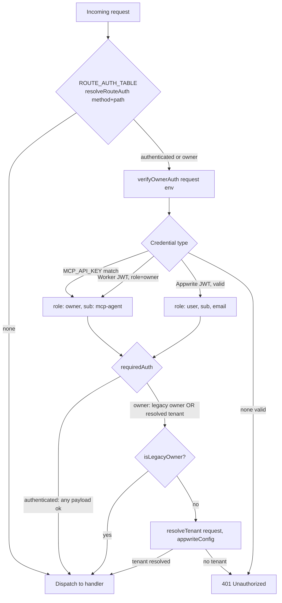
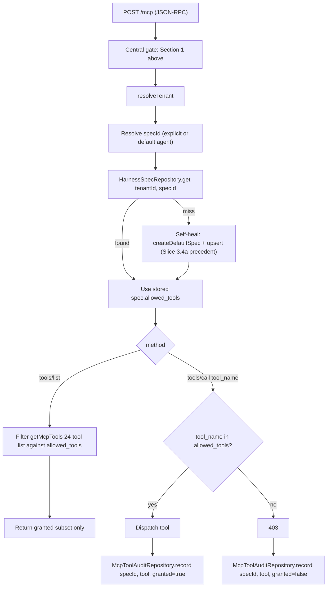
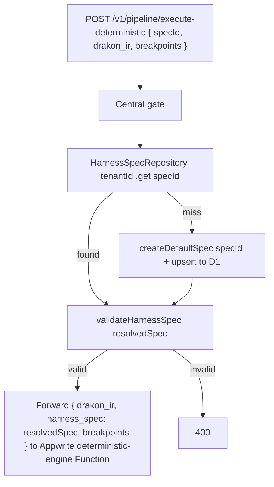

# Existing System Logic — Minimal Schemas

Author: Claude (this session), grounded in code verified directly during tonight's Slice
3.2–4.4 work (line-by-line diff review, not a fresh guess). Purpose: give the deep-research
pass a compact, accurate picture of how the CURRENT system actually routes a request,
before reasoning about how Q's organizational-workforce vision (ADR-0026) would extend it.

These are minimal — three flows, not an exhaustive system map. Full detail lives in the
code itself (`cloudflare-worker/worker-mcp-drakon.js`) and the ADRs referenced inline.

---

## 1. Every request: auth + tenant resolution (the central gate)

Key invariants (ADR-0025): no global "owner" role reachable via plain Appwrite login as
of Slice 3.3 step 7 — `MCP_API_KEY`/Worker-JWT-owner are intentionally kept as
service/automation exceptions, not a user backdoor. Every D1 access downstream of `Z` goes
through a tenant-scoped repository in `packages/tenancy` (constructor-bound `tenantId`,
unscoped query unrepresentable in the type system).

---

## 2. MCP surface: tools/list + tools/call (Slice 4.4, just landed on a branch — not
   yet reviewed/merged as of this document)

This is the mechanism ADR-0019 mandates ("tools/list returns only what the calling
tenant's server-resolved spec grants; tools/call re-checks and writes an audit entry").
`allowed_tools` vocabulary is per-`agent_name` (one `harness_specs` row per specialized
role) — this is the closest existing precedent to ADR-0026's "each worker role gets a
scoped agent" vision; worth the deep-research pass treating it as the seed of that model,
not a coincidence.

---

## 3. Harness spec resolution + self-heal (Slice 3.4a)

Known, deliberately-accepted side effect (see CURRENT-PLAN.md): a wrong/typo'd `specId`
now silently self-heals into a fresh default rather than erroring — cross-tenant isolation
still holds (a tenant can never resolve another tenant's actual spec, self-heal only ever
produces a fresh default scoped to the caller's own tenant), but a client-side bug in
`specId` is currently invisible rather than surfaced. Worth the deep-research pass
considering whether the organizational-workforce vision's per-role agents want the same
"always succeed with a sensible default" behavior, or whether some roles need hard-fail
instead (e.g. a worker's agent silently getting the WRONG role's default spec because of
a typo could be a real safety issue in a factory-floor context, not just an inconvenience).

---

## Where these three flows sit relative to ADR-0026's vision

- Flow 1 (auth+tenant) = the "organization" boundary already exists and is enforced.
- Flow 2 (MCP filtering) = the closest existing precedent for "each worker role is a
  scoped agent with a specific tool/capability grant" — Q6 (org hierarchy) would need
  this per-role model to nest under a parent organization, not just sit flat per tenant.
- Flow 3 (spec resolution) = the closest existing precedent for "a worker has a personal
  spec resolved server-side" — but today it's keyed by `agent_name` as a role archetype,
  not by an individual worker identity. ADR-0026's "personal knowledge base per worker"
  likely needs a finer-grained key than `agent_name` alone (role AND individual), which
  none of the current three flows provide yet — flagged as a genuine gap for the
  deep-research pass to reason about, not something already solved.
