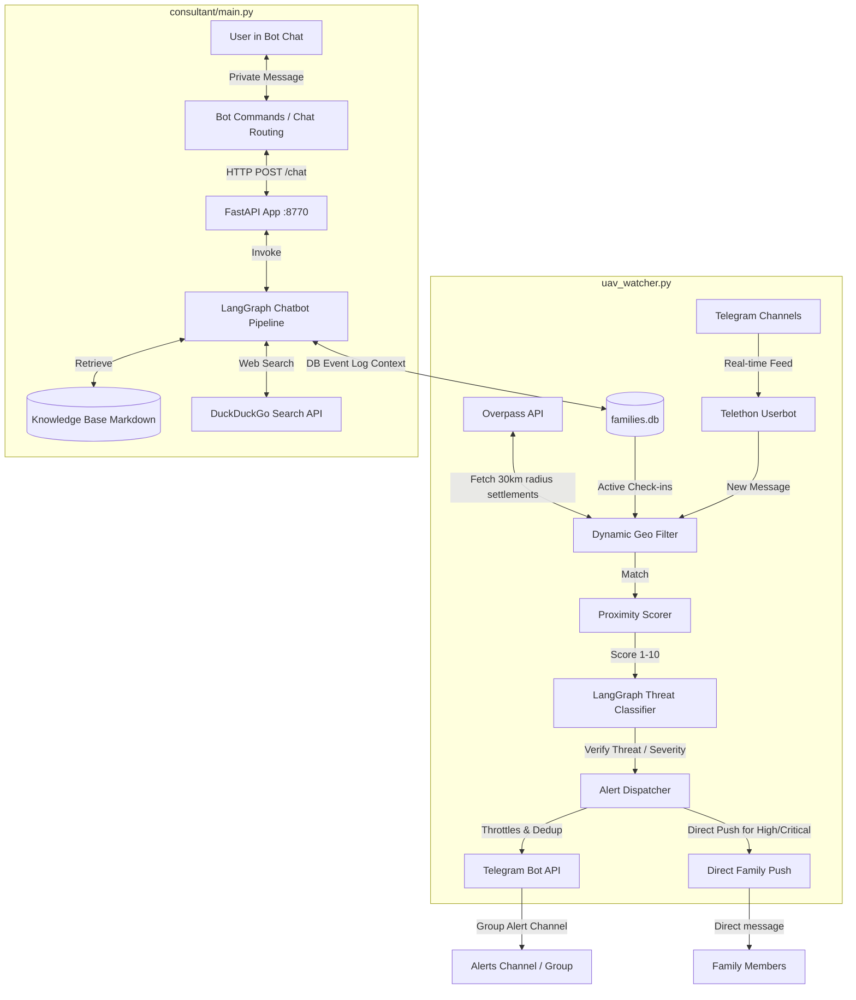

# UAV Watcher (Sharon) System Architecture

This document describes the high-level architecture of the `uav-watcher` system, which monitors Ukrainian Telegram channels for active aerial threats (UAVs, missiles), processes information in real time using a LangGraph AI pipeline, sends alerts to users and registered family members, and exposes an interactive FastAPI consultant chatbot.

---

## 1. System Overview & Diagram

The system consists of two primary services running concurrently:
1. **Threat Watcher Service** ([uav_watcher.py](file:///home/vokov/projects/uav-watcher/uav_watcher.py)): Monitors Telegram channels via Telethon, runs geospatial filtering, processes threat severity via a LangGraph pipeline, and dispatches alerts.
2. **Consultant API Service** ([consultant/main.py](file:///home/vokov/projects/uav-watcher/consultant/main.py)): Runs a FastAPI server (port `8770`) that acts as the backend for the interactive Sharon safety chatbot, managing RAG (Retrieval-Augmented Generation) from a local knowledge base.

---

## 2. Core Architectural Components

### A. Telethon Userbot & Channel Monitoring
- Monitors configured channel IDs from `config.json` plus a hardcoded master feed channel (`-1001223955273`).
- Listens to incoming messages in real time using the Telethon library.

### B. Dynamic Geospatial Geofencing ([geo_monitor.py](file:///home/vokov/projects/uav-watcher/geo_monitor.py))
- To minimize alert noise, incoming messages are filtered using a regex pattern.
- This pattern is generated dynamically:
  1. Queries the SQLite database ([families.db](file:///home/vokov/projects/uav-watcher/db/models.py)) for all coordinates reported by active family members in the last 8 hours.
  2. Queries the Openpass OpenStreetMap API to find all settlements (cities, villages, towns) within a 30 km radius of those coordinates.
  3. Combines these names with the home city keywords from `config.json` to compile a master geographical regex pattern.
- Only messages matching names in this pattern are analyzed further.

### C. LangGraph Threat Classifier Pipeline ([sharon/pipelines/threat_classifier.py](file:///home/vokov/projects/uav-watcher/sharon/pipelines/threat_classifier.py))
- Integrates a structured graph pipeline to analyze threats:
  1. **`extract_entities`**: Calls LLM (Gemini 2.5 Flash) via API proxies to extract `threat_type` (Shahed, Missile, Ballistics, Recon, Unknown), `region`, and `time`.
  2. **`assess_severity`**: Computes a threat severity score based on keywords, proximity score (derived from proximity keywords), and official air-raid indicators.
  3. **`decide_alert`**: Routes the state to formatting if the threat severity is `MEDIUM`, `HIGH`, or `CRITICAL`.
  4. **`format_message`**: Generates a warning message with clear action recommendations.

### D. Multi-Channel Notification Dispatcher
- **Flood Control (Throttle)**: Restricts notifications to at most one alert per 3 minutes (`180s`) per channel.
- **Deduplication Cooldown**: Blocks same-or-lower-severity alerts if sent within 90 seconds. Escalations bypass this cooldown.
- **Direct Family Push Notifications**: For `HIGH` and `CRITICAL` alerts, the bot directly queries `families.db` and pushes private, targeted messages to all registered family members.

### E. Consultant FastAPI Backend & RAG Pipeline
- The FastAPI app hosts the Sharon interactive agent.
- Queries are normalized and analyzed to detect user state: `ACTIVE THREAT`, `PANIC`, `STUPOR`, `DISSOCIATION`, or `SUICIDAL RISK`.
- **RAG Integration**: Retrieves emergency context from local markdown guides, matches it with recent threat logs, and falls back to a DuckDuckGo search if current information is requested.
- Outputs are generated via LLM Proxy with strict constraints (no markdown formatting, short conversational paragraphs, directive verbs in emergencies).

## Семантичні зв'язки
**Цей документ є частиною:** [[INDEX]]

**Цей документ пов'язаний з:**
- [[INDEX]] — переглянути всі документи розділу