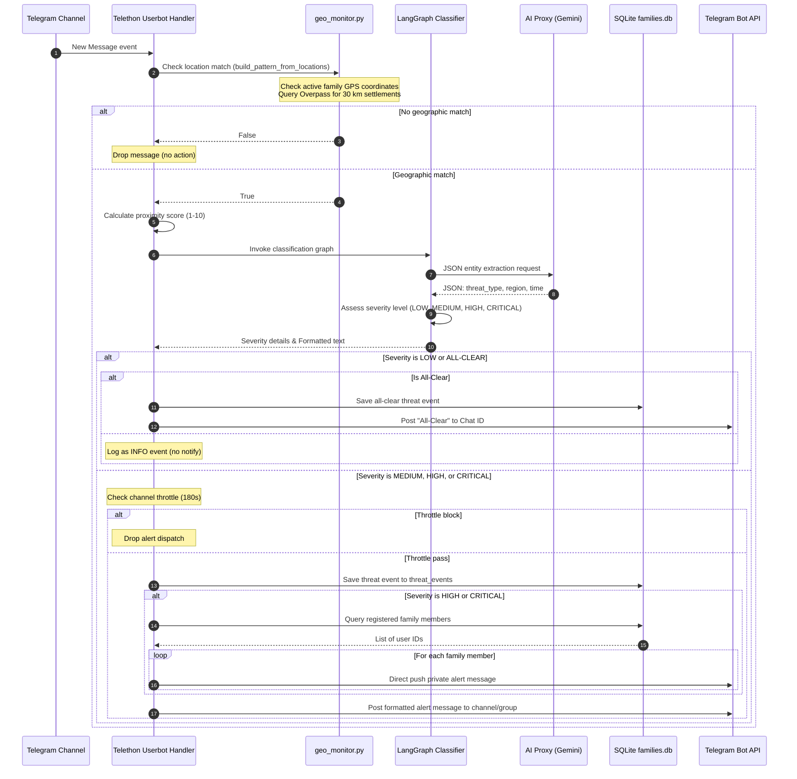
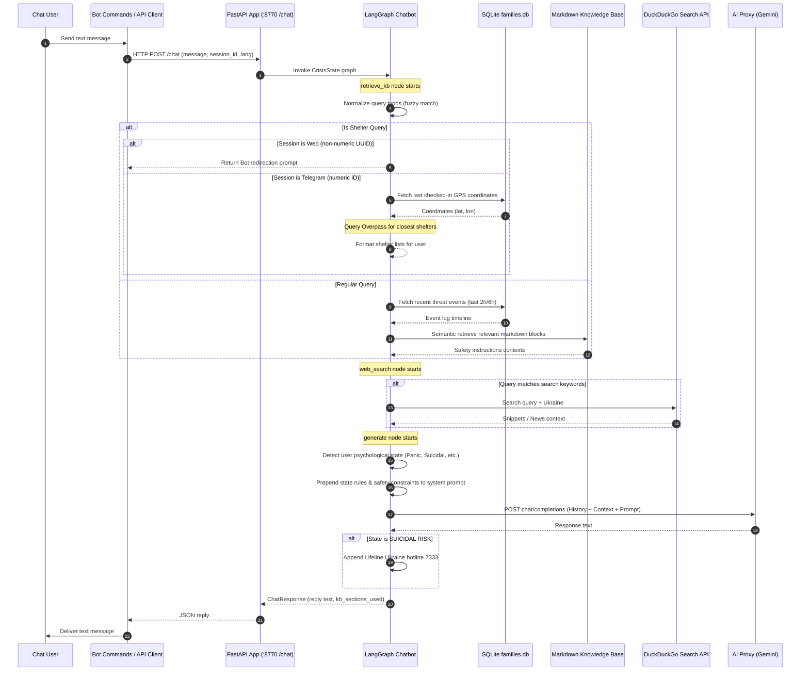

# UAV Watcher Data-Flow Streams

This document describes the step-by-step flows of data within the `uav-watcher` system, mapping how incoming channel alerts are parsed and how user questions are answered.

---

## 1. Stream A: Threat Scraper & Notification Pipeline

This stream handles real-time messages scraped from Telegram monitor channels.

---

## 2. Stream B: Sharon Chatbot Consultant RAG Pipeline

This stream handles user queries sent directly to the Sharon bot.

