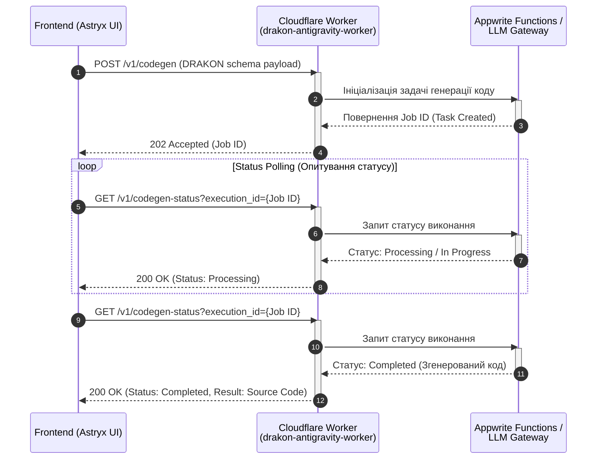

# 02_architecture_flows.md

## 1. Взаємодія Frontend -> Cloudflare Worker -> Appwrite / LLM Gateway

Архітектура платформи **AI-DRAKON Scaffolder** побудована на розділенні шарів (UI, Proxy-Gateway, Backend):

* **Frontend (Клієнтські елементи)**: Інтерфейс побудований з використанням дизайн-системи Astryx (React 18/19 + Tailwind CSS) та розгортається на Cloudflare Pages. Маршрутизація та SSR виконуються через TanStack Start + TanStack Router (компілюється з `.lovable/src/`).
* **Cloudflare Worker (`drakon-antigravity-worker`)**: Виступає в ролі Proxy та Gateway між фронтендом та бекенд-сервісами, забезпечуючи маскування ключів та маршрутизацію API.
* **Appwrite Cloud / LLM Gateway**: Основний бекенд для автентифікації (Auth/Functions), зберігання даних та AI кодогенерації.

---

## 2. Процес генерації коду ДРАКОН

Асинхронний процес генерації коду з візуальної схеми ДРАКОН (від запиту до опитування статусу):

---

## 3. Обробка SSR та ClientOnly

Frontend використовує React + TanStack Router; цей repository build не слід описувати як підтверджений TanStack Start SSR runtime.

* **Проблема SSR-гідрації**: Компоненти `DrakonEditor.tsx`, `yjs` (WebRTC) та `@monaco-editor/react` безпосередньо звертаються до `window`, `document` та Canvas API, що під час SSR викликає `ReferenceError`.
* **Рішення (`ClientOnly.tsx`)**: Використовується захисний компонент `src/components/app/ClientOnly.tsx`, який відкладає рендеринг Canvas, Yjs та Monaco до моменту монтування на клієнті.
