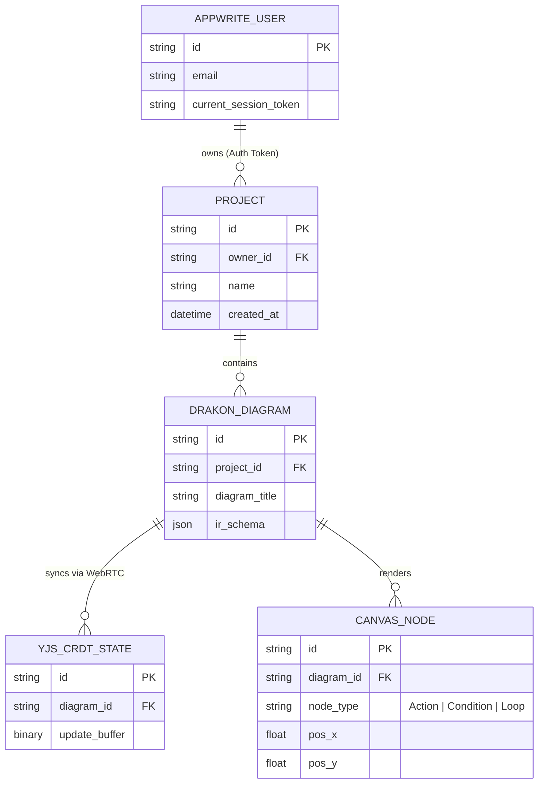

# 04_data_models.md

Опис моделей даних та управління станом для проєкту AI-DRAKON Scaffolder.

## 1. Appwrite колекції та Auth токени

* **Auth токени**: Аутентифікація реалізується через JWT сесій Appwrite (`Authorization: Bearer <jwt>`).
* **Проекти та Діаграми**: Метадані збережених графічних схем ДРАКОН, доступ та права власника.

---

## 2. ДРАКОН діаграми та IR схеми

* **ДРАКОН діаграми**: Canvas-модель елементів палітри ДРАКОН у `DrakonEditor.tsx`. Синхронізація у реальному часі за допомогою Yjs CRDT (WebRTC).
* **IR (Intermediate Representation) схеми**: Формат викликів вузлів ("Дія", "Умова", "Шампур") перед генерацією коду та передачею до Monaco Editor.

---

## 3. Zustand та React Context канали стану

* **React Context**: auth/project state через `AuthContext` та `ProjectContext`.
* **Zustand (Клієнтський UI-стан)**:
  * *Diagram/agent/chat stores*: Zustand stores у `src/store/`; navigation config не є Zustand store.
  * *Editor Store*: Стан діалогів (`NewDrakonDialog`), палітри та форматирування (`FormatInspector`).

---

## 4. Схема сутностей (ER Diagram)

